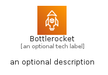
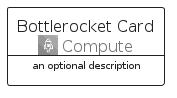

# Bottlerocket


```text
aws-q3-2022/Architecture/Compute/Bottlerocket
```

```text
include('aws-q3-2022/Architecture/Compute/Bottlerocket')
```


| Illustration | Bottlerocket | BottlerocketCard | BottlerocketGroup |
| :---: | :---: | :---: | :---: |
|  |  |  |  |


## Bottlerocket

### Load remotely
```plantuml
@startuml
' configures the library
!global $LIB_BASE_LOCATION="https://raw.githubusercontent.com/tmorin/plantuml-libs/master/distribution"

' loads the library's bootstrap
!include $LIB_BASE_LOCATION/bootstrap.puml

' loads the package bootstrap
include('aws-q3-2022/bootstrap')

' loads the Item which embeds the element Bottlerocket
include('aws-q3-2022/Architecture/Compute/Bottlerocket')

' renders the element
Bottlerocket('Bottlerocket', 'Bottlerocket', 'an optional tech label', 'an optional description')
@enduml
```

### Load locally
```plantuml
@startuml
' configures the library
!global $INCLUSION_MODE="local"
!global $LIB_BASE_LOCATION="../../.."

' loads the library's bootstrap
!include $LIB_BASE_LOCATION/bootstrap.puml

' loads the package bootstrap
include('aws-q3-2022/bootstrap')

' loads the Item which embeds the element Bottlerocket
include('aws-q3-2022/Architecture/Compute/Bottlerocket')

' renders the element
Bottlerocket('Bottlerocket', 'Bottlerocket', 'an optional tech label', 'an optional description')
@enduml
```

## BottlerocketCard

### Load remotely
```plantuml
@startuml
' configures the library
!global $LIB_BASE_LOCATION="https://raw.githubusercontent.com/tmorin/plantuml-libs/master/distribution"

' loads the library's bootstrap
!include $LIB_BASE_LOCATION/bootstrap.puml

' loads the package bootstrap
include('aws-q3-2022/bootstrap')

' loads the Item which embeds the element BottlerocketCard
include('aws-q3-2022/Architecture/Compute/Bottlerocket')

' renders the element
BottlerocketCard('BottlerocketCard', 'Bottlerocket Card', 'an optional description')
@enduml
```

### Load locally
```plantuml
@startuml
' configures the library
!global $INCLUSION_MODE="local"
!global $LIB_BASE_LOCATION="../../.."

' loads the library's bootstrap
!include $LIB_BASE_LOCATION/bootstrap.puml

' loads the package bootstrap
include('aws-q3-2022/bootstrap')

' loads the Item which embeds the element BottlerocketCard
include('aws-q3-2022/Architecture/Compute/Bottlerocket')

' renders the element
BottlerocketCard('BottlerocketCard', 'Bottlerocket Card', 'an optional description')
@enduml
```

## BottlerocketGroup

### Load remotely
```plantuml
@startuml
' configures the library
!global $LIB_BASE_LOCATION="https://raw.githubusercontent.com/tmorin/plantuml-libs/master/distribution"

' loads the library's bootstrap
!include $LIB_BASE_LOCATION/bootstrap.puml

' loads the package bootstrap
include('aws-q3-2022/bootstrap')

' loads the Item which embeds the element BottlerocketGroup
include('aws-q3-2022/Architecture/Compute/Bottlerocket')

' renders the element
BottlerocketGroup('BottlerocketGroup', 'Bottlerocket Group', 'an optional tech label') {
    note as note
        the content of the group
    end note
}
@enduml
```

### Load locally
```plantuml
@startuml
' configures the library
!global $INCLUSION_MODE="local"
!global $LIB_BASE_LOCATION="../../.."

' loads the library's bootstrap
!include $LIB_BASE_LOCATION/bootstrap.puml

' loads the package bootstrap
include('aws-q3-2022/bootstrap')

' loads the Item which embeds the element BottlerocketGroup
include('aws-q3-2022/Architecture/Compute/Bottlerocket')

' renders the element
BottlerocketGroup('BottlerocketGroup', 'Bottlerocket Group', 'an optional tech label') {
    note as note
        the content of the group
    end note
}
@enduml
```

