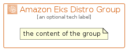

# AmazonEksDistro


```text
aws-q3-2022/Architecture/Containers/AmazonEksDistro
```

```text
include('aws-q3-2022/Architecture/Containers/AmazonEksDistro')
```


| Illustration | AmazonEksDistro | AmazonEksDistroCard | AmazonEksDistroGroup |
| :---: | :---: | :---: | :---: |
|  |  |  |  |


## AmazonEksDistro

### Load remotely
```plantuml
@startuml
' configures the library
!global $LIB_BASE_LOCATION="https://raw.githubusercontent.com/tmorin/plantuml-libs/master/distribution"

' loads the library's bootstrap
!include $LIB_BASE_LOCATION/bootstrap.puml

' loads the package bootstrap
include('aws-q3-2022/bootstrap')

' loads the Item which embeds the element AmazonEksDistro
include('aws-q3-2022/Architecture/Containers/AmazonEksDistro')

' renders the element
AmazonEksDistro('AmazonEksDistro', 'Amazon Eks Distro', 'an optional tech label', 'an optional description')
@enduml
```

### Load locally
```plantuml
@startuml
' configures the library
!global $INCLUSION_MODE="local"
!global $LIB_BASE_LOCATION="../../.."

' loads the library's bootstrap
!include $LIB_BASE_LOCATION/bootstrap.puml

' loads the package bootstrap
include('aws-q3-2022/bootstrap')

' loads the Item which embeds the element AmazonEksDistro
include('aws-q3-2022/Architecture/Containers/AmazonEksDistro')

' renders the element
AmazonEksDistro('AmazonEksDistro', 'Amazon Eks Distro', 'an optional tech label', 'an optional description')
@enduml
```

## AmazonEksDistroCard

### Load remotely
```plantuml
@startuml
' configures the library
!global $LIB_BASE_LOCATION="https://raw.githubusercontent.com/tmorin/plantuml-libs/master/distribution"

' loads the library's bootstrap
!include $LIB_BASE_LOCATION/bootstrap.puml

' loads the package bootstrap
include('aws-q3-2022/bootstrap')

' loads the Item which embeds the element AmazonEksDistroCard
include('aws-q3-2022/Architecture/Containers/AmazonEksDistro')

' renders the element
AmazonEksDistroCard('AmazonEksDistroCard', 'Amazon Eks Distro Card', 'an optional description')
@enduml
```

### Load locally
```plantuml
@startuml
' configures the library
!global $INCLUSION_MODE="local"
!global $LIB_BASE_LOCATION="../../.."

' loads the library's bootstrap
!include $LIB_BASE_LOCATION/bootstrap.puml

' loads the package bootstrap
include('aws-q3-2022/bootstrap')

' loads the Item which embeds the element AmazonEksDistroCard
include('aws-q3-2022/Architecture/Containers/AmazonEksDistro')

' renders the element
AmazonEksDistroCard('AmazonEksDistroCard', 'Amazon Eks Distro Card', 'an optional description')
@enduml
```

## AmazonEksDistroGroup

### Load remotely
```plantuml
@startuml
' configures the library
!global $LIB_BASE_LOCATION="https://raw.githubusercontent.com/tmorin/plantuml-libs/master/distribution"

' loads the library's bootstrap
!include $LIB_BASE_LOCATION/bootstrap.puml

' loads the package bootstrap
include('aws-q3-2022/bootstrap')

' loads the Item which embeds the element AmazonEksDistroGroup
include('aws-q3-2022/Architecture/Containers/AmazonEksDistro')

' renders the element
AmazonEksDistroGroup('AmazonEksDistroGroup', 'Amazon Eks Distro Group', 'an optional tech label') {
    note as note
        the content of the group
    end note
}
@enduml
```

### Load locally
```plantuml
@startuml
' configures the library
!global $INCLUSION_MODE="local"
!global $LIB_BASE_LOCATION="../../.."

' loads the library's bootstrap
!include $LIB_BASE_LOCATION/bootstrap.puml

' loads the package bootstrap
include('aws-q3-2022/bootstrap')

' loads the Item which embeds the element AmazonEksDistroGroup
include('aws-q3-2022/Architecture/Containers/AmazonEksDistro')

' renders the element
AmazonEksDistroGroup('AmazonEksDistroGroup', 'Amazon Eks Distro Group', 'an optional tech label') {
    note as note
        the content of the group
    end note
}
@enduml
```

