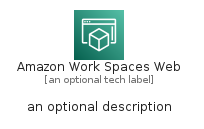
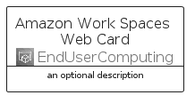

# AmazonWorkSpacesWeb


```text
aws-q3-2022/Architecture/EndUserComputing/AmazonWorkSpacesWeb
```

```text
include('aws-q3-2022/Architecture/EndUserComputing/AmazonWorkSpacesWeb')
```


| Illustration | AmazonWorkSpacesWeb | AmazonWorkSpacesWebCard | AmazonWorkSpacesWebGroup |
| :---: | :---: | :---: | :---: |
|  |  |  |  |


## AmazonWorkSpacesWeb

### Load remotely
```plantuml
@startuml
' configures the library
!global $LIB_BASE_LOCATION="https://raw.githubusercontent.com/tmorin/plantuml-libs/master/distribution"

' loads the library's bootstrap
!include $LIB_BASE_LOCATION/bootstrap.puml

' loads the package bootstrap
include('aws-q3-2022/bootstrap')

' loads the Item which embeds the element AmazonWorkSpacesWeb
include('aws-q3-2022/Architecture/EndUserComputing/AmazonWorkSpacesWeb')

' renders the element
AmazonWorkSpacesWeb('AmazonWorkSpacesWeb', 'Amazon Work Spaces Web', 'an optional tech label', 'an optional description')
@enduml
```

### Load locally
```plantuml
@startuml
' configures the library
!global $INCLUSION_MODE="local"
!global $LIB_BASE_LOCATION="../../.."

' loads the library's bootstrap
!include $LIB_BASE_LOCATION/bootstrap.puml

' loads the package bootstrap
include('aws-q3-2022/bootstrap')

' loads the Item which embeds the element AmazonWorkSpacesWeb
include('aws-q3-2022/Architecture/EndUserComputing/AmazonWorkSpacesWeb')

' renders the element
AmazonWorkSpacesWeb('AmazonWorkSpacesWeb', 'Amazon Work Spaces Web', 'an optional tech label', 'an optional description')
@enduml
```

## AmazonWorkSpacesWebCard

### Load remotely
```plantuml
@startuml
' configures the library
!global $LIB_BASE_LOCATION="https://raw.githubusercontent.com/tmorin/plantuml-libs/master/distribution"

' loads the library's bootstrap
!include $LIB_BASE_LOCATION/bootstrap.puml

' loads the package bootstrap
include('aws-q3-2022/bootstrap')

' loads the Item which embeds the element AmazonWorkSpacesWebCard
include('aws-q3-2022/Architecture/EndUserComputing/AmazonWorkSpacesWeb')

' renders the element
AmazonWorkSpacesWebCard('AmazonWorkSpacesWebCard', 'Amazon Work Spaces Web Card', 'an optional description')
@enduml
```

### Load locally
```plantuml
@startuml
' configures the library
!global $INCLUSION_MODE="local"
!global $LIB_BASE_LOCATION="../../.."

' loads the library's bootstrap
!include $LIB_BASE_LOCATION/bootstrap.puml

' loads the package bootstrap
include('aws-q3-2022/bootstrap')

' loads the Item which embeds the element AmazonWorkSpacesWebCard
include('aws-q3-2022/Architecture/EndUserComputing/AmazonWorkSpacesWeb')

' renders the element
AmazonWorkSpacesWebCard('AmazonWorkSpacesWebCard', 'Amazon Work Spaces Web Card', 'an optional description')
@enduml
```

## AmazonWorkSpacesWebGroup

### Load remotely
```plantuml
@startuml
' configures the library
!global $LIB_BASE_LOCATION="https://raw.githubusercontent.com/tmorin/plantuml-libs/master/distribution"

' loads the library's bootstrap
!include $LIB_BASE_LOCATION/bootstrap.puml

' loads the package bootstrap
include('aws-q3-2022/bootstrap')

' loads the Item which embeds the element AmazonWorkSpacesWebGroup
include('aws-q3-2022/Architecture/EndUserComputing/AmazonWorkSpacesWeb')

' renders the element
AmazonWorkSpacesWebGroup('AmazonWorkSpacesWebGroup', 'Amazon Work Spaces Web Group', 'an optional tech label') {
    note as note
        the content of the group
    end note
}
@enduml
```

### Load locally
```plantuml
@startuml
' configures the library
!global $INCLUSION_MODE="local"
!global $LIB_BASE_LOCATION="../../.."

' loads the library's bootstrap
!include $LIB_BASE_LOCATION/bootstrap.puml

' loads the package bootstrap
include('aws-q3-2022/bootstrap')

' loads the Item which embeds the element AmazonWorkSpacesWebGroup
include('aws-q3-2022/Architecture/EndUserComputing/AmazonWorkSpacesWeb')

' renders the element
AmazonWorkSpacesWebGroup('AmazonWorkSpacesWebGroup', 'Amazon Work Spaces Web Group', 'an optional tech label') {
    note as note
        the content of the group
    end note
}
@enduml
```

