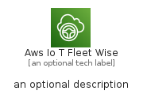
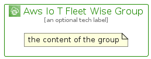

# AwsIoTFleetWise


```text
aws-q3-2022/Architecture/InternetOfThings/AwsIoTFleetWise
```

```text
include('aws-q3-2022/Architecture/InternetOfThings/AwsIoTFleetWise')
```


| Illustration | AwsIoTFleetWise | AwsIoTFleetWiseCard | AwsIoTFleetWiseGroup |
| :---: | :---: | :---: | :---: |
|  |  |  |  |


## AwsIoTFleetWise

### Load remotely
```plantuml
@startuml
' configures the library
!global $LIB_BASE_LOCATION="https://raw.githubusercontent.com/tmorin/plantuml-libs/master/distribution"

' loads the library's bootstrap
!include $LIB_BASE_LOCATION/bootstrap.puml

' loads the package bootstrap
include('aws-q3-2022/bootstrap')

' loads the Item which embeds the element AwsIoTFleetWise
include('aws-q3-2022/Architecture/InternetOfThings/AwsIoTFleetWise')

' renders the element
AwsIoTFleetWise('AwsIoTFleetWise', 'Aws Io T Fleet Wise', 'an optional tech label', 'an optional description')
@enduml
```

### Load locally
```plantuml
@startuml
' configures the library
!global $INCLUSION_MODE="local"
!global $LIB_BASE_LOCATION="../../.."

' loads the library's bootstrap
!include $LIB_BASE_LOCATION/bootstrap.puml

' loads the package bootstrap
include('aws-q3-2022/bootstrap')

' loads the Item which embeds the element AwsIoTFleetWise
include('aws-q3-2022/Architecture/InternetOfThings/AwsIoTFleetWise')

' renders the element
AwsIoTFleetWise('AwsIoTFleetWise', 'Aws Io T Fleet Wise', 'an optional tech label', 'an optional description')
@enduml
```

## AwsIoTFleetWiseCard

### Load remotely
```plantuml
@startuml
' configures the library
!global $LIB_BASE_LOCATION="https://raw.githubusercontent.com/tmorin/plantuml-libs/master/distribution"

' loads the library's bootstrap
!include $LIB_BASE_LOCATION/bootstrap.puml

' loads the package bootstrap
include('aws-q3-2022/bootstrap')

' loads the Item which embeds the element AwsIoTFleetWiseCard
include('aws-q3-2022/Architecture/InternetOfThings/AwsIoTFleetWise')

' renders the element
AwsIoTFleetWiseCard('AwsIoTFleetWiseCard', 'Aws Io T Fleet Wise Card', 'an optional description')
@enduml
```

### Load locally
```plantuml
@startuml
' configures the library
!global $INCLUSION_MODE="local"
!global $LIB_BASE_LOCATION="../../.."

' loads the library's bootstrap
!include $LIB_BASE_LOCATION/bootstrap.puml

' loads the package bootstrap
include('aws-q3-2022/bootstrap')

' loads the Item which embeds the element AwsIoTFleetWiseCard
include('aws-q3-2022/Architecture/InternetOfThings/AwsIoTFleetWise')

' renders the element
AwsIoTFleetWiseCard('AwsIoTFleetWiseCard', 'Aws Io T Fleet Wise Card', 'an optional description')
@enduml
```

## AwsIoTFleetWiseGroup

### Load remotely
```plantuml
@startuml
' configures the library
!global $LIB_BASE_LOCATION="https://raw.githubusercontent.com/tmorin/plantuml-libs/master/distribution"

' loads the library's bootstrap
!include $LIB_BASE_LOCATION/bootstrap.puml

' loads the package bootstrap
include('aws-q3-2022/bootstrap')

' loads the Item which embeds the element AwsIoTFleetWiseGroup
include('aws-q3-2022/Architecture/InternetOfThings/AwsIoTFleetWise')

' renders the element
AwsIoTFleetWiseGroup('AwsIoTFleetWiseGroup', 'Aws Io T Fleet Wise Group', 'an optional tech label') {
    note as note
        the content of the group
    end note
}
@enduml
```

### Load locally
```plantuml
@startuml
' configures the library
!global $INCLUSION_MODE="local"
!global $LIB_BASE_LOCATION="../../.."

' loads the library's bootstrap
!include $LIB_BASE_LOCATION/bootstrap.puml

' loads the package bootstrap
include('aws-q3-2022/bootstrap')

' loads the Item which embeds the element AwsIoTFleetWiseGroup
include('aws-q3-2022/Architecture/InternetOfThings/AwsIoTFleetWise')

' renders the element
AwsIoTFleetWiseGroup('AwsIoTFleetWiseGroup', 'Aws Io T Fleet Wise Group', 'an optional tech label') {
    note as note
        the content of the group
    end note
}
@enduml
```

