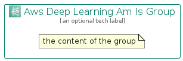

# AwsDeepLearningAmIs


```text
aws-q3-2022/Architecture/MachineLearning/AwsDeepLearningAmIs
```

```text
include('aws-q3-2022/Architecture/MachineLearning/AwsDeepLearningAmIs')
```


| Illustration | AwsDeepLearningAmIs | AwsDeepLearningAmIsCard | AwsDeepLearningAmIsGroup |
| :---: | :---: | :---: | :---: |
|  |  |  |  |


## AwsDeepLearningAmIs

### Load remotely
```plantuml
@startuml
' configures the library
!global $LIB_BASE_LOCATION="https://raw.githubusercontent.com/tmorin/plantuml-libs/master/distribution"

' loads the library's bootstrap
!include $LIB_BASE_LOCATION/bootstrap.puml

' loads the package bootstrap
include('aws-q3-2022/bootstrap')

' loads the Item which embeds the element AwsDeepLearningAmIs
include('aws-q3-2022/Architecture/MachineLearning/AwsDeepLearningAmIs')

' renders the element
AwsDeepLearningAmIs('AwsDeepLearningAmIs', 'Aws Deep Learning Am Is', 'an optional tech label', 'an optional description')
@enduml
```

### Load locally
```plantuml
@startuml
' configures the library
!global $INCLUSION_MODE="local"
!global $LIB_BASE_LOCATION="../../.."

' loads the library's bootstrap
!include $LIB_BASE_LOCATION/bootstrap.puml

' loads the package bootstrap
include('aws-q3-2022/bootstrap')

' loads the Item which embeds the element AwsDeepLearningAmIs
include('aws-q3-2022/Architecture/MachineLearning/AwsDeepLearningAmIs')

' renders the element
AwsDeepLearningAmIs('AwsDeepLearningAmIs', 'Aws Deep Learning Am Is', 'an optional tech label', 'an optional description')
@enduml
```

## AwsDeepLearningAmIsCard

### Load remotely
```plantuml
@startuml
' configures the library
!global $LIB_BASE_LOCATION="https://raw.githubusercontent.com/tmorin/plantuml-libs/master/distribution"

' loads the library's bootstrap
!include $LIB_BASE_LOCATION/bootstrap.puml

' loads the package bootstrap
include('aws-q3-2022/bootstrap')

' loads the Item which embeds the element AwsDeepLearningAmIsCard
include('aws-q3-2022/Architecture/MachineLearning/AwsDeepLearningAmIs')

' renders the element
AwsDeepLearningAmIsCard('AwsDeepLearningAmIsCard', 'Aws Deep Learning Am Is Card', 'an optional description')
@enduml
```

### Load locally
```plantuml
@startuml
' configures the library
!global $INCLUSION_MODE="local"
!global $LIB_BASE_LOCATION="../../.."

' loads the library's bootstrap
!include $LIB_BASE_LOCATION/bootstrap.puml

' loads the package bootstrap
include('aws-q3-2022/bootstrap')

' loads the Item which embeds the element AwsDeepLearningAmIsCard
include('aws-q3-2022/Architecture/MachineLearning/AwsDeepLearningAmIs')

' renders the element
AwsDeepLearningAmIsCard('AwsDeepLearningAmIsCard', 'Aws Deep Learning Am Is Card', 'an optional description')
@enduml
```

## AwsDeepLearningAmIsGroup

### Load remotely
```plantuml
@startuml
' configures the library
!global $LIB_BASE_LOCATION="https://raw.githubusercontent.com/tmorin/plantuml-libs/master/distribution"

' loads the library's bootstrap
!include $LIB_BASE_LOCATION/bootstrap.puml

' loads the package bootstrap
include('aws-q3-2022/bootstrap')

' loads the Item which embeds the element AwsDeepLearningAmIsGroup
include('aws-q3-2022/Architecture/MachineLearning/AwsDeepLearningAmIs')

' renders the element
AwsDeepLearningAmIsGroup('AwsDeepLearningAmIsGroup', 'Aws Deep Learning Am Is Group', 'an optional tech label') {
    note as note
        the content of the group
    end note
}
@enduml
```

### Load locally
```plantuml
@startuml
' configures the library
!global $INCLUSION_MODE="local"
!global $LIB_BASE_LOCATION="../../.."

' loads the library's bootstrap
!include $LIB_BASE_LOCATION/bootstrap.puml

' loads the package bootstrap
include('aws-q3-2022/bootstrap')

' loads the Item which embeds the element AwsDeepLearningAmIsGroup
include('aws-q3-2022/Architecture/MachineLearning/AwsDeepLearningAmIs')

' renders the element
AwsDeepLearningAmIsGroup('AwsDeepLearningAmIsGroup', 'Aws Deep Learning Am Is Group', 'an optional tech label') {
    note as note
        the content of the group
    end note
}
@enduml
```

