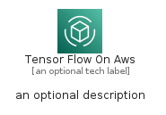
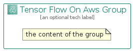

# TensorFlowOnAws


```text
aws-q3-2022/Architecture/MachineLearning/TensorFlowOnAws
```

```text
include('aws-q3-2022/Architecture/MachineLearning/TensorFlowOnAws')
```


| Illustration | TensorFlowOnAws | TensorFlowOnAwsCard | TensorFlowOnAwsGroup |
| :---: | :---: | :---: | :---: |
|  |  |  |  |


## TensorFlowOnAws

### Load remotely
```plantuml
@startuml
' configures the library
!global $LIB_BASE_LOCATION="https://raw.githubusercontent.com/tmorin/plantuml-libs/master/distribution"

' loads the library's bootstrap
!include $LIB_BASE_LOCATION/bootstrap.puml

' loads the package bootstrap
include('aws-q3-2022/bootstrap')

' loads the Item which embeds the element TensorFlowOnAws
include('aws-q3-2022/Architecture/MachineLearning/TensorFlowOnAws')

' renders the element
TensorFlowOnAws('TensorFlowOnAws', 'Tensor Flow On Aws', 'an optional tech label', 'an optional description')
@enduml
```

### Load locally
```plantuml
@startuml
' configures the library
!global $INCLUSION_MODE="local"
!global $LIB_BASE_LOCATION="../../.."

' loads the library's bootstrap
!include $LIB_BASE_LOCATION/bootstrap.puml

' loads the package bootstrap
include('aws-q3-2022/bootstrap')

' loads the Item which embeds the element TensorFlowOnAws
include('aws-q3-2022/Architecture/MachineLearning/TensorFlowOnAws')

' renders the element
TensorFlowOnAws('TensorFlowOnAws', 'Tensor Flow On Aws', 'an optional tech label', 'an optional description')
@enduml
```

## TensorFlowOnAwsCard

### Load remotely
```plantuml
@startuml
' configures the library
!global $LIB_BASE_LOCATION="https://raw.githubusercontent.com/tmorin/plantuml-libs/master/distribution"

' loads the library's bootstrap
!include $LIB_BASE_LOCATION/bootstrap.puml

' loads the package bootstrap
include('aws-q3-2022/bootstrap')

' loads the Item which embeds the element TensorFlowOnAwsCard
include('aws-q3-2022/Architecture/MachineLearning/TensorFlowOnAws')

' renders the element
TensorFlowOnAwsCard('TensorFlowOnAwsCard', 'Tensor Flow On Aws Card', 'an optional description')
@enduml
```

### Load locally
```plantuml
@startuml
' configures the library
!global $INCLUSION_MODE="local"
!global $LIB_BASE_LOCATION="../../.."

' loads the library's bootstrap
!include $LIB_BASE_LOCATION/bootstrap.puml

' loads the package bootstrap
include('aws-q3-2022/bootstrap')

' loads the Item which embeds the element TensorFlowOnAwsCard
include('aws-q3-2022/Architecture/MachineLearning/TensorFlowOnAws')

' renders the element
TensorFlowOnAwsCard('TensorFlowOnAwsCard', 'Tensor Flow On Aws Card', 'an optional description')
@enduml
```

## TensorFlowOnAwsGroup

### Load remotely
```plantuml
@startuml
' configures the library
!global $LIB_BASE_LOCATION="https://raw.githubusercontent.com/tmorin/plantuml-libs/master/distribution"

' loads the library's bootstrap
!include $LIB_BASE_LOCATION/bootstrap.puml

' loads the package bootstrap
include('aws-q3-2022/bootstrap')

' loads the Item which embeds the element TensorFlowOnAwsGroup
include('aws-q3-2022/Architecture/MachineLearning/TensorFlowOnAws')

' renders the element
TensorFlowOnAwsGroup('TensorFlowOnAwsGroup', 'Tensor Flow On Aws Group', 'an optional tech label') {
    note as note
        the content of the group
    end note
}
@enduml
```

### Load locally
```plantuml
@startuml
' configures the library
!global $INCLUSION_MODE="local"
!global $LIB_BASE_LOCATION="../../.."

' loads the library's bootstrap
!include $LIB_BASE_LOCATION/bootstrap.puml

' loads the package bootstrap
include('aws-q3-2022/bootstrap')

' loads the Item which embeds the element TensorFlowOnAwsGroup
include('aws-q3-2022/Architecture/MachineLearning/TensorFlowOnAws')

' renders the element
TensorFlowOnAwsGroup('TensorFlowOnAwsGroup', 'Tensor Flow On Aws Group', 'an optional tech label') {
    note as note
        the content of the group
    end note
}
@enduml
```

