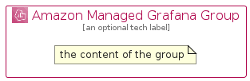

# AmazonManagedGrafana


```text
aws-q3-2022/Architecture/ManagementGovernance/AmazonManagedGrafana
```

```text
include('aws-q3-2022/Architecture/ManagementGovernance/AmazonManagedGrafana')
```


| Illustration | AmazonManagedGrafana | AmazonManagedGrafanaCard | AmazonManagedGrafanaGroup |
| :---: | :---: | :---: | :---: |
|  |  |  |  |


## AmazonManagedGrafana

### Load remotely
```plantuml
@startuml
' configures the library
!global $LIB_BASE_LOCATION="https://raw.githubusercontent.com/tmorin/plantuml-libs/master/distribution"

' loads the library's bootstrap
!include $LIB_BASE_LOCATION/bootstrap.puml

' loads the package bootstrap
include('aws-q3-2022/bootstrap')

' loads the Item which embeds the element AmazonManagedGrafana
include('aws-q3-2022/Architecture/ManagementGovernance/AmazonManagedGrafana')

' renders the element
AmazonManagedGrafana('AmazonManagedGrafana', 'Amazon Managed Grafana', 'an optional tech label', 'an optional description')
@enduml
```

### Load locally
```plantuml
@startuml
' configures the library
!global $INCLUSION_MODE="local"
!global $LIB_BASE_LOCATION="../../.."

' loads the library's bootstrap
!include $LIB_BASE_LOCATION/bootstrap.puml

' loads the package bootstrap
include('aws-q3-2022/bootstrap')

' loads the Item which embeds the element AmazonManagedGrafana
include('aws-q3-2022/Architecture/ManagementGovernance/AmazonManagedGrafana')

' renders the element
AmazonManagedGrafana('AmazonManagedGrafana', 'Amazon Managed Grafana', 'an optional tech label', 'an optional description')
@enduml
```

## AmazonManagedGrafanaCard

### Load remotely
```plantuml
@startuml
' configures the library
!global $LIB_BASE_LOCATION="https://raw.githubusercontent.com/tmorin/plantuml-libs/master/distribution"

' loads the library's bootstrap
!include $LIB_BASE_LOCATION/bootstrap.puml

' loads the package bootstrap
include('aws-q3-2022/bootstrap')

' loads the Item which embeds the element AmazonManagedGrafanaCard
include('aws-q3-2022/Architecture/ManagementGovernance/AmazonManagedGrafana')

' renders the element
AmazonManagedGrafanaCard('AmazonManagedGrafanaCard', 'Amazon Managed Grafana Card', 'an optional description')
@enduml
```

### Load locally
```plantuml
@startuml
' configures the library
!global $INCLUSION_MODE="local"
!global $LIB_BASE_LOCATION="../../.."

' loads the library's bootstrap
!include $LIB_BASE_LOCATION/bootstrap.puml

' loads the package bootstrap
include('aws-q3-2022/bootstrap')

' loads the Item which embeds the element AmazonManagedGrafanaCard
include('aws-q3-2022/Architecture/ManagementGovernance/AmazonManagedGrafana')

' renders the element
AmazonManagedGrafanaCard('AmazonManagedGrafanaCard', 'Amazon Managed Grafana Card', 'an optional description')
@enduml
```

## AmazonManagedGrafanaGroup

### Load remotely
```plantuml
@startuml
' configures the library
!global $LIB_BASE_LOCATION="https://raw.githubusercontent.com/tmorin/plantuml-libs/master/distribution"

' loads the library's bootstrap
!include $LIB_BASE_LOCATION/bootstrap.puml

' loads the package bootstrap
include('aws-q3-2022/bootstrap')

' loads the Item which embeds the element AmazonManagedGrafanaGroup
include('aws-q3-2022/Architecture/ManagementGovernance/AmazonManagedGrafana')

' renders the element
AmazonManagedGrafanaGroup('AmazonManagedGrafanaGroup', 'Amazon Managed Grafana Group', 'an optional tech label') {
    note as note
        the content of the group
    end note
}
@enduml
```

### Load locally
```plantuml
@startuml
' configures the library
!global $INCLUSION_MODE="local"
!global $LIB_BASE_LOCATION="../../.."

' loads the library's bootstrap
!include $LIB_BASE_LOCATION/bootstrap.puml

' loads the package bootstrap
include('aws-q3-2022/bootstrap')

' loads the Item which embeds the element AmazonManagedGrafanaGroup
include('aws-q3-2022/Architecture/ManagementGovernance/AmazonManagedGrafana')

' renders the element
AmazonManagedGrafanaGroup('AmazonManagedGrafanaGroup', 'Amazon Managed Grafana Group', 'an optional tech label') {
    note as note
        the content of the group
    end note
}
@enduml
```

