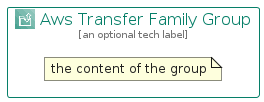

# AwsTransferFamily


```text
aws-q3-2022/Architecture/MigrationTransfer/AwsTransferFamily
```

```text
include('aws-q3-2022/Architecture/MigrationTransfer/AwsTransferFamily')
```


| Illustration | AwsTransferFamily | AwsTransferFamilyCard | AwsTransferFamilyGroup |
| :---: | :---: | :---: | :---: |
|  |  |  |  |


## AwsTransferFamily

### Load remotely
```plantuml
@startuml
' configures the library
!global $LIB_BASE_LOCATION="https://raw.githubusercontent.com/tmorin/plantuml-libs/master/distribution"

' loads the library's bootstrap
!include $LIB_BASE_LOCATION/bootstrap.puml

' loads the package bootstrap
include('aws-q3-2022/bootstrap')

' loads the Item which embeds the element AwsTransferFamily
include('aws-q3-2022/Architecture/MigrationTransfer/AwsTransferFamily')

' renders the element
AwsTransferFamily('AwsTransferFamily', 'Aws Transfer Family', 'an optional tech label', 'an optional description')
@enduml
```

### Load locally
```plantuml
@startuml
' configures the library
!global $INCLUSION_MODE="local"
!global $LIB_BASE_LOCATION="../../.."

' loads the library's bootstrap
!include $LIB_BASE_LOCATION/bootstrap.puml

' loads the package bootstrap
include('aws-q3-2022/bootstrap')

' loads the Item which embeds the element AwsTransferFamily
include('aws-q3-2022/Architecture/MigrationTransfer/AwsTransferFamily')

' renders the element
AwsTransferFamily('AwsTransferFamily', 'Aws Transfer Family', 'an optional tech label', 'an optional description')
@enduml
```

## AwsTransferFamilyCard

### Load remotely
```plantuml
@startuml
' configures the library
!global $LIB_BASE_LOCATION="https://raw.githubusercontent.com/tmorin/plantuml-libs/master/distribution"

' loads the library's bootstrap
!include $LIB_BASE_LOCATION/bootstrap.puml

' loads the package bootstrap
include('aws-q3-2022/bootstrap')

' loads the Item which embeds the element AwsTransferFamilyCard
include('aws-q3-2022/Architecture/MigrationTransfer/AwsTransferFamily')

' renders the element
AwsTransferFamilyCard('AwsTransferFamilyCard', 'Aws Transfer Family Card', 'an optional description')
@enduml
```

### Load locally
```plantuml
@startuml
' configures the library
!global $INCLUSION_MODE="local"
!global $LIB_BASE_LOCATION="../../.."

' loads the library's bootstrap
!include $LIB_BASE_LOCATION/bootstrap.puml

' loads the package bootstrap
include('aws-q3-2022/bootstrap')

' loads the Item which embeds the element AwsTransferFamilyCard
include('aws-q3-2022/Architecture/MigrationTransfer/AwsTransferFamily')

' renders the element
AwsTransferFamilyCard('AwsTransferFamilyCard', 'Aws Transfer Family Card', 'an optional description')
@enduml
```

## AwsTransferFamilyGroup

### Load remotely
```plantuml
@startuml
' configures the library
!global $LIB_BASE_LOCATION="https://raw.githubusercontent.com/tmorin/plantuml-libs/master/distribution"

' loads the library's bootstrap
!include $LIB_BASE_LOCATION/bootstrap.puml

' loads the package bootstrap
include('aws-q3-2022/bootstrap')

' loads the Item which embeds the element AwsTransferFamilyGroup
include('aws-q3-2022/Architecture/MigrationTransfer/AwsTransferFamily')

' renders the element
AwsTransferFamilyGroup('AwsTransferFamilyGroup', 'Aws Transfer Family Group', 'an optional tech label') {
    note as note
        the content of the group
    end note
}
@enduml
```

### Load locally
```plantuml
@startuml
' configures the library
!global $INCLUSION_MODE="local"
!global $LIB_BASE_LOCATION="../../.."

' loads the library's bootstrap
!include $LIB_BASE_LOCATION/bootstrap.puml

' loads the package bootstrap
include('aws-q3-2022/bootstrap')

' loads the Item which embeds the element AwsTransferFamilyGroup
include('aws-q3-2022/Architecture/MigrationTransfer/AwsTransferFamily')

' renders the element
AwsTransferFamilyGroup('AwsTransferFamilyGroup', 'Aws Transfer Family Group', 'an optional tech label') {
    note as note
        the content of the group
    end note
}
@enduml
```

