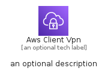
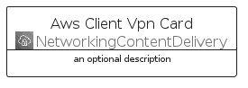
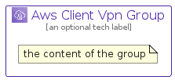

# AwsClientVpn


```text
aws-q3-2022/Architecture/NetworkingContentDelivery/AwsClientVpn
```

```text
include('aws-q3-2022/Architecture/NetworkingContentDelivery/AwsClientVpn')
```


| Illustration | AwsClientVpn | AwsClientVpnCard | AwsClientVpnGroup |
| :---: | :---: | :---: | :---: |
|  |  |  |  |


## AwsClientVpn

### Load remotely
```plantuml
@startuml
' configures the library
!global $LIB_BASE_LOCATION="https://raw.githubusercontent.com/tmorin/plantuml-libs/master/distribution"

' loads the library's bootstrap
!include $LIB_BASE_LOCATION/bootstrap.puml

' loads the package bootstrap
include('aws-q3-2022/bootstrap')

' loads the Item which embeds the element AwsClientVpn
include('aws-q3-2022/Architecture/NetworkingContentDelivery/AwsClientVpn')

' renders the element
AwsClientVpn('AwsClientVpn', 'Aws Client Vpn', 'an optional tech label', 'an optional description')
@enduml
```

### Load locally
```plantuml
@startuml
' configures the library
!global $INCLUSION_MODE="local"
!global $LIB_BASE_LOCATION="../../.."

' loads the library's bootstrap
!include $LIB_BASE_LOCATION/bootstrap.puml

' loads the package bootstrap
include('aws-q3-2022/bootstrap')

' loads the Item which embeds the element AwsClientVpn
include('aws-q3-2022/Architecture/NetworkingContentDelivery/AwsClientVpn')

' renders the element
AwsClientVpn('AwsClientVpn', 'Aws Client Vpn', 'an optional tech label', 'an optional description')
@enduml
```

## AwsClientVpnCard

### Load remotely
```plantuml
@startuml
' configures the library
!global $LIB_BASE_LOCATION="https://raw.githubusercontent.com/tmorin/plantuml-libs/master/distribution"

' loads the library's bootstrap
!include $LIB_BASE_LOCATION/bootstrap.puml

' loads the package bootstrap
include('aws-q3-2022/bootstrap')

' loads the Item which embeds the element AwsClientVpnCard
include('aws-q3-2022/Architecture/NetworkingContentDelivery/AwsClientVpn')

' renders the element
AwsClientVpnCard('AwsClientVpnCard', 'Aws Client Vpn Card', 'an optional description')
@enduml
```

### Load locally
```plantuml
@startuml
' configures the library
!global $INCLUSION_MODE="local"
!global $LIB_BASE_LOCATION="../../.."

' loads the library's bootstrap
!include $LIB_BASE_LOCATION/bootstrap.puml

' loads the package bootstrap
include('aws-q3-2022/bootstrap')

' loads the Item which embeds the element AwsClientVpnCard
include('aws-q3-2022/Architecture/NetworkingContentDelivery/AwsClientVpn')

' renders the element
AwsClientVpnCard('AwsClientVpnCard', 'Aws Client Vpn Card', 'an optional description')
@enduml
```

## AwsClientVpnGroup

### Load remotely
```plantuml
@startuml
' configures the library
!global $LIB_BASE_LOCATION="https://raw.githubusercontent.com/tmorin/plantuml-libs/master/distribution"

' loads the library's bootstrap
!include $LIB_BASE_LOCATION/bootstrap.puml

' loads the package bootstrap
include('aws-q3-2022/bootstrap')

' loads the Item which embeds the element AwsClientVpnGroup
include('aws-q3-2022/Architecture/NetworkingContentDelivery/AwsClientVpn')

' renders the element
AwsClientVpnGroup('AwsClientVpnGroup', 'Aws Client Vpn Group', 'an optional tech label') {
    note as note
        the content of the group
    end note
}
@enduml
```

### Load locally
```plantuml
@startuml
' configures the library
!global $INCLUSION_MODE="local"
!global $LIB_BASE_LOCATION="../../.."

' loads the library's bootstrap
!include $LIB_BASE_LOCATION/bootstrap.puml

' loads the package bootstrap
include('aws-q3-2022/bootstrap')

' loads the Item which embeds the element AwsClientVpnGroup
include('aws-q3-2022/Architecture/NetworkingContentDelivery/AwsClientVpn')

' renders the element
AwsClientVpnGroup('AwsClientVpnGroup', 'Aws Client Vpn Group', 'an optional tech label') {
    note as note
        the content of the group
    end note
}
@enduml
```

