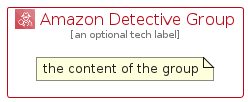

# AmazonDetective


```text
aws-q3-2022/Architecture/SecurityIdentityCompliance/AmazonDetective
```

```text
include('aws-q3-2022/Architecture/SecurityIdentityCompliance/AmazonDetective')
```


| Illustration | AmazonDetective | AmazonDetectiveCard | AmazonDetectiveGroup |
| :---: | :---: | :---: | :---: |
|  |  |  |  |


## AmazonDetective

### Load remotely
```plantuml
@startuml
' configures the library
!global $LIB_BASE_LOCATION="https://raw.githubusercontent.com/tmorin/plantuml-libs/master/distribution"

' loads the library's bootstrap
!include $LIB_BASE_LOCATION/bootstrap.puml

' loads the package bootstrap
include('aws-q3-2022/bootstrap')

' loads the Item which embeds the element AmazonDetective
include('aws-q3-2022/Architecture/SecurityIdentityCompliance/AmazonDetective')

' renders the element
AmazonDetective('AmazonDetective', 'Amazon Detective', 'an optional tech label', 'an optional description')
@enduml
```

### Load locally
```plantuml
@startuml
' configures the library
!global $INCLUSION_MODE="local"
!global $LIB_BASE_LOCATION="../../.."

' loads the library's bootstrap
!include $LIB_BASE_LOCATION/bootstrap.puml

' loads the package bootstrap
include('aws-q3-2022/bootstrap')

' loads the Item which embeds the element AmazonDetective
include('aws-q3-2022/Architecture/SecurityIdentityCompliance/AmazonDetective')

' renders the element
AmazonDetective('AmazonDetective', 'Amazon Detective', 'an optional tech label', 'an optional description')
@enduml
```

## AmazonDetectiveCard

### Load remotely
```plantuml
@startuml
' configures the library
!global $LIB_BASE_LOCATION="https://raw.githubusercontent.com/tmorin/plantuml-libs/master/distribution"

' loads the library's bootstrap
!include $LIB_BASE_LOCATION/bootstrap.puml

' loads the package bootstrap
include('aws-q3-2022/bootstrap')

' loads the Item which embeds the element AmazonDetectiveCard
include('aws-q3-2022/Architecture/SecurityIdentityCompliance/AmazonDetective')

' renders the element
AmazonDetectiveCard('AmazonDetectiveCard', 'Amazon Detective Card', 'an optional description')
@enduml
```

### Load locally
```plantuml
@startuml
' configures the library
!global $INCLUSION_MODE="local"
!global $LIB_BASE_LOCATION="../../.."

' loads the library's bootstrap
!include $LIB_BASE_LOCATION/bootstrap.puml

' loads the package bootstrap
include('aws-q3-2022/bootstrap')

' loads the Item which embeds the element AmazonDetectiveCard
include('aws-q3-2022/Architecture/SecurityIdentityCompliance/AmazonDetective')

' renders the element
AmazonDetectiveCard('AmazonDetectiveCard', 'Amazon Detective Card', 'an optional description')
@enduml
```

## AmazonDetectiveGroup

### Load remotely
```plantuml
@startuml
' configures the library
!global $LIB_BASE_LOCATION="https://raw.githubusercontent.com/tmorin/plantuml-libs/master/distribution"

' loads the library's bootstrap
!include $LIB_BASE_LOCATION/bootstrap.puml

' loads the package bootstrap
include('aws-q3-2022/bootstrap')

' loads the Item which embeds the element AmazonDetectiveGroup
include('aws-q3-2022/Architecture/SecurityIdentityCompliance/AmazonDetective')

' renders the element
AmazonDetectiveGroup('AmazonDetectiveGroup', 'Amazon Detective Group', 'an optional tech label') {
    note as note
        the content of the group
    end note
}
@enduml
```

### Load locally
```plantuml
@startuml
' configures the library
!global $INCLUSION_MODE="local"
!global $LIB_BASE_LOCATION="../../.."

' loads the library's bootstrap
!include $LIB_BASE_LOCATION/bootstrap.puml

' loads the package bootstrap
include('aws-q3-2022/bootstrap')

' loads the Item which embeds the element AmazonDetectiveGroup
include('aws-q3-2022/Architecture/SecurityIdentityCompliance/AmazonDetective')

' renders the element
AmazonDetectiveGroup('AmazonDetectiveGroup', 'Amazon Detective Group', 'an optional tech label') {
    note as note
        the content of the group
    end note
}
@enduml
```

