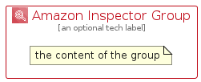

# AmazonInspector


```text
aws-q3-2022/Architecture/SecurityIdentityCompliance/AmazonInspector
```

```text
include('aws-q3-2022/Architecture/SecurityIdentityCompliance/AmazonInspector')
```


| Illustration | AmazonInspector | AmazonInspectorCard | AmazonInspectorGroup |
| :---: | :---: | :---: | :---: |
|  |  |  |  |


## AmazonInspector

### Load remotely
```plantuml
@startuml
' configures the library
!global $LIB_BASE_LOCATION="https://raw.githubusercontent.com/tmorin/plantuml-libs/master/distribution"

' loads the library's bootstrap
!include $LIB_BASE_LOCATION/bootstrap.puml

' loads the package bootstrap
include('aws-q3-2022/bootstrap')

' loads the Item which embeds the element AmazonInspector
include('aws-q3-2022/Architecture/SecurityIdentityCompliance/AmazonInspector')

' renders the element
AmazonInspector('AmazonInspector', 'Amazon Inspector', 'an optional tech label', 'an optional description')
@enduml
```

### Load locally
```plantuml
@startuml
' configures the library
!global $INCLUSION_MODE="local"
!global $LIB_BASE_LOCATION="../../.."

' loads the library's bootstrap
!include $LIB_BASE_LOCATION/bootstrap.puml

' loads the package bootstrap
include('aws-q3-2022/bootstrap')

' loads the Item which embeds the element AmazonInspector
include('aws-q3-2022/Architecture/SecurityIdentityCompliance/AmazonInspector')

' renders the element
AmazonInspector('AmazonInspector', 'Amazon Inspector', 'an optional tech label', 'an optional description')
@enduml
```

## AmazonInspectorCard

### Load remotely
```plantuml
@startuml
' configures the library
!global $LIB_BASE_LOCATION="https://raw.githubusercontent.com/tmorin/plantuml-libs/master/distribution"

' loads the library's bootstrap
!include $LIB_BASE_LOCATION/bootstrap.puml

' loads the package bootstrap
include('aws-q3-2022/bootstrap')

' loads the Item which embeds the element AmazonInspectorCard
include('aws-q3-2022/Architecture/SecurityIdentityCompliance/AmazonInspector')

' renders the element
AmazonInspectorCard('AmazonInspectorCard', 'Amazon Inspector Card', 'an optional description')
@enduml
```

### Load locally
```plantuml
@startuml
' configures the library
!global $INCLUSION_MODE="local"
!global $LIB_BASE_LOCATION="../../.."

' loads the library's bootstrap
!include $LIB_BASE_LOCATION/bootstrap.puml

' loads the package bootstrap
include('aws-q3-2022/bootstrap')

' loads the Item which embeds the element AmazonInspectorCard
include('aws-q3-2022/Architecture/SecurityIdentityCompliance/AmazonInspector')

' renders the element
AmazonInspectorCard('AmazonInspectorCard', 'Amazon Inspector Card', 'an optional description')
@enduml
```

## AmazonInspectorGroup

### Load remotely
```plantuml
@startuml
' configures the library
!global $LIB_BASE_LOCATION="https://raw.githubusercontent.com/tmorin/plantuml-libs/master/distribution"

' loads the library's bootstrap
!include $LIB_BASE_LOCATION/bootstrap.puml

' loads the package bootstrap
include('aws-q3-2022/bootstrap')

' loads the Item which embeds the element AmazonInspectorGroup
include('aws-q3-2022/Architecture/SecurityIdentityCompliance/AmazonInspector')

' renders the element
AmazonInspectorGroup('AmazonInspectorGroup', 'Amazon Inspector Group', 'an optional tech label') {
    note as note
        the content of the group
    end note
}
@enduml
```

### Load locally
```plantuml
@startuml
' configures the library
!global $INCLUSION_MODE="local"
!global $LIB_BASE_LOCATION="../../.."

' loads the library's bootstrap
!include $LIB_BASE_LOCATION/bootstrap.puml

' loads the package bootstrap
include('aws-q3-2022/bootstrap')

' loads the Item which embeds the element AmazonInspectorGroup
include('aws-q3-2022/Architecture/SecurityIdentityCompliance/AmazonInspector')

' renders the element
AmazonInspectorGroup('AmazonInspectorGroup', 'Amazon Inspector Group', 'an optional tech label') {
    note as note
        the content of the group
    end note
}
@enduml
```

