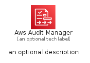
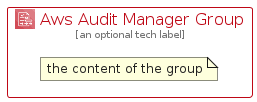

# AwsAuditManager


```text
aws-q3-2022/Architecture/SecurityIdentityCompliance/AwsAuditManager
```

```text
include('aws-q3-2022/Architecture/SecurityIdentityCompliance/AwsAuditManager')
```


| Illustration | AwsAuditManager | AwsAuditManagerCard | AwsAuditManagerGroup |
| :---: | :---: | :---: | :---: |
|  |  |  |  |


## AwsAuditManager

### Load remotely
```plantuml
@startuml
' configures the library
!global $LIB_BASE_LOCATION="https://raw.githubusercontent.com/tmorin/plantuml-libs/master/distribution"

' loads the library's bootstrap
!include $LIB_BASE_LOCATION/bootstrap.puml

' loads the package bootstrap
include('aws-q3-2022/bootstrap')

' loads the Item which embeds the element AwsAuditManager
include('aws-q3-2022/Architecture/SecurityIdentityCompliance/AwsAuditManager')

' renders the element
AwsAuditManager('AwsAuditManager', 'Aws Audit Manager', 'an optional tech label', 'an optional description')
@enduml
```

### Load locally
```plantuml
@startuml
' configures the library
!global $INCLUSION_MODE="local"
!global $LIB_BASE_LOCATION="../../.."

' loads the library's bootstrap
!include $LIB_BASE_LOCATION/bootstrap.puml

' loads the package bootstrap
include('aws-q3-2022/bootstrap')

' loads the Item which embeds the element AwsAuditManager
include('aws-q3-2022/Architecture/SecurityIdentityCompliance/AwsAuditManager')

' renders the element
AwsAuditManager('AwsAuditManager', 'Aws Audit Manager', 'an optional tech label', 'an optional description')
@enduml
```

## AwsAuditManagerCard

### Load remotely
```plantuml
@startuml
' configures the library
!global $LIB_BASE_LOCATION="https://raw.githubusercontent.com/tmorin/plantuml-libs/master/distribution"

' loads the library's bootstrap
!include $LIB_BASE_LOCATION/bootstrap.puml

' loads the package bootstrap
include('aws-q3-2022/bootstrap')

' loads the Item which embeds the element AwsAuditManagerCard
include('aws-q3-2022/Architecture/SecurityIdentityCompliance/AwsAuditManager')

' renders the element
AwsAuditManagerCard('AwsAuditManagerCard', 'Aws Audit Manager Card', 'an optional description')
@enduml
```

### Load locally
```plantuml
@startuml
' configures the library
!global $INCLUSION_MODE="local"
!global $LIB_BASE_LOCATION="../../.."

' loads the library's bootstrap
!include $LIB_BASE_LOCATION/bootstrap.puml

' loads the package bootstrap
include('aws-q3-2022/bootstrap')

' loads the Item which embeds the element AwsAuditManagerCard
include('aws-q3-2022/Architecture/SecurityIdentityCompliance/AwsAuditManager')

' renders the element
AwsAuditManagerCard('AwsAuditManagerCard', 'Aws Audit Manager Card', 'an optional description')
@enduml
```

## AwsAuditManagerGroup

### Load remotely
```plantuml
@startuml
' configures the library
!global $LIB_BASE_LOCATION="https://raw.githubusercontent.com/tmorin/plantuml-libs/master/distribution"

' loads the library's bootstrap
!include $LIB_BASE_LOCATION/bootstrap.puml

' loads the package bootstrap
include('aws-q3-2022/bootstrap')

' loads the Item which embeds the element AwsAuditManagerGroup
include('aws-q3-2022/Architecture/SecurityIdentityCompliance/AwsAuditManager')

' renders the element
AwsAuditManagerGroup('AwsAuditManagerGroup', 'Aws Audit Manager Group', 'an optional tech label') {
    note as note
        the content of the group
    end note
}
@enduml
```

### Load locally
```plantuml
@startuml
' configures the library
!global $INCLUSION_MODE="local"
!global $LIB_BASE_LOCATION="../../.."

' loads the library's bootstrap
!include $LIB_BASE_LOCATION/bootstrap.puml

' loads the package bootstrap
include('aws-q3-2022/bootstrap')

' loads the Item which embeds the element AwsAuditManagerGroup
include('aws-q3-2022/Architecture/SecurityIdentityCompliance/AwsAuditManager')

' renders the element
AwsAuditManagerGroup('AwsAuditManagerGroup', 'Aws Audit Manager Group', 'an optional tech label') {
    note as note
        the content of the group
    end note
}
@enduml
```

