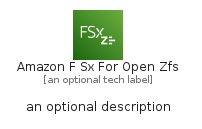

# AmazonFSxForOpenZfs


```text
aws-q3-2022/Architecture/Storage/AmazonFSxForOpenZfs
```

```text
include('aws-q3-2022/Architecture/Storage/AmazonFSxForOpenZfs')
```


| Illustration | AmazonFSxForOpenZfs | AmazonFSxForOpenZfsCard | AmazonFSxForOpenZfsGroup |
| :---: | :---: | :---: | :---: |
|  |  |  |  |


## AmazonFSxForOpenZfs

### Load remotely
```plantuml
@startuml
' configures the library
!global $LIB_BASE_LOCATION="https://raw.githubusercontent.com/tmorin/plantuml-libs/master/distribution"

' loads the library's bootstrap
!include $LIB_BASE_LOCATION/bootstrap.puml

' loads the package bootstrap
include('aws-q3-2022/bootstrap')

' loads the Item which embeds the element AmazonFSxForOpenZfs
include('aws-q3-2022/Architecture/Storage/AmazonFSxForOpenZfs')

' renders the element
AmazonFSxForOpenZfs('AmazonFSxForOpenZfs', 'Amazon F Sx For Open Zfs', 'an optional tech label', 'an optional description')
@enduml
```

### Load locally
```plantuml
@startuml
' configures the library
!global $INCLUSION_MODE="local"
!global $LIB_BASE_LOCATION="../../.."

' loads the library's bootstrap
!include $LIB_BASE_LOCATION/bootstrap.puml

' loads the package bootstrap
include('aws-q3-2022/bootstrap')

' loads the Item which embeds the element AmazonFSxForOpenZfs
include('aws-q3-2022/Architecture/Storage/AmazonFSxForOpenZfs')

' renders the element
AmazonFSxForOpenZfs('AmazonFSxForOpenZfs', 'Amazon F Sx For Open Zfs', 'an optional tech label', 'an optional description')
@enduml
```

## AmazonFSxForOpenZfsCard

### Load remotely
```plantuml
@startuml
' configures the library
!global $LIB_BASE_LOCATION="https://raw.githubusercontent.com/tmorin/plantuml-libs/master/distribution"

' loads the library's bootstrap
!include $LIB_BASE_LOCATION/bootstrap.puml

' loads the package bootstrap
include('aws-q3-2022/bootstrap')

' loads the Item which embeds the element AmazonFSxForOpenZfsCard
include('aws-q3-2022/Architecture/Storage/AmazonFSxForOpenZfs')

' renders the element
AmazonFSxForOpenZfsCard('AmazonFSxForOpenZfsCard', 'Amazon F Sx For Open Zfs Card', 'an optional description')
@enduml
```

### Load locally
```plantuml
@startuml
' configures the library
!global $INCLUSION_MODE="local"
!global $LIB_BASE_LOCATION="../../.."

' loads the library's bootstrap
!include $LIB_BASE_LOCATION/bootstrap.puml

' loads the package bootstrap
include('aws-q3-2022/bootstrap')

' loads the Item which embeds the element AmazonFSxForOpenZfsCard
include('aws-q3-2022/Architecture/Storage/AmazonFSxForOpenZfs')

' renders the element
AmazonFSxForOpenZfsCard('AmazonFSxForOpenZfsCard', 'Amazon F Sx For Open Zfs Card', 'an optional description')
@enduml
```

## AmazonFSxForOpenZfsGroup

### Load remotely
```plantuml
@startuml
' configures the library
!global $LIB_BASE_LOCATION="https://raw.githubusercontent.com/tmorin/plantuml-libs/master/distribution"

' loads the library's bootstrap
!include $LIB_BASE_LOCATION/bootstrap.puml

' loads the package bootstrap
include('aws-q3-2022/bootstrap')

' loads the Item which embeds the element AmazonFSxForOpenZfsGroup
include('aws-q3-2022/Architecture/Storage/AmazonFSxForOpenZfs')

' renders the element
AmazonFSxForOpenZfsGroup('AmazonFSxForOpenZfsGroup', 'Amazon F Sx For Open Zfs Group', 'an optional tech label') {
    note as note
        the content of the group
    end note
}
@enduml
```

### Load locally
```plantuml
@startuml
' configures the library
!global $INCLUSION_MODE="local"
!global $LIB_BASE_LOCATION="../../.."

' loads the library's bootstrap
!include $LIB_BASE_LOCATION/bootstrap.puml

' loads the package bootstrap
include('aws-q3-2022/bootstrap')

' loads the Item which embeds the element AmazonFSxForOpenZfsGroup
include('aws-q3-2022/Architecture/Storage/AmazonFSxForOpenZfs')

' renders the element
AmazonFSxForOpenZfsGroup('AmazonFSxForOpenZfsGroup', 'Amazon F Sx For Open Zfs Group', 'an optional tech label') {
    note as note
        the content of the group
    end note
}
@enduml
```

