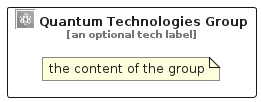

# QuantumTechnologies


```text
aws-q3-2022/Category/QuantumTechnologies
```

```text
include('aws-q3-2022/Category/QuantumTechnologies')
```


| Illustration | QuantumTechnologies | QuantumTechnologiesCard | QuantumTechnologiesGroup |
| :---: | :---: | :---: | :---: |
|  |  |  |  |


## QuantumTechnologies

### Load remotely
```plantuml
@startuml
' configures the library
!global $LIB_BASE_LOCATION="https://raw.githubusercontent.com/tmorin/plantuml-libs/master/distribution"

' loads the library's bootstrap
!include $LIB_BASE_LOCATION/bootstrap.puml

' loads the package bootstrap
include('aws-q3-2022/bootstrap')

' loads the Item which embeds the element QuantumTechnologies
include('aws-q3-2022/Category/QuantumTechnologies')

' renders the element
QuantumTechnologies('QuantumTechnologies', 'Quantum Technologies', 'an optional tech label', 'an optional description')
@enduml
```

### Load locally
```plantuml
@startuml
' configures the library
!global $INCLUSION_MODE="local"
!global $LIB_BASE_LOCATION="../.."

' loads the library's bootstrap
!include $LIB_BASE_LOCATION/bootstrap.puml

' loads the package bootstrap
include('aws-q3-2022/bootstrap')

' loads the Item which embeds the element QuantumTechnologies
include('aws-q3-2022/Category/QuantumTechnologies')

' renders the element
QuantumTechnologies('QuantumTechnologies', 'Quantum Technologies', 'an optional tech label', 'an optional description')
@enduml
```

## QuantumTechnologiesCard

### Load remotely
```plantuml
@startuml
' configures the library
!global $LIB_BASE_LOCATION="https://raw.githubusercontent.com/tmorin/plantuml-libs/master/distribution"

' loads the library's bootstrap
!include $LIB_BASE_LOCATION/bootstrap.puml

' loads the package bootstrap
include('aws-q3-2022/bootstrap')

' loads the Item which embeds the element QuantumTechnologiesCard
include('aws-q3-2022/Category/QuantumTechnologies')

' renders the element
QuantumTechnologiesCard('QuantumTechnologiesCard', 'Quantum Technologies Card', 'an optional description')
@enduml
```

### Load locally
```plantuml
@startuml
' configures the library
!global $INCLUSION_MODE="local"
!global $LIB_BASE_LOCATION="../.."

' loads the library's bootstrap
!include $LIB_BASE_LOCATION/bootstrap.puml

' loads the package bootstrap
include('aws-q3-2022/bootstrap')

' loads the Item which embeds the element QuantumTechnologiesCard
include('aws-q3-2022/Category/QuantumTechnologies')

' renders the element
QuantumTechnologiesCard('QuantumTechnologiesCard', 'Quantum Technologies Card', 'an optional description')
@enduml
```

## QuantumTechnologiesGroup

### Load remotely
```plantuml
@startuml
' configures the library
!global $LIB_BASE_LOCATION="https://raw.githubusercontent.com/tmorin/plantuml-libs/master/distribution"

' loads the library's bootstrap
!include $LIB_BASE_LOCATION/bootstrap.puml

' loads the package bootstrap
include('aws-q3-2022/bootstrap')

' loads the Item which embeds the element QuantumTechnologiesGroup
include('aws-q3-2022/Category/QuantumTechnologies')

' renders the element
QuantumTechnologiesGroup('QuantumTechnologiesGroup', 'Quantum Technologies Group', 'an optional tech label') {
    note as note
        the content of the group
    end note
}
@enduml
```

### Load locally
```plantuml
@startuml
' configures the library
!global $INCLUSION_MODE="local"
!global $LIB_BASE_LOCATION="../.."

' loads the library's bootstrap
!include $LIB_BASE_LOCATION/bootstrap.puml

' loads the package bootstrap
include('aws-q3-2022/bootstrap')

' loads the Item which embeds the element QuantumTechnologiesGroup
include('aws-q3-2022/Category/QuantumTechnologies')

' renders the element
QuantumTechnologiesGroup('QuantumTechnologiesGroup', 'Quantum Technologies Group', 'an optional tech label') {
    note as note
        the content of the group
    end note
}
@enduml
```

