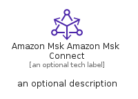

# AmazonMskAmazonMskConnect


```text
aws-q3-2022/Resource/Analytics/AmazonMskAmazonMskConnect
```

```text
include('aws-q3-2022/Resource/Analytics/AmazonMskAmazonMskConnect')
```


| Illustration | AmazonMskAmazonMskConnect | AmazonMskAmazonMskConnectCard | AmazonMskAmazonMskConnectGroup |
| :---: | :---: | :---: | :---: |
|  |  |  |  |


## AmazonMskAmazonMskConnect

### Load remotely
```plantuml
@startuml
' configures the library
!global $LIB_BASE_LOCATION="https://raw.githubusercontent.com/tmorin/plantuml-libs/master/distribution"

' loads the library's bootstrap
!include $LIB_BASE_LOCATION/bootstrap.puml

' loads the package bootstrap
include('aws-q3-2022/bootstrap')

' loads the Item which embeds the element AmazonMskAmazonMskConnect
include('aws-q3-2022/Resource/Analytics/AmazonMskAmazonMskConnect')

' renders the element
AmazonMskAmazonMskConnect('AmazonMskAmazonMskConnect', 'Amazon Msk Amazon Msk Connect', 'an optional tech label', 'an optional description')
@enduml
```

### Load locally
```plantuml
@startuml
' configures the library
!global $INCLUSION_MODE="local"
!global $LIB_BASE_LOCATION="../../.."

' loads the library's bootstrap
!include $LIB_BASE_LOCATION/bootstrap.puml

' loads the package bootstrap
include('aws-q3-2022/bootstrap')

' loads the Item which embeds the element AmazonMskAmazonMskConnect
include('aws-q3-2022/Resource/Analytics/AmazonMskAmazonMskConnect')

' renders the element
AmazonMskAmazonMskConnect('AmazonMskAmazonMskConnect', 'Amazon Msk Amazon Msk Connect', 'an optional tech label', 'an optional description')
@enduml
```

## AmazonMskAmazonMskConnectCard

### Load remotely
```plantuml
@startuml
' configures the library
!global $LIB_BASE_LOCATION="https://raw.githubusercontent.com/tmorin/plantuml-libs/master/distribution"

' loads the library's bootstrap
!include $LIB_BASE_LOCATION/bootstrap.puml

' loads the package bootstrap
include('aws-q3-2022/bootstrap')

' loads the Item which embeds the element AmazonMskAmazonMskConnectCard
include('aws-q3-2022/Resource/Analytics/AmazonMskAmazonMskConnect')

' renders the element
AmazonMskAmazonMskConnectCard('AmazonMskAmazonMskConnectCard', 'Amazon Msk Amazon Msk Connect Card', 'an optional description')
@enduml
```

### Load locally
```plantuml
@startuml
' configures the library
!global $INCLUSION_MODE="local"
!global $LIB_BASE_LOCATION="../../.."

' loads the library's bootstrap
!include $LIB_BASE_LOCATION/bootstrap.puml

' loads the package bootstrap
include('aws-q3-2022/bootstrap')

' loads the Item which embeds the element AmazonMskAmazonMskConnectCard
include('aws-q3-2022/Resource/Analytics/AmazonMskAmazonMskConnect')

' renders the element
AmazonMskAmazonMskConnectCard('AmazonMskAmazonMskConnectCard', 'Amazon Msk Amazon Msk Connect Card', 'an optional description')
@enduml
```

## AmazonMskAmazonMskConnectGroup

### Load remotely
```plantuml
@startuml
' configures the library
!global $LIB_BASE_LOCATION="https://raw.githubusercontent.com/tmorin/plantuml-libs/master/distribution"

' loads the library's bootstrap
!include $LIB_BASE_LOCATION/bootstrap.puml

' loads the package bootstrap
include('aws-q3-2022/bootstrap')

' loads the Item which embeds the element AmazonMskAmazonMskConnectGroup
include('aws-q3-2022/Resource/Analytics/AmazonMskAmazonMskConnect')

' renders the element
AmazonMskAmazonMskConnectGroup('AmazonMskAmazonMskConnectGroup', 'Amazon Msk Amazon Msk Connect Group', 'an optional tech label') {
    note as note
        the content of the group
    end note
}
@enduml
```

### Load locally
```plantuml
@startuml
' configures the library
!global $INCLUSION_MODE="local"
!global $LIB_BASE_LOCATION="../../.."

' loads the library's bootstrap
!include $LIB_BASE_LOCATION/bootstrap.puml

' loads the package bootstrap
include('aws-q3-2022/bootstrap')

' loads the Item which embeds the element AmazonMskAmazonMskConnectGroup
include('aws-q3-2022/Resource/Analytics/AmazonMskAmazonMskConnect')

' renders the element
AmazonMskAmazonMskConnectGroup('AmazonMskAmazonMskConnectGroup', 'Amazon Msk Amazon Msk Connect Group', 'an optional tech label') {
    note as note
        the content of the group
    end note
}
@enduml
```

