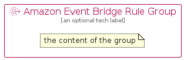

# AmazonEventBridgeRule


```text
aws-q3-2022/Resource/ApplicationIntegration/AmazonEventBridgeRule
```

```text
include('aws-q3-2022/Resource/ApplicationIntegration/AmazonEventBridgeRule')
```


| Illustration | AmazonEventBridgeRule | AmazonEventBridgeRuleCard | AmazonEventBridgeRuleGroup |
| :---: | :---: | :---: | :---: |
|  |  |  |  |


## AmazonEventBridgeRule

### Load remotely
```plantuml
@startuml
' configures the library
!global $LIB_BASE_LOCATION="https://raw.githubusercontent.com/tmorin/plantuml-libs/master/distribution"

' loads the library's bootstrap
!include $LIB_BASE_LOCATION/bootstrap.puml

' loads the package bootstrap
include('aws-q3-2022/bootstrap')

' loads the Item which embeds the element AmazonEventBridgeRule
include('aws-q3-2022/Resource/ApplicationIntegration/AmazonEventBridgeRule')

' renders the element
AmazonEventBridgeRule('AmazonEventBridgeRule', 'Amazon Event Bridge Rule', 'an optional tech label', 'an optional description')
@enduml
```

### Load locally
```plantuml
@startuml
' configures the library
!global $INCLUSION_MODE="local"
!global $LIB_BASE_LOCATION="../../.."

' loads the library's bootstrap
!include $LIB_BASE_LOCATION/bootstrap.puml

' loads the package bootstrap
include('aws-q3-2022/bootstrap')

' loads the Item which embeds the element AmazonEventBridgeRule
include('aws-q3-2022/Resource/ApplicationIntegration/AmazonEventBridgeRule')

' renders the element
AmazonEventBridgeRule('AmazonEventBridgeRule', 'Amazon Event Bridge Rule', 'an optional tech label', 'an optional description')
@enduml
```

## AmazonEventBridgeRuleCard

### Load remotely
```plantuml
@startuml
' configures the library
!global $LIB_BASE_LOCATION="https://raw.githubusercontent.com/tmorin/plantuml-libs/master/distribution"

' loads the library's bootstrap
!include $LIB_BASE_LOCATION/bootstrap.puml

' loads the package bootstrap
include('aws-q3-2022/bootstrap')

' loads the Item which embeds the element AmazonEventBridgeRuleCard
include('aws-q3-2022/Resource/ApplicationIntegration/AmazonEventBridgeRule')

' renders the element
AmazonEventBridgeRuleCard('AmazonEventBridgeRuleCard', 'Amazon Event Bridge Rule Card', 'an optional description')
@enduml
```

### Load locally
```plantuml
@startuml
' configures the library
!global $INCLUSION_MODE="local"
!global $LIB_BASE_LOCATION="../../.."

' loads the library's bootstrap
!include $LIB_BASE_LOCATION/bootstrap.puml

' loads the package bootstrap
include('aws-q3-2022/bootstrap')

' loads the Item which embeds the element AmazonEventBridgeRuleCard
include('aws-q3-2022/Resource/ApplicationIntegration/AmazonEventBridgeRule')

' renders the element
AmazonEventBridgeRuleCard('AmazonEventBridgeRuleCard', 'Amazon Event Bridge Rule Card', 'an optional description')
@enduml
```

## AmazonEventBridgeRuleGroup

### Load remotely
```plantuml
@startuml
' configures the library
!global $LIB_BASE_LOCATION="https://raw.githubusercontent.com/tmorin/plantuml-libs/master/distribution"

' loads the library's bootstrap
!include $LIB_BASE_LOCATION/bootstrap.puml

' loads the package bootstrap
include('aws-q3-2022/bootstrap')

' loads the Item which embeds the element AmazonEventBridgeRuleGroup
include('aws-q3-2022/Resource/ApplicationIntegration/AmazonEventBridgeRule')

' renders the element
AmazonEventBridgeRuleGroup('AmazonEventBridgeRuleGroup', 'Amazon Event Bridge Rule Group', 'an optional tech label') {
    note as note
        the content of the group
    end note
}
@enduml
```

### Load locally
```plantuml
@startuml
' configures the library
!global $INCLUSION_MODE="local"
!global $LIB_BASE_LOCATION="../../.."

' loads the library's bootstrap
!include $LIB_BASE_LOCATION/bootstrap.puml

' loads the package bootstrap
include('aws-q3-2022/bootstrap')

' loads the Item which embeds the element AmazonEventBridgeRuleGroup
include('aws-q3-2022/Resource/ApplicationIntegration/AmazonEventBridgeRule')

' renders the element
AmazonEventBridgeRuleGroup('AmazonEventBridgeRuleGroup', 'Amazon Event Bridge Rule Group', 'an optional tech label') {
    note as note
        the content of the group
    end note
}
@enduml
```

