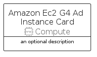

# AmazonEc2G4AdInstance


```text
aws-q3-2022/Resource/Compute/AmazonEc2G4AdInstance
```

```text
include('aws-q3-2022/Resource/Compute/AmazonEc2G4AdInstance')
```


| Illustration | AmazonEc2G4AdInstance | AmazonEc2G4AdInstanceCard | AmazonEc2G4AdInstanceGroup |
| :---: | :---: | :---: | :---: |
|  |  |  |  |


## AmazonEc2G4AdInstance

### Load remotely
```plantuml
@startuml
' configures the library
!global $LIB_BASE_LOCATION="https://raw.githubusercontent.com/tmorin/plantuml-libs/master/distribution"

' loads the library's bootstrap
!include $LIB_BASE_LOCATION/bootstrap.puml

' loads the package bootstrap
include('aws-q3-2022/bootstrap')

' loads the Item which embeds the element AmazonEc2G4AdInstance
include('aws-q3-2022/Resource/Compute/AmazonEc2G4AdInstance')

' renders the element
AmazonEc2G4AdInstance('AmazonEc2G4AdInstance', 'Amazon Ec2 G4 Ad Instance', 'an optional tech label', 'an optional description')
@enduml
```

### Load locally
```plantuml
@startuml
' configures the library
!global $INCLUSION_MODE="local"
!global $LIB_BASE_LOCATION="../../.."

' loads the library's bootstrap
!include $LIB_BASE_LOCATION/bootstrap.puml

' loads the package bootstrap
include('aws-q3-2022/bootstrap')

' loads the Item which embeds the element AmazonEc2G4AdInstance
include('aws-q3-2022/Resource/Compute/AmazonEc2G4AdInstance')

' renders the element
AmazonEc2G4AdInstance('AmazonEc2G4AdInstance', 'Amazon Ec2 G4 Ad Instance', 'an optional tech label', 'an optional description')
@enduml
```

## AmazonEc2G4AdInstanceCard

### Load remotely
```plantuml
@startuml
' configures the library
!global $LIB_BASE_LOCATION="https://raw.githubusercontent.com/tmorin/plantuml-libs/master/distribution"

' loads the library's bootstrap
!include $LIB_BASE_LOCATION/bootstrap.puml

' loads the package bootstrap
include('aws-q3-2022/bootstrap')

' loads the Item which embeds the element AmazonEc2G4AdInstanceCard
include('aws-q3-2022/Resource/Compute/AmazonEc2G4AdInstance')

' renders the element
AmazonEc2G4AdInstanceCard('AmazonEc2G4AdInstanceCard', 'Amazon Ec2 G4 Ad Instance Card', 'an optional description')
@enduml
```

### Load locally
```plantuml
@startuml
' configures the library
!global $INCLUSION_MODE="local"
!global $LIB_BASE_LOCATION="../../.."

' loads the library's bootstrap
!include $LIB_BASE_LOCATION/bootstrap.puml

' loads the package bootstrap
include('aws-q3-2022/bootstrap')

' loads the Item which embeds the element AmazonEc2G4AdInstanceCard
include('aws-q3-2022/Resource/Compute/AmazonEc2G4AdInstance')

' renders the element
AmazonEc2G4AdInstanceCard('AmazonEc2G4AdInstanceCard', 'Amazon Ec2 G4 Ad Instance Card', 'an optional description')
@enduml
```

## AmazonEc2G4AdInstanceGroup

### Load remotely
```plantuml
@startuml
' configures the library
!global $LIB_BASE_LOCATION="https://raw.githubusercontent.com/tmorin/plantuml-libs/master/distribution"

' loads the library's bootstrap
!include $LIB_BASE_LOCATION/bootstrap.puml

' loads the package bootstrap
include('aws-q3-2022/bootstrap')

' loads the Item which embeds the element AmazonEc2G4AdInstanceGroup
include('aws-q3-2022/Resource/Compute/AmazonEc2G4AdInstance')

' renders the element
AmazonEc2G4AdInstanceGroup('AmazonEc2G4AdInstanceGroup', 'Amazon Ec2 G4 Ad Instance Group', 'an optional tech label') {
    note as note
        the content of the group
    end note
}
@enduml
```

### Load locally
```plantuml
@startuml
' configures the library
!global $INCLUSION_MODE="local"
!global $LIB_BASE_LOCATION="../../.."

' loads the library's bootstrap
!include $LIB_BASE_LOCATION/bootstrap.puml

' loads the package bootstrap
include('aws-q3-2022/bootstrap')

' loads the Item which embeds the element AmazonEc2G4AdInstanceGroup
include('aws-q3-2022/Resource/Compute/AmazonEc2G4AdInstance')

' renders the element
AmazonEc2G4AdInstanceGroup('AmazonEc2G4AdInstanceGroup', 'Amazon Ec2 G4 Ad Instance Group', 'an optional tech label') {
    note as note
        the content of the group
    end note
}
@enduml
```

