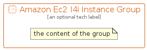

# AmazonEc2I4IInstance


```text
aws-q3-2022/Resource/Compute/AmazonEc2I4IInstance
```

```text
include('aws-q3-2022/Resource/Compute/AmazonEc2I4IInstance')
```


| Illustration | AmazonEc2I4IInstance | AmazonEc2I4IInstanceCard | AmazonEc2I4IInstanceGroup |
| :---: | :---: | :---: | :---: |
|  |  |  |  |


## AmazonEc2I4IInstance

### Load remotely
```plantuml
@startuml
' configures the library
!global $LIB_BASE_LOCATION="https://raw.githubusercontent.com/tmorin/plantuml-libs/master/distribution"

' loads the library's bootstrap
!include $LIB_BASE_LOCATION/bootstrap.puml

' loads the package bootstrap
include('aws-q3-2022/bootstrap')

' loads the Item which embeds the element AmazonEc2I4IInstance
include('aws-q3-2022/Resource/Compute/AmazonEc2I4IInstance')

' renders the element
AmazonEc2I4IInstance('AmazonEc2I4iInstance', 'Amazon Ec2 I4i Instance', 'an optional tech label', 'an optional description')
@enduml
```

### Load locally
```plantuml
@startuml
' configures the library
!global $INCLUSION_MODE="local"
!global $LIB_BASE_LOCATION="../../.."

' loads the library's bootstrap
!include $LIB_BASE_LOCATION/bootstrap.puml

' loads the package bootstrap
include('aws-q3-2022/bootstrap')

' loads the Item which embeds the element AmazonEc2I4IInstance
include('aws-q3-2022/Resource/Compute/AmazonEc2I4IInstance')

' renders the element
AmazonEc2I4IInstance('AmazonEc2I4iInstance', 'Amazon Ec2 I4i Instance', 'an optional tech label', 'an optional description')
@enduml
```

## AmazonEc2I4IInstanceCard

### Load remotely
```plantuml
@startuml
' configures the library
!global $LIB_BASE_LOCATION="https://raw.githubusercontent.com/tmorin/plantuml-libs/master/distribution"

' loads the library's bootstrap
!include $LIB_BASE_LOCATION/bootstrap.puml

' loads the package bootstrap
include('aws-q3-2022/bootstrap')

' loads the Item which embeds the element AmazonEc2I4IInstanceCard
include('aws-q3-2022/Resource/Compute/AmazonEc2I4IInstance')

' renders the element
AmazonEc2I4IInstanceCard('AmazonEc2I4iInstanceCard', 'Amazon Ec2 I4i Instance Card', 'an optional description')
@enduml
```

### Load locally
```plantuml
@startuml
' configures the library
!global $INCLUSION_MODE="local"
!global $LIB_BASE_LOCATION="../../.."

' loads the library's bootstrap
!include $LIB_BASE_LOCATION/bootstrap.puml

' loads the package bootstrap
include('aws-q3-2022/bootstrap')

' loads the Item which embeds the element AmazonEc2I4IInstanceCard
include('aws-q3-2022/Resource/Compute/AmazonEc2I4IInstance')

' renders the element
AmazonEc2I4IInstanceCard('AmazonEc2I4iInstanceCard', 'Amazon Ec2 I4i Instance Card', 'an optional description')
@enduml
```

## AmazonEc2I4IInstanceGroup

### Load remotely
```plantuml
@startuml
' configures the library
!global $LIB_BASE_LOCATION="https://raw.githubusercontent.com/tmorin/plantuml-libs/master/distribution"

' loads the library's bootstrap
!include $LIB_BASE_LOCATION/bootstrap.puml

' loads the package bootstrap
include('aws-q3-2022/bootstrap')

' loads the Item which embeds the element AmazonEc2I4IInstanceGroup
include('aws-q3-2022/Resource/Compute/AmazonEc2I4IInstance')

' renders the element
AmazonEc2I4IInstanceGroup('AmazonEc2I4iInstanceGroup', 'Amazon Ec2 I4i Instance Group', 'an optional tech label') {
    note as note
        the content of the group
    end note
}
@enduml
```

### Load locally
```plantuml
@startuml
' configures the library
!global $INCLUSION_MODE="local"
!global $LIB_BASE_LOCATION="../../.."

' loads the library's bootstrap
!include $LIB_BASE_LOCATION/bootstrap.puml

' loads the package bootstrap
include('aws-q3-2022/bootstrap')

' loads the Item which embeds the element AmazonEc2I4IInstanceGroup
include('aws-q3-2022/Resource/Compute/AmazonEc2I4IInstance')

' renders the element
AmazonEc2I4IInstanceGroup('AmazonEc2I4iInstanceGroup', 'Amazon Ec2 I4i Instance Group', 'an optional tech label') {
    note as note
        the content of the group
    end note
}
@enduml
```

