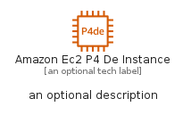
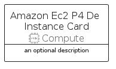
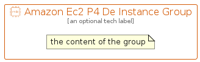

# AmazonEc2P4DeInstance


```text
aws-q3-2022/Resource/Compute/AmazonEc2P4DeInstance
```

```text
include('aws-q3-2022/Resource/Compute/AmazonEc2P4DeInstance')
```


| Illustration | AmazonEc2P4DeInstance | AmazonEc2P4DeInstanceCard | AmazonEc2P4DeInstanceGroup |
| :---: | :---: | :---: | :---: |
|  |  |  |  |


## AmazonEc2P4DeInstance

### Load remotely
```plantuml
@startuml
' configures the library
!global $LIB_BASE_LOCATION="https://raw.githubusercontent.com/tmorin/plantuml-libs/master/distribution"

' loads the library's bootstrap
!include $LIB_BASE_LOCATION/bootstrap.puml

' loads the package bootstrap
include('aws-q3-2022/bootstrap')

' loads the Item which embeds the element AmazonEc2P4DeInstance
include('aws-q3-2022/Resource/Compute/AmazonEc2P4DeInstance')

' renders the element
AmazonEc2P4DeInstance('AmazonEc2P4DeInstance', 'Amazon Ec2 P4 De Instance', 'an optional tech label', 'an optional description')
@enduml
```

### Load locally
```plantuml
@startuml
' configures the library
!global $INCLUSION_MODE="local"
!global $LIB_BASE_LOCATION="../../.."

' loads the library's bootstrap
!include $LIB_BASE_LOCATION/bootstrap.puml

' loads the package bootstrap
include('aws-q3-2022/bootstrap')

' loads the Item which embeds the element AmazonEc2P4DeInstance
include('aws-q3-2022/Resource/Compute/AmazonEc2P4DeInstance')

' renders the element
AmazonEc2P4DeInstance('AmazonEc2P4DeInstance', 'Amazon Ec2 P4 De Instance', 'an optional tech label', 'an optional description')
@enduml
```

## AmazonEc2P4DeInstanceCard

### Load remotely
```plantuml
@startuml
' configures the library
!global $LIB_BASE_LOCATION="https://raw.githubusercontent.com/tmorin/plantuml-libs/master/distribution"

' loads the library's bootstrap
!include $LIB_BASE_LOCATION/bootstrap.puml

' loads the package bootstrap
include('aws-q3-2022/bootstrap')

' loads the Item which embeds the element AmazonEc2P4DeInstanceCard
include('aws-q3-2022/Resource/Compute/AmazonEc2P4DeInstance')

' renders the element
AmazonEc2P4DeInstanceCard('AmazonEc2P4DeInstanceCard', 'Amazon Ec2 P4 De Instance Card', 'an optional description')
@enduml
```

### Load locally
```plantuml
@startuml
' configures the library
!global $INCLUSION_MODE="local"
!global $LIB_BASE_LOCATION="../../.."

' loads the library's bootstrap
!include $LIB_BASE_LOCATION/bootstrap.puml

' loads the package bootstrap
include('aws-q3-2022/bootstrap')

' loads the Item which embeds the element AmazonEc2P4DeInstanceCard
include('aws-q3-2022/Resource/Compute/AmazonEc2P4DeInstance')

' renders the element
AmazonEc2P4DeInstanceCard('AmazonEc2P4DeInstanceCard', 'Amazon Ec2 P4 De Instance Card', 'an optional description')
@enduml
```

## AmazonEc2P4DeInstanceGroup

### Load remotely
```plantuml
@startuml
' configures the library
!global $LIB_BASE_LOCATION="https://raw.githubusercontent.com/tmorin/plantuml-libs/master/distribution"

' loads the library's bootstrap
!include $LIB_BASE_LOCATION/bootstrap.puml

' loads the package bootstrap
include('aws-q3-2022/bootstrap')

' loads the Item which embeds the element AmazonEc2P4DeInstanceGroup
include('aws-q3-2022/Resource/Compute/AmazonEc2P4DeInstance')

' renders the element
AmazonEc2P4DeInstanceGroup('AmazonEc2P4DeInstanceGroup', 'Amazon Ec2 P4 De Instance Group', 'an optional tech label') {
    note as note
        the content of the group
    end note
}
@enduml
```

### Load locally
```plantuml
@startuml
' configures the library
!global $INCLUSION_MODE="local"
!global $LIB_BASE_LOCATION="../../.."

' loads the library's bootstrap
!include $LIB_BASE_LOCATION/bootstrap.puml

' loads the package bootstrap
include('aws-q3-2022/bootstrap')

' loads the Item which embeds the element AmazonEc2P4DeInstanceGroup
include('aws-q3-2022/Resource/Compute/AmazonEc2P4DeInstance')

' renders the element
AmazonEc2P4DeInstanceGroup('AmazonEc2P4DeInstanceGroup', 'Amazon Ec2 P4 De Instance Group', 'an optional tech label') {
    note as note
        the content of the group
    end note
}
@enduml
```

