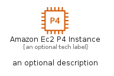
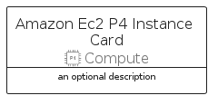
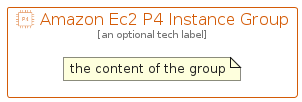

# AmazonEc2P4Instance


```text
aws-q3-2022/Resource/Compute/AmazonEc2P4Instance
```

```text
include('aws-q3-2022/Resource/Compute/AmazonEc2P4Instance')
```


| Illustration | AmazonEc2P4Instance | AmazonEc2P4InstanceCard | AmazonEc2P4InstanceGroup |
| :---: | :---: | :---: | :---: |
|  |  |  |  |


## AmazonEc2P4Instance

### Load remotely
```plantuml
@startuml
' configures the library
!global $LIB_BASE_LOCATION="https://raw.githubusercontent.com/tmorin/plantuml-libs/master/distribution"

' loads the library's bootstrap
!include $LIB_BASE_LOCATION/bootstrap.puml

' loads the package bootstrap
include('aws-q3-2022/bootstrap')

' loads the Item which embeds the element AmazonEc2P4Instance
include('aws-q3-2022/Resource/Compute/AmazonEc2P4Instance')

' renders the element
AmazonEc2P4Instance('AmazonEc2P4Instance', 'Amazon Ec2 P4 Instance', 'an optional tech label', 'an optional description')
@enduml
```

### Load locally
```plantuml
@startuml
' configures the library
!global $INCLUSION_MODE="local"
!global $LIB_BASE_LOCATION="../../.."

' loads the library's bootstrap
!include $LIB_BASE_LOCATION/bootstrap.puml

' loads the package bootstrap
include('aws-q3-2022/bootstrap')

' loads the Item which embeds the element AmazonEc2P4Instance
include('aws-q3-2022/Resource/Compute/AmazonEc2P4Instance')

' renders the element
AmazonEc2P4Instance('AmazonEc2P4Instance', 'Amazon Ec2 P4 Instance', 'an optional tech label', 'an optional description')
@enduml
```

## AmazonEc2P4InstanceCard

### Load remotely
```plantuml
@startuml
' configures the library
!global $LIB_BASE_LOCATION="https://raw.githubusercontent.com/tmorin/plantuml-libs/master/distribution"

' loads the library's bootstrap
!include $LIB_BASE_LOCATION/bootstrap.puml

' loads the package bootstrap
include('aws-q3-2022/bootstrap')

' loads the Item which embeds the element AmazonEc2P4InstanceCard
include('aws-q3-2022/Resource/Compute/AmazonEc2P4Instance')

' renders the element
AmazonEc2P4InstanceCard('AmazonEc2P4InstanceCard', 'Amazon Ec2 P4 Instance Card', 'an optional description')
@enduml
```

### Load locally
```plantuml
@startuml
' configures the library
!global $INCLUSION_MODE="local"
!global $LIB_BASE_LOCATION="../../.."

' loads the library's bootstrap
!include $LIB_BASE_LOCATION/bootstrap.puml

' loads the package bootstrap
include('aws-q3-2022/bootstrap')

' loads the Item which embeds the element AmazonEc2P4InstanceCard
include('aws-q3-2022/Resource/Compute/AmazonEc2P4Instance')

' renders the element
AmazonEc2P4InstanceCard('AmazonEc2P4InstanceCard', 'Amazon Ec2 P4 Instance Card', 'an optional description')
@enduml
```

## AmazonEc2P4InstanceGroup

### Load remotely
```plantuml
@startuml
' configures the library
!global $LIB_BASE_LOCATION="https://raw.githubusercontent.com/tmorin/plantuml-libs/master/distribution"

' loads the library's bootstrap
!include $LIB_BASE_LOCATION/bootstrap.puml

' loads the package bootstrap
include('aws-q3-2022/bootstrap')

' loads the Item which embeds the element AmazonEc2P4InstanceGroup
include('aws-q3-2022/Resource/Compute/AmazonEc2P4Instance')

' renders the element
AmazonEc2P4InstanceGroup('AmazonEc2P4InstanceGroup', 'Amazon Ec2 P4 Instance Group', 'an optional tech label') {
    note as note
        the content of the group
    end note
}
@enduml
```

### Load locally
```plantuml
@startuml
' configures the library
!global $INCLUSION_MODE="local"
!global $LIB_BASE_LOCATION="../../.."

' loads the library's bootstrap
!include $LIB_BASE_LOCATION/bootstrap.puml

' loads the package bootstrap
include('aws-q3-2022/bootstrap')

' loads the Item which embeds the element AmazonEc2P4InstanceGroup
include('aws-q3-2022/Resource/Compute/AmazonEc2P4Instance')

' renders the element
AmazonEc2P4InstanceGroup('AmazonEc2P4InstanceGroup', 'Amazon Ec2 P4 Instance Group', 'an optional tech label') {
    note as note
        the content of the group
    end note
}
@enduml
```

