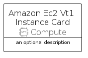
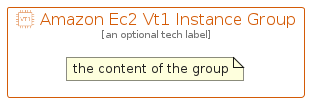

# AmazonEc2Vt1Instance


```text
aws-q3-2022/Resource/Compute/AmazonEc2Vt1Instance
```

```text
include('aws-q3-2022/Resource/Compute/AmazonEc2Vt1Instance')
```


| Illustration | AmazonEc2Vt1Instance | AmazonEc2Vt1InstanceCard | AmazonEc2Vt1InstanceGroup |
| :---: | :---: | :---: | :---: |
|  |  |  |  |


## AmazonEc2Vt1Instance

### Load remotely
```plantuml
@startuml
' configures the library
!global $LIB_BASE_LOCATION="https://raw.githubusercontent.com/tmorin/plantuml-libs/master/distribution"

' loads the library's bootstrap
!include $LIB_BASE_LOCATION/bootstrap.puml

' loads the package bootstrap
include('aws-q3-2022/bootstrap')

' loads the Item which embeds the element AmazonEc2Vt1Instance
include('aws-q3-2022/Resource/Compute/AmazonEc2Vt1Instance')

' renders the element
AmazonEc2Vt1Instance('AmazonEc2Vt1Instance', 'Amazon Ec2 Vt1 Instance', 'an optional tech label', 'an optional description')
@enduml
```

### Load locally
```plantuml
@startuml
' configures the library
!global $INCLUSION_MODE="local"
!global $LIB_BASE_LOCATION="../../.."

' loads the library's bootstrap
!include $LIB_BASE_LOCATION/bootstrap.puml

' loads the package bootstrap
include('aws-q3-2022/bootstrap')

' loads the Item which embeds the element AmazonEc2Vt1Instance
include('aws-q3-2022/Resource/Compute/AmazonEc2Vt1Instance')

' renders the element
AmazonEc2Vt1Instance('AmazonEc2Vt1Instance', 'Amazon Ec2 Vt1 Instance', 'an optional tech label', 'an optional description')
@enduml
```

## AmazonEc2Vt1InstanceCard

### Load remotely
```plantuml
@startuml
' configures the library
!global $LIB_BASE_LOCATION="https://raw.githubusercontent.com/tmorin/plantuml-libs/master/distribution"

' loads the library's bootstrap
!include $LIB_BASE_LOCATION/bootstrap.puml

' loads the package bootstrap
include('aws-q3-2022/bootstrap')

' loads the Item which embeds the element AmazonEc2Vt1InstanceCard
include('aws-q3-2022/Resource/Compute/AmazonEc2Vt1Instance')

' renders the element
AmazonEc2Vt1InstanceCard('AmazonEc2Vt1InstanceCard', 'Amazon Ec2 Vt1 Instance Card', 'an optional description')
@enduml
```

### Load locally
```plantuml
@startuml
' configures the library
!global $INCLUSION_MODE="local"
!global $LIB_BASE_LOCATION="../../.."

' loads the library's bootstrap
!include $LIB_BASE_LOCATION/bootstrap.puml

' loads the package bootstrap
include('aws-q3-2022/bootstrap')

' loads the Item which embeds the element AmazonEc2Vt1InstanceCard
include('aws-q3-2022/Resource/Compute/AmazonEc2Vt1Instance')

' renders the element
AmazonEc2Vt1InstanceCard('AmazonEc2Vt1InstanceCard', 'Amazon Ec2 Vt1 Instance Card', 'an optional description')
@enduml
```

## AmazonEc2Vt1InstanceGroup

### Load remotely
```plantuml
@startuml
' configures the library
!global $LIB_BASE_LOCATION="https://raw.githubusercontent.com/tmorin/plantuml-libs/master/distribution"

' loads the library's bootstrap
!include $LIB_BASE_LOCATION/bootstrap.puml

' loads the package bootstrap
include('aws-q3-2022/bootstrap')

' loads the Item which embeds the element AmazonEc2Vt1InstanceGroup
include('aws-q3-2022/Resource/Compute/AmazonEc2Vt1Instance')

' renders the element
AmazonEc2Vt1InstanceGroup('AmazonEc2Vt1InstanceGroup', 'Amazon Ec2 Vt1 Instance Group', 'an optional tech label') {
    note as note
        the content of the group
    end note
}
@enduml
```

### Load locally
```plantuml
@startuml
' configures the library
!global $INCLUSION_MODE="local"
!global $LIB_BASE_LOCATION="../../.."

' loads the library's bootstrap
!include $LIB_BASE_LOCATION/bootstrap.puml

' loads the package bootstrap
include('aws-q3-2022/bootstrap')

' loads the Item which embeds the element AmazonEc2Vt1InstanceGroup
include('aws-q3-2022/Resource/Compute/AmazonEc2Vt1Instance')

' renders the element
AmazonEc2Vt1InstanceGroup('AmazonEc2Vt1InstanceGroup', 'Amazon Ec2 Vt1 Instance Group', 'an optional tech label') {
    note as note
        the content of the group
    end note
}
@enduml
```

