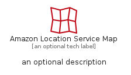
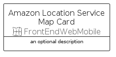

# AmazonLocationServiceMap


```text
aws-q3-2022/Resource/FrontEndWebMobile/AmazonLocationServiceMap
```

```text
include('aws-q3-2022/Resource/FrontEndWebMobile/AmazonLocationServiceMap')
```


| Illustration | AmazonLocationServiceMap | AmazonLocationServiceMapCard | AmazonLocationServiceMapGroup |
| :---: | :---: | :---: | :---: |
|  |  |  |  |


## AmazonLocationServiceMap

### Load remotely
```plantuml
@startuml
' configures the library
!global $LIB_BASE_LOCATION="https://raw.githubusercontent.com/tmorin/plantuml-libs/master/distribution"

' loads the library's bootstrap
!include $LIB_BASE_LOCATION/bootstrap.puml

' loads the package bootstrap
include('aws-q3-2022/bootstrap')

' loads the Item which embeds the element AmazonLocationServiceMap
include('aws-q3-2022/Resource/FrontEndWebMobile/AmazonLocationServiceMap')

' renders the element
AmazonLocationServiceMap('AmazonLocationServiceMap', 'Amazon Location Service Map', 'an optional tech label', 'an optional description')
@enduml
```

### Load locally
```plantuml
@startuml
' configures the library
!global $INCLUSION_MODE="local"
!global $LIB_BASE_LOCATION="../../.."

' loads the library's bootstrap
!include $LIB_BASE_LOCATION/bootstrap.puml

' loads the package bootstrap
include('aws-q3-2022/bootstrap')

' loads the Item which embeds the element AmazonLocationServiceMap
include('aws-q3-2022/Resource/FrontEndWebMobile/AmazonLocationServiceMap')

' renders the element
AmazonLocationServiceMap('AmazonLocationServiceMap', 'Amazon Location Service Map', 'an optional tech label', 'an optional description')
@enduml
```

## AmazonLocationServiceMapCard

### Load remotely
```plantuml
@startuml
' configures the library
!global $LIB_BASE_LOCATION="https://raw.githubusercontent.com/tmorin/plantuml-libs/master/distribution"

' loads the library's bootstrap
!include $LIB_BASE_LOCATION/bootstrap.puml

' loads the package bootstrap
include('aws-q3-2022/bootstrap')

' loads the Item which embeds the element AmazonLocationServiceMapCard
include('aws-q3-2022/Resource/FrontEndWebMobile/AmazonLocationServiceMap')

' renders the element
AmazonLocationServiceMapCard('AmazonLocationServiceMapCard', 'Amazon Location Service Map Card', 'an optional description')
@enduml
```

### Load locally
```plantuml
@startuml
' configures the library
!global $INCLUSION_MODE="local"
!global $LIB_BASE_LOCATION="../../.."

' loads the library's bootstrap
!include $LIB_BASE_LOCATION/bootstrap.puml

' loads the package bootstrap
include('aws-q3-2022/bootstrap')

' loads the Item which embeds the element AmazonLocationServiceMapCard
include('aws-q3-2022/Resource/FrontEndWebMobile/AmazonLocationServiceMap')

' renders the element
AmazonLocationServiceMapCard('AmazonLocationServiceMapCard', 'Amazon Location Service Map Card', 'an optional description')
@enduml
```

## AmazonLocationServiceMapGroup

### Load remotely
```plantuml
@startuml
' configures the library
!global $LIB_BASE_LOCATION="https://raw.githubusercontent.com/tmorin/plantuml-libs/master/distribution"

' loads the library's bootstrap
!include $LIB_BASE_LOCATION/bootstrap.puml

' loads the package bootstrap
include('aws-q3-2022/bootstrap')

' loads the Item which embeds the element AmazonLocationServiceMapGroup
include('aws-q3-2022/Resource/FrontEndWebMobile/AmazonLocationServiceMap')

' renders the element
AmazonLocationServiceMapGroup('AmazonLocationServiceMapGroup', 'Amazon Location Service Map Group', 'an optional tech label') {
    note as note
        the content of the group
    end note
}
@enduml
```

### Load locally
```plantuml
@startuml
' configures the library
!global $INCLUSION_MODE="local"
!global $LIB_BASE_LOCATION="../../.."

' loads the library's bootstrap
!include $LIB_BASE_LOCATION/bootstrap.puml

' loads the package bootstrap
include('aws-q3-2022/bootstrap')

' loads the Item which embeds the element AmazonLocationServiceMapGroup
include('aws-q3-2022/Resource/FrontEndWebMobile/AmazonLocationServiceMap')

' renders the element
AmazonLocationServiceMapGroup('AmazonLocationServiceMapGroup', 'Amazon Location Service Map Group', 'an optional tech label') {
    note as note
        the content of the group
    end note
}
@enduml
```

