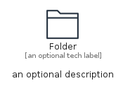

# Folder


```text
aws-q3-2022/Resource/GeneralIcons/Folder
```

```text
include('aws-q3-2022/Resource/GeneralIcons/Folder')
```


| Illustration | Folder | FolderCard | FolderGroup |
| :---: | :---: | :---: | :---: |
|  |  |  |  |


## Folder

### Load remotely
```plantuml
@startuml
' configures the library
!global $LIB_BASE_LOCATION="https://raw.githubusercontent.com/tmorin/plantuml-libs/master/distribution"

' loads the library's bootstrap
!include $LIB_BASE_LOCATION/bootstrap.puml

' loads the package bootstrap
include('aws-q3-2022/bootstrap')

' loads the Item which embeds the element Folder
include('aws-q3-2022/Resource/GeneralIcons/Folder')

' renders the element
Folder('Folder', 'Folder', 'an optional tech label', 'an optional description')
@enduml
```

### Load locally
```plantuml
@startuml
' configures the library
!global $INCLUSION_MODE="local"
!global $LIB_BASE_LOCATION="../../.."

' loads the library's bootstrap
!include $LIB_BASE_LOCATION/bootstrap.puml

' loads the package bootstrap
include('aws-q3-2022/bootstrap')

' loads the Item which embeds the element Folder
include('aws-q3-2022/Resource/GeneralIcons/Folder')

' renders the element
Folder('Folder', 'Folder', 'an optional tech label', 'an optional description')
@enduml
```

## FolderCard

### Load remotely
```plantuml
@startuml
' configures the library
!global $LIB_BASE_LOCATION="https://raw.githubusercontent.com/tmorin/plantuml-libs/master/distribution"

' loads the library's bootstrap
!include $LIB_BASE_LOCATION/bootstrap.puml

' loads the package bootstrap
include('aws-q3-2022/bootstrap')

' loads the Item which embeds the element FolderCard
include('aws-q3-2022/Resource/GeneralIcons/Folder')

' renders the element
FolderCard('FolderCard', 'Folder Card', 'an optional description')
@enduml
```

### Load locally
```plantuml
@startuml
' configures the library
!global $INCLUSION_MODE="local"
!global $LIB_BASE_LOCATION="../../.."

' loads the library's bootstrap
!include $LIB_BASE_LOCATION/bootstrap.puml

' loads the package bootstrap
include('aws-q3-2022/bootstrap')

' loads the Item which embeds the element FolderCard
include('aws-q3-2022/Resource/GeneralIcons/Folder')

' renders the element
FolderCard('FolderCard', 'Folder Card', 'an optional description')
@enduml
```

## FolderGroup

### Load remotely
```plantuml
@startuml
' configures the library
!global $LIB_BASE_LOCATION="https://raw.githubusercontent.com/tmorin/plantuml-libs/master/distribution"

' loads the library's bootstrap
!include $LIB_BASE_LOCATION/bootstrap.puml

' loads the package bootstrap
include('aws-q3-2022/bootstrap')

' loads the Item which embeds the element FolderGroup
include('aws-q3-2022/Resource/GeneralIcons/Folder')

' renders the element
FolderGroup('FolderGroup', 'Folder Group', 'an optional tech label') {
    note as note
        the content of the group
    end note
}
@enduml
```

### Load locally
```plantuml
@startuml
' configures the library
!global $INCLUSION_MODE="local"
!global $LIB_BASE_LOCATION="../../.."

' loads the library's bootstrap
!include $LIB_BASE_LOCATION/bootstrap.puml

' loads the package bootstrap
include('aws-q3-2022/bootstrap')

' loads the Item which embeds the element FolderGroup
include('aws-q3-2022/Resource/GeneralIcons/Folder')

' renders the element
FolderGroup('FolderGroup', 'Folder Group', 'an optional tech label') {
    note as note
        the content of the group
    end note
}
@enduml
```

