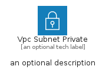
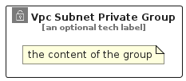

# VpcSubnetPrivate


```text
aws-q3-2022/Resource/GroupIcons/VpcSubnetPrivate
```

```text
include('aws-q3-2022/Resource/GroupIcons/VpcSubnetPrivate')
```


| Illustration | VpcSubnetPrivate | VpcSubnetPrivateCard | VpcSubnetPrivateGroup |
| :---: | :---: | :---: | :---: |
|  |  |  |  |


## VpcSubnetPrivate

### Load remotely
```plantuml
@startuml
' configures the library
!global $LIB_BASE_LOCATION="https://raw.githubusercontent.com/tmorin/plantuml-libs/master/distribution"

' loads the library's bootstrap
!include $LIB_BASE_LOCATION/bootstrap.puml

' loads the package bootstrap
include('aws-q3-2022/bootstrap')

' loads the Item which embeds the element VpcSubnetPrivate
include('aws-q3-2022/Resource/GroupIcons/VpcSubnetPrivate')

' renders the element
VpcSubnetPrivate('VpcSubnetPrivate', 'Vpc Subnet Private', 'an optional tech label', 'an optional description')
@enduml
```

### Load locally
```plantuml
@startuml
' configures the library
!global $INCLUSION_MODE="local"
!global $LIB_BASE_LOCATION="../../.."

' loads the library's bootstrap
!include $LIB_BASE_LOCATION/bootstrap.puml

' loads the package bootstrap
include('aws-q3-2022/bootstrap')

' loads the Item which embeds the element VpcSubnetPrivate
include('aws-q3-2022/Resource/GroupIcons/VpcSubnetPrivate')

' renders the element
VpcSubnetPrivate('VpcSubnetPrivate', 'Vpc Subnet Private', 'an optional tech label', 'an optional description')
@enduml
```

## VpcSubnetPrivateCard

### Load remotely
```plantuml
@startuml
' configures the library
!global $LIB_BASE_LOCATION="https://raw.githubusercontent.com/tmorin/plantuml-libs/master/distribution"

' loads the library's bootstrap
!include $LIB_BASE_LOCATION/bootstrap.puml

' loads the package bootstrap
include('aws-q3-2022/bootstrap')

' loads the Item which embeds the element VpcSubnetPrivateCard
include('aws-q3-2022/Resource/GroupIcons/VpcSubnetPrivate')

' renders the element
VpcSubnetPrivateCard('VpcSubnetPrivateCard', 'Vpc Subnet Private Card', 'an optional description')
@enduml
```

### Load locally
```plantuml
@startuml
' configures the library
!global $INCLUSION_MODE="local"
!global $LIB_BASE_LOCATION="../../.."

' loads the library's bootstrap
!include $LIB_BASE_LOCATION/bootstrap.puml

' loads the package bootstrap
include('aws-q3-2022/bootstrap')

' loads the Item which embeds the element VpcSubnetPrivateCard
include('aws-q3-2022/Resource/GroupIcons/VpcSubnetPrivate')

' renders the element
VpcSubnetPrivateCard('VpcSubnetPrivateCard', 'Vpc Subnet Private Card', 'an optional description')
@enduml
```

## VpcSubnetPrivateGroup

### Load remotely
```plantuml
@startuml
' configures the library
!global $LIB_BASE_LOCATION="https://raw.githubusercontent.com/tmorin/plantuml-libs/master/distribution"

' loads the library's bootstrap
!include $LIB_BASE_LOCATION/bootstrap.puml

' loads the package bootstrap
include('aws-q3-2022/bootstrap')

' loads the Item which embeds the element VpcSubnetPrivateGroup
include('aws-q3-2022/Resource/GroupIcons/VpcSubnetPrivate')

' renders the element
VpcSubnetPrivateGroup('VpcSubnetPrivateGroup', 'Vpc Subnet Private Group', 'an optional tech label') {
    note as note
        the content of the group
    end note
}
@enduml
```

### Load locally
```plantuml
@startuml
' configures the library
!global $INCLUSION_MODE="local"
!global $LIB_BASE_LOCATION="../../.."

' loads the library's bootstrap
!include $LIB_BASE_LOCATION/bootstrap.puml

' loads the package bootstrap
include('aws-q3-2022/bootstrap')

' loads the Item which embeds the element VpcSubnetPrivateGroup
include('aws-q3-2022/Resource/GroupIcons/VpcSubnetPrivate')

' renders the element
VpcSubnetPrivateGroup('VpcSubnetPrivateGroup', 'Vpc Subnet Private Group', 'an optional tech label') {
    note as note
        the content of the group
    end note
}
@enduml
```

