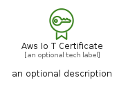

# AwsIoTCertificate


```text
aws-q3-2022/Resource/LoT/AwsIoTCertificate
```

```text
include('aws-q3-2022/Resource/LoT/AwsIoTCertificate')
```


| Illustration | AwsIoTCertificate | AwsIoTCertificateCard | AwsIoTCertificateGroup |
| :---: | :---: | :---: | :---: |
|  |  |  |  |


## AwsIoTCertificate

### Load remotely
```plantuml
@startuml
' configures the library
!global $LIB_BASE_LOCATION="https://raw.githubusercontent.com/tmorin/plantuml-libs/master/distribution"

' loads the library's bootstrap
!include $LIB_BASE_LOCATION/bootstrap.puml

' loads the package bootstrap
include('aws-q3-2022/bootstrap')

' loads the Item which embeds the element AwsIoTCertificate
include('aws-q3-2022/Resource/LoT/AwsIoTCertificate')

' renders the element
AwsIoTCertificate('AwsIoTCertificate', 'Aws Io T Certificate', 'an optional tech label', 'an optional description')
@enduml
```

### Load locally
```plantuml
@startuml
' configures the library
!global $INCLUSION_MODE="local"
!global $LIB_BASE_LOCATION="../../.."

' loads the library's bootstrap
!include $LIB_BASE_LOCATION/bootstrap.puml

' loads the package bootstrap
include('aws-q3-2022/bootstrap')

' loads the Item which embeds the element AwsIoTCertificate
include('aws-q3-2022/Resource/LoT/AwsIoTCertificate')

' renders the element
AwsIoTCertificate('AwsIoTCertificate', 'Aws Io T Certificate', 'an optional tech label', 'an optional description')
@enduml
```

## AwsIoTCertificateCard

### Load remotely
```plantuml
@startuml
' configures the library
!global $LIB_BASE_LOCATION="https://raw.githubusercontent.com/tmorin/plantuml-libs/master/distribution"

' loads the library's bootstrap
!include $LIB_BASE_LOCATION/bootstrap.puml

' loads the package bootstrap
include('aws-q3-2022/bootstrap')

' loads the Item which embeds the element AwsIoTCertificateCard
include('aws-q3-2022/Resource/LoT/AwsIoTCertificate')

' renders the element
AwsIoTCertificateCard('AwsIoTCertificateCard', 'Aws Io T Certificate Card', 'an optional description')
@enduml
```

### Load locally
```plantuml
@startuml
' configures the library
!global $INCLUSION_MODE="local"
!global $LIB_BASE_LOCATION="../../.."

' loads the library's bootstrap
!include $LIB_BASE_LOCATION/bootstrap.puml

' loads the package bootstrap
include('aws-q3-2022/bootstrap')

' loads the Item which embeds the element AwsIoTCertificateCard
include('aws-q3-2022/Resource/LoT/AwsIoTCertificate')

' renders the element
AwsIoTCertificateCard('AwsIoTCertificateCard', 'Aws Io T Certificate Card', 'an optional description')
@enduml
```

## AwsIoTCertificateGroup

### Load remotely
```plantuml
@startuml
' configures the library
!global $LIB_BASE_LOCATION="https://raw.githubusercontent.com/tmorin/plantuml-libs/master/distribution"

' loads the library's bootstrap
!include $LIB_BASE_LOCATION/bootstrap.puml

' loads the package bootstrap
include('aws-q3-2022/bootstrap')

' loads the Item which embeds the element AwsIoTCertificateGroup
include('aws-q3-2022/Resource/LoT/AwsIoTCertificate')

' renders the element
AwsIoTCertificateGroup('AwsIoTCertificateGroup', 'Aws Io T Certificate Group', 'an optional tech label') {
    note as note
        the content of the group
    end note
}
@enduml
```

### Load locally
```plantuml
@startuml
' configures the library
!global $INCLUSION_MODE="local"
!global $LIB_BASE_LOCATION="../../.."

' loads the library's bootstrap
!include $LIB_BASE_LOCATION/bootstrap.puml

' loads the package bootstrap
include('aws-q3-2022/bootstrap')

' loads the Item which embeds the element AwsIoTCertificateGroup
include('aws-q3-2022/Resource/LoT/AwsIoTCertificate')

' renders the element
AwsIoTCertificateGroup('AwsIoTCertificateGroup', 'Aws Io T Certificate Group', 'an optional tech label') {
    note as note
        the content of the group
    end note
}
@enduml
```

