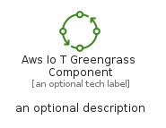

# AwsIoTGreengrassComponent


```text
aws-q3-2022/Resource/LoT/AwsIoTGreengrassComponent
```

```text
include('aws-q3-2022/Resource/LoT/AwsIoTGreengrassComponent')
```


| Illustration | AwsIoTGreengrassComponent | AwsIoTGreengrassComponentCard | AwsIoTGreengrassComponentGroup |
| :---: | :---: | :---: | :---: |
|  |  |  |  |


## AwsIoTGreengrassComponent

### Load remotely
```plantuml
@startuml
' configures the library
!global $LIB_BASE_LOCATION="https://raw.githubusercontent.com/tmorin/plantuml-libs/master/distribution"

' loads the library's bootstrap
!include $LIB_BASE_LOCATION/bootstrap.puml

' loads the package bootstrap
include('aws-q3-2022/bootstrap')

' loads the Item which embeds the element AwsIoTGreengrassComponent
include('aws-q3-2022/Resource/LoT/AwsIoTGreengrassComponent')

' renders the element
AwsIoTGreengrassComponent('AwsIoTGreengrassComponent', 'Aws Io T Greengrass Component', 'an optional tech label', 'an optional description')
@enduml
```

### Load locally
```plantuml
@startuml
' configures the library
!global $INCLUSION_MODE="local"
!global $LIB_BASE_LOCATION="../../.."

' loads the library's bootstrap
!include $LIB_BASE_LOCATION/bootstrap.puml

' loads the package bootstrap
include('aws-q3-2022/bootstrap')

' loads the Item which embeds the element AwsIoTGreengrassComponent
include('aws-q3-2022/Resource/LoT/AwsIoTGreengrassComponent')

' renders the element
AwsIoTGreengrassComponent('AwsIoTGreengrassComponent', 'Aws Io T Greengrass Component', 'an optional tech label', 'an optional description')
@enduml
```

## AwsIoTGreengrassComponentCard

### Load remotely
```plantuml
@startuml
' configures the library
!global $LIB_BASE_LOCATION="https://raw.githubusercontent.com/tmorin/plantuml-libs/master/distribution"

' loads the library's bootstrap
!include $LIB_BASE_LOCATION/bootstrap.puml

' loads the package bootstrap
include('aws-q3-2022/bootstrap')

' loads the Item which embeds the element AwsIoTGreengrassComponentCard
include('aws-q3-2022/Resource/LoT/AwsIoTGreengrassComponent')

' renders the element
AwsIoTGreengrassComponentCard('AwsIoTGreengrassComponentCard', 'Aws Io T Greengrass Component Card', 'an optional description')
@enduml
```

### Load locally
```plantuml
@startuml
' configures the library
!global $INCLUSION_MODE="local"
!global $LIB_BASE_LOCATION="../../.."

' loads the library's bootstrap
!include $LIB_BASE_LOCATION/bootstrap.puml

' loads the package bootstrap
include('aws-q3-2022/bootstrap')

' loads the Item which embeds the element AwsIoTGreengrassComponentCard
include('aws-q3-2022/Resource/LoT/AwsIoTGreengrassComponent')

' renders the element
AwsIoTGreengrassComponentCard('AwsIoTGreengrassComponentCard', 'Aws Io T Greengrass Component Card', 'an optional description')
@enduml
```

## AwsIoTGreengrassComponentGroup

### Load remotely
```plantuml
@startuml
' configures the library
!global $LIB_BASE_LOCATION="https://raw.githubusercontent.com/tmorin/plantuml-libs/master/distribution"

' loads the library's bootstrap
!include $LIB_BASE_LOCATION/bootstrap.puml

' loads the package bootstrap
include('aws-q3-2022/bootstrap')

' loads the Item which embeds the element AwsIoTGreengrassComponentGroup
include('aws-q3-2022/Resource/LoT/AwsIoTGreengrassComponent')

' renders the element
AwsIoTGreengrassComponentGroup('AwsIoTGreengrassComponentGroup', 'Aws Io T Greengrass Component Group', 'an optional tech label') {
    note as note
        the content of the group
    end note
}
@enduml
```

### Load locally
```plantuml
@startuml
' configures the library
!global $INCLUSION_MODE="local"
!global $LIB_BASE_LOCATION="../../.."

' loads the library's bootstrap
!include $LIB_BASE_LOCATION/bootstrap.puml

' loads the package bootstrap
include('aws-q3-2022/bootstrap')

' loads the Item which embeds the element AwsIoTGreengrassComponentGroup
include('aws-q3-2022/Resource/LoT/AwsIoTGreengrassComponent')

' renders the element
AwsIoTGreengrassComponentGroup('AwsIoTGreengrassComponentGroup', 'Aws Io T Greengrass Component Group', 'an optional tech label') {
    note as note
        the content of the group
    end note
}
@enduml
```

