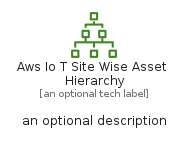
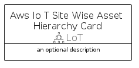

# AwsIoTSiteWiseAssetHierarchy


```text
aws-q3-2022/Resource/LoT/AwsIoTSiteWiseAssetHierarchy
```

```text
include('aws-q3-2022/Resource/LoT/AwsIoTSiteWiseAssetHierarchy')
```


| Illustration | AwsIoTSiteWiseAssetHierarchy | AwsIoTSiteWiseAssetHierarchyCard | AwsIoTSiteWiseAssetHierarchyGroup |
| :---: | :---: | :---: | :---: |
|  |  |  |  |


## AwsIoTSiteWiseAssetHierarchy

### Load remotely
```plantuml
@startuml
' configures the library
!global $LIB_BASE_LOCATION="https://raw.githubusercontent.com/tmorin/plantuml-libs/master/distribution"

' loads the library's bootstrap
!include $LIB_BASE_LOCATION/bootstrap.puml

' loads the package bootstrap
include('aws-q3-2022/bootstrap')

' loads the Item which embeds the element AwsIoTSiteWiseAssetHierarchy
include('aws-q3-2022/Resource/LoT/AwsIoTSiteWiseAssetHierarchy')

' renders the element
AwsIoTSiteWiseAssetHierarchy('AwsIoTSiteWiseAssetHierarchy', 'Aws Io T Site Wise Asset Hierarchy', 'an optional tech label', 'an optional description')
@enduml
```

### Load locally
```plantuml
@startuml
' configures the library
!global $INCLUSION_MODE="local"
!global $LIB_BASE_LOCATION="../../.."

' loads the library's bootstrap
!include $LIB_BASE_LOCATION/bootstrap.puml

' loads the package bootstrap
include('aws-q3-2022/bootstrap')

' loads the Item which embeds the element AwsIoTSiteWiseAssetHierarchy
include('aws-q3-2022/Resource/LoT/AwsIoTSiteWiseAssetHierarchy')

' renders the element
AwsIoTSiteWiseAssetHierarchy('AwsIoTSiteWiseAssetHierarchy', 'Aws Io T Site Wise Asset Hierarchy', 'an optional tech label', 'an optional description')
@enduml
```

## AwsIoTSiteWiseAssetHierarchyCard

### Load remotely
```plantuml
@startuml
' configures the library
!global $LIB_BASE_LOCATION="https://raw.githubusercontent.com/tmorin/plantuml-libs/master/distribution"

' loads the library's bootstrap
!include $LIB_BASE_LOCATION/bootstrap.puml

' loads the package bootstrap
include('aws-q3-2022/bootstrap')

' loads the Item which embeds the element AwsIoTSiteWiseAssetHierarchyCard
include('aws-q3-2022/Resource/LoT/AwsIoTSiteWiseAssetHierarchy')

' renders the element
AwsIoTSiteWiseAssetHierarchyCard('AwsIoTSiteWiseAssetHierarchyCard', 'Aws Io T Site Wise Asset Hierarchy Card', 'an optional description')
@enduml
```

### Load locally
```plantuml
@startuml
' configures the library
!global $INCLUSION_MODE="local"
!global $LIB_BASE_LOCATION="../../.."

' loads the library's bootstrap
!include $LIB_BASE_LOCATION/bootstrap.puml

' loads the package bootstrap
include('aws-q3-2022/bootstrap')

' loads the Item which embeds the element AwsIoTSiteWiseAssetHierarchyCard
include('aws-q3-2022/Resource/LoT/AwsIoTSiteWiseAssetHierarchy')

' renders the element
AwsIoTSiteWiseAssetHierarchyCard('AwsIoTSiteWiseAssetHierarchyCard', 'Aws Io T Site Wise Asset Hierarchy Card', 'an optional description')
@enduml
```

## AwsIoTSiteWiseAssetHierarchyGroup

### Load remotely
```plantuml
@startuml
' configures the library
!global $LIB_BASE_LOCATION="https://raw.githubusercontent.com/tmorin/plantuml-libs/master/distribution"

' loads the library's bootstrap
!include $LIB_BASE_LOCATION/bootstrap.puml

' loads the package bootstrap
include('aws-q3-2022/bootstrap')

' loads the Item which embeds the element AwsIoTSiteWiseAssetHierarchyGroup
include('aws-q3-2022/Resource/LoT/AwsIoTSiteWiseAssetHierarchy')

' renders the element
AwsIoTSiteWiseAssetHierarchyGroup('AwsIoTSiteWiseAssetHierarchyGroup', 'Aws Io T Site Wise Asset Hierarchy Group', 'an optional tech label') {
    note as note
        the content of the group
    end note
}
@enduml
```

### Load locally
```plantuml
@startuml
' configures the library
!global $INCLUSION_MODE="local"
!global $LIB_BASE_LOCATION="../../.."

' loads the library's bootstrap
!include $LIB_BASE_LOCATION/bootstrap.puml

' loads the package bootstrap
include('aws-q3-2022/bootstrap')

' loads the Item which embeds the element AwsIoTSiteWiseAssetHierarchyGroup
include('aws-q3-2022/Resource/LoT/AwsIoTSiteWiseAssetHierarchy')

' renders the element
AwsIoTSiteWiseAssetHierarchyGroup('AwsIoTSiteWiseAssetHierarchyGroup', 'Aws Io T Site Wise Asset Hierarchy Group', 'an optional tech label') {
    note as note
        the content of the group
    end note
}
@enduml
```

