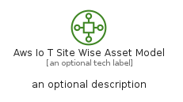

# AwsIoTSiteWiseAssetModel


```text
aws-q3-2022/Resource/LoT/AwsIoTSiteWiseAssetModel
```

```text
include('aws-q3-2022/Resource/LoT/AwsIoTSiteWiseAssetModel')
```


| Illustration | AwsIoTSiteWiseAssetModel | AwsIoTSiteWiseAssetModelCard | AwsIoTSiteWiseAssetModelGroup |
| :---: | :---: | :---: | :---: |
|  |  |  |  |


## AwsIoTSiteWiseAssetModel

### Load remotely
```plantuml
@startuml
' configures the library
!global $LIB_BASE_LOCATION="https://raw.githubusercontent.com/tmorin/plantuml-libs/master/distribution"

' loads the library's bootstrap
!include $LIB_BASE_LOCATION/bootstrap.puml

' loads the package bootstrap
include('aws-q3-2022/bootstrap')

' loads the Item which embeds the element AwsIoTSiteWiseAssetModel
include('aws-q3-2022/Resource/LoT/AwsIoTSiteWiseAssetModel')

' renders the element
AwsIoTSiteWiseAssetModel('AwsIoTSiteWiseAssetModel', 'Aws Io T Site Wise Asset Model', 'an optional tech label', 'an optional description')
@enduml
```

### Load locally
```plantuml
@startuml
' configures the library
!global $INCLUSION_MODE="local"
!global $LIB_BASE_LOCATION="../../.."

' loads the library's bootstrap
!include $LIB_BASE_LOCATION/bootstrap.puml

' loads the package bootstrap
include('aws-q3-2022/bootstrap')

' loads the Item which embeds the element AwsIoTSiteWiseAssetModel
include('aws-q3-2022/Resource/LoT/AwsIoTSiteWiseAssetModel')

' renders the element
AwsIoTSiteWiseAssetModel('AwsIoTSiteWiseAssetModel', 'Aws Io T Site Wise Asset Model', 'an optional tech label', 'an optional description')
@enduml
```

## AwsIoTSiteWiseAssetModelCard

### Load remotely
```plantuml
@startuml
' configures the library
!global $LIB_BASE_LOCATION="https://raw.githubusercontent.com/tmorin/plantuml-libs/master/distribution"

' loads the library's bootstrap
!include $LIB_BASE_LOCATION/bootstrap.puml

' loads the package bootstrap
include('aws-q3-2022/bootstrap')

' loads the Item which embeds the element AwsIoTSiteWiseAssetModelCard
include('aws-q3-2022/Resource/LoT/AwsIoTSiteWiseAssetModel')

' renders the element
AwsIoTSiteWiseAssetModelCard('AwsIoTSiteWiseAssetModelCard', 'Aws Io T Site Wise Asset Model Card', 'an optional description')
@enduml
```

### Load locally
```plantuml
@startuml
' configures the library
!global $INCLUSION_MODE="local"
!global $LIB_BASE_LOCATION="../../.."

' loads the library's bootstrap
!include $LIB_BASE_LOCATION/bootstrap.puml

' loads the package bootstrap
include('aws-q3-2022/bootstrap')

' loads the Item which embeds the element AwsIoTSiteWiseAssetModelCard
include('aws-q3-2022/Resource/LoT/AwsIoTSiteWiseAssetModel')

' renders the element
AwsIoTSiteWiseAssetModelCard('AwsIoTSiteWiseAssetModelCard', 'Aws Io T Site Wise Asset Model Card', 'an optional description')
@enduml
```

## AwsIoTSiteWiseAssetModelGroup

### Load remotely
```plantuml
@startuml
' configures the library
!global $LIB_BASE_LOCATION="https://raw.githubusercontent.com/tmorin/plantuml-libs/master/distribution"

' loads the library's bootstrap
!include $LIB_BASE_LOCATION/bootstrap.puml

' loads the package bootstrap
include('aws-q3-2022/bootstrap')

' loads the Item which embeds the element AwsIoTSiteWiseAssetModelGroup
include('aws-q3-2022/Resource/LoT/AwsIoTSiteWiseAssetModel')

' renders the element
AwsIoTSiteWiseAssetModelGroup('AwsIoTSiteWiseAssetModelGroup', 'Aws Io T Site Wise Asset Model Group', 'an optional tech label') {
    note as note
        the content of the group
    end note
}
@enduml
```

### Load locally
```plantuml
@startuml
' configures the library
!global $INCLUSION_MODE="local"
!global $LIB_BASE_LOCATION="../../.."

' loads the library's bootstrap
!include $LIB_BASE_LOCATION/bootstrap.puml

' loads the package bootstrap
include('aws-q3-2022/bootstrap')

' loads the Item which embeds the element AwsIoTSiteWiseAssetModelGroup
include('aws-q3-2022/Resource/LoT/AwsIoTSiteWiseAssetModel')

' renders the element
AwsIoTSiteWiseAssetModelGroup('AwsIoTSiteWiseAssetModelGroup', 'Aws Io T Site Wise Asset Model Group', 'an optional tech label') {
    note as note
        the content of the group
    end note
}
@enduml
```

