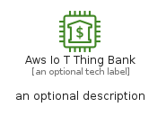

# AwsIoTThingBank


```text
aws-q3-2022/Resource/LoT/AwsIoTThingBank
```

```text
include('aws-q3-2022/Resource/LoT/AwsIoTThingBank')
```


| Illustration | AwsIoTThingBank | AwsIoTThingBankCard | AwsIoTThingBankGroup |
| :---: | :---: | :---: | :---: |
|  |  |  |  |


## AwsIoTThingBank

### Load remotely
```plantuml
@startuml
' configures the library
!global $LIB_BASE_LOCATION="https://raw.githubusercontent.com/tmorin/plantuml-libs/master/distribution"

' loads the library's bootstrap
!include $LIB_BASE_LOCATION/bootstrap.puml

' loads the package bootstrap
include('aws-q3-2022/bootstrap')

' loads the Item which embeds the element AwsIoTThingBank
include('aws-q3-2022/Resource/LoT/AwsIoTThingBank')

' renders the element
AwsIoTThingBank('AwsIoTThingBank', 'Aws Io T Thing Bank', 'an optional tech label', 'an optional description')
@enduml
```

### Load locally
```plantuml
@startuml
' configures the library
!global $INCLUSION_MODE="local"
!global $LIB_BASE_LOCATION="../../.."

' loads the library's bootstrap
!include $LIB_BASE_LOCATION/bootstrap.puml

' loads the package bootstrap
include('aws-q3-2022/bootstrap')

' loads the Item which embeds the element AwsIoTThingBank
include('aws-q3-2022/Resource/LoT/AwsIoTThingBank')

' renders the element
AwsIoTThingBank('AwsIoTThingBank', 'Aws Io T Thing Bank', 'an optional tech label', 'an optional description')
@enduml
```

## AwsIoTThingBankCard

### Load remotely
```plantuml
@startuml
' configures the library
!global $LIB_BASE_LOCATION="https://raw.githubusercontent.com/tmorin/plantuml-libs/master/distribution"

' loads the library's bootstrap
!include $LIB_BASE_LOCATION/bootstrap.puml

' loads the package bootstrap
include('aws-q3-2022/bootstrap')

' loads the Item which embeds the element AwsIoTThingBankCard
include('aws-q3-2022/Resource/LoT/AwsIoTThingBank')

' renders the element
AwsIoTThingBankCard('AwsIoTThingBankCard', 'Aws Io T Thing Bank Card', 'an optional description')
@enduml
```

### Load locally
```plantuml
@startuml
' configures the library
!global $INCLUSION_MODE="local"
!global $LIB_BASE_LOCATION="../../.."

' loads the library's bootstrap
!include $LIB_BASE_LOCATION/bootstrap.puml

' loads the package bootstrap
include('aws-q3-2022/bootstrap')

' loads the Item which embeds the element AwsIoTThingBankCard
include('aws-q3-2022/Resource/LoT/AwsIoTThingBank')

' renders the element
AwsIoTThingBankCard('AwsIoTThingBankCard', 'Aws Io T Thing Bank Card', 'an optional description')
@enduml
```

## AwsIoTThingBankGroup

### Load remotely
```plantuml
@startuml
' configures the library
!global $LIB_BASE_LOCATION="https://raw.githubusercontent.com/tmorin/plantuml-libs/master/distribution"

' loads the library's bootstrap
!include $LIB_BASE_LOCATION/bootstrap.puml

' loads the package bootstrap
include('aws-q3-2022/bootstrap')

' loads the Item which embeds the element AwsIoTThingBankGroup
include('aws-q3-2022/Resource/LoT/AwsIoTThingBank')

' renders the element
AwsIoTThingBankGroup('AwsIoTThingBankGroup', 'Aws Io T Thing Bank Group', 'an optional tech label') {
    note as note
        the content of the group
    end note
}
@enduml
```

### Load locally
```plantuml
@startuml
' configures the library
!global $INCLUSION_MODE="local"
!global $LIB_BASE_LOCATION="../../.."

' loads the library's bootstrap
!include $LIB_BASE_LOCATION/bootstrap.puml

' loads the package bootstrap
include('aws-q3-2022/bootstrap')

' loads the Item which embeds the element AwsIoTThingBankGroup
include('aws-q3-2022/Resource/LoT/AwsIoTThingBank')

' renders the element
AwsIoTThingBankGroup('AwsIoTThingBankGroup', 'Aws Io T Thing Bank Group', 'an optional tech label') {
    note as note
        the content of the group
    end note
}
@enduml
```

