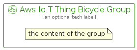

# AwsIoTThingBicycle


```text
aws-q3-2022/Resource/LoT/AwsIoTThingBicycle
```

```text
include('aws-q3-2022/Resource/LoT/AwsIoTThingBicycle')
```


| Illustration | AwsIoTThingBicycle | AwsIoTThingBicycleCard | AwsIoTThingBicycleGroup |
| :---: | :---: | :---: | :---: |
|  |  |  |  |


## AwsIoTThingBicycle

### Load remotely
```plantuml
@startuml
' configures the library
!global $LIB_BASE_LOCATION="https://raw.githubusercontent.com/tmorin/plantuml-libs/master/distribution"

' loads the library's bootstrap
!include $LIB_BASE_LOCATION/bootstrap.puml

' loads the package bootstrap
include('aws-q3-2022/bootstrap')

' loads the Item which embeds the element AwsIoTThingBicycle
include('aws-q3-2022/Resource/LoT/AwsIoTThingBicycle')

' renders the element
AwsIoTThingBicycle('AwsIoTThingBicycle', 'Aws Io T Thing Bicycle', 'an optional tech label', 'an optional description')
@enduml
```

### Load locally
```plantuml
@startuml
' configures the library
!global $INCLUSION_MODE="local"
!global $LIB_BASE_LOCATION="../../.."

' loads the library's bootstrap
!include $LIB_BASE_LOCATION/bootstrap.puml

' loads the package bootstrap
include('aws-q3-2022/bootstrap')

' loads the Item which embeds the element AwsIoTThingBicycle
include('aws-q3-2022/Resource/LoT/AwsIoTThingBicycle')

' renders the element
AwsIoTThingBicycle('AwsIoTThingBicycle', 'Aws Io T Thing Bicycle', 'an optional tech label', 'an optional description')
@enduml
```

## AwsIoTThingBicycleCard

### Load remotely
```plantuml
@startuml
' configures the library
!global $LIB_BASE_LOCATION="https://raw.githubusercontent.com/tmorin/plantuml-libs/master/distribution"

' loads the library's bootstrap
!include $LIB_BASE_LOCATION/bootstrap.puml

' loads the package bootstrap
include('aws-q3-2022/bootstrap')

' loads the Item which embeds the element AwsIoTThingBicycleCard
include('aws-q3-2022/Resource/LoT/AwsIoTThingBicycle')

' renders the element
AwsIoTThingBicycleCard('AwsIoTThingBicycleCard', 'Aws Io T Thing Bicycle Card', 'an optional description')
@enduml
```

### Load locally
```plantuml
@startuml
' configures the library
!global $INCLUSION_MODE="local"
!global $LIB_BASE_LOCATION="../../.."

' loads the library's bootstrap
!include $LIB_BASE_LOCATION/bootstrap.puml

' loads the package bootstrap
include('aws-q3-2022/bootstrap')

' loads the Item which embeds the element AwsIoTThingBicycleCard
include('aws-q3-2022/Resource/LoT/AwsIoTThingBicycle')

' renders the element
AwsIoTThingBicycleCard('AwsIoTThingBicycleCard', 'Aws Io T Thing Bicycle Card', 'an optional description')
@enduml
```

## AwsIoTThingBicycleGroup

### Load remotely
```plantuml
@startuml
' configures the library
!global $LIB_BASE_LOCATION="https://raw.githubusercontent.com/tmorin/plantuml-libs/master/distribution"

' loads the library's bootstrap
!include $LIB_BASE_LOCATION/bootstrap.puml

' loads the package bootstrap
include('aws-q3-2022/bootstrap')

' loads the Item which embeds the element AwsIoTThingBicycleGroup
include('aws-q3-2022/Resource/LoT/AwsIoTThingBicycle')

' renders the element
AwsIoTThingBicycleGroup('AwsIoTThingBicycleGroup', 'Aws Io T Thing Bicycle Group', 'an optional tech label') {
    note as note
        the content of the group
    end note
}
@enduml
```

### Load locally
```plantuml
@startuml
' configures the library
!global $INCLUSION_MODE="local"
!global $LIB_BASE_LOCATION="../../.."

' loads the library's bootstrap
!include $LIB_BASE_LOCATION/bootstrap.puml

' loads the package bootstrap
include('aws-q3-2022/bootstrap')

' loads the Item which embeds the element AwsIoTThingBicycleGroup
include('aws-q3-2022/Resource/LoT/AwsIoTThingBicycle')

' renders the element
AwsIoTThingBicycleGroup('AwsIoTThingBicycleGroup', 'Aws Io T Thing Bicycle Group', 'an optional tech label') {
    note as note
        the content of the group
    end note
}
@enduml
```

