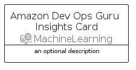
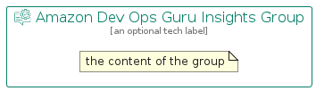

# AmazonDevOpsGuruInsights


```text
aws-q3-2022/Resource/MachineLearning/AmazonDevOpsGuruInsights
```

```text
include('aws-q3-2022/Resource/MachineLearning/AmazonDevOpsGuruInsights')
```


| Illustration | AmazonDevOpsGuruInsights | AmazonDevOpsGuruInsightsCard | AmazonDevOpsGuruInsightsGroup |
| :---: | :---: | :---: | :---: |
|  |  |  |  |


## AmazonDevOpsGuruInsights

### Load remotely
```plantuml
@startuml
' configures the library
!global $LIB_BASE_LOCATION="https://raw.githubusercontent.com/tmorin/plantuml-libs/master/distribution"

' loads the library's bootstrap
!include $LIB_BASE_LOCATION/bootstrap.puml

' loads the package bootstrap
include('aws-q3-2022/bootstrap')

' loads the Item which embeds the element AmazonDevOpsGuruInsights
include('aws-q3-2022/Resource/MachineLearning/AmazonDevOpsGuruInsights')

' renders the element
AmazonDevOpsGuruInsights('AmazonDevOpsGuruInsights', 'Amazon Dev Ops Guru Insights', 'an optional tech label', 'an optional description')
@enduml
```

### Load locally
```plantuml
@startuml
' configures the library
!global $INCLUSION_MODE="local"
!global $LIB_BASE_LOCATION="../../.."

' loads the library's bootstrap
!include $LIB_BASE_LOCATION/bootstrap.puml

' loads the package bootstrap
include('aws-q3-2022/bootstrap')

' loads the Item which embeds the element AmazonDevOpsGuruInsights
include('aws-q3-2022/Resource/MachineLearning/AmazonDevOpsGuruInsights')

' renders the element
AmazonDevOpsGuruInsights('AmazonDevOpsGuruInsights', 'Amazon Dev Ops Guru Insights', 'an optional tech label', 'an optional description')
@enduml
```

## AmazonDevOpsGuruInsightsCard

### Load remotely
```plantuml
@startuml
' configures the library
!global $LIB_BASE_LOCATION="https://raw.githubusercontent.com/tmorin/plantuml-libs/master/distribution"

' loads the library's bootstrap
!include $LIB_BASE_LOCATION/bootstrap.puml

' loads the package bootstrap
include('aws-q3-2022/bootstrap')

' loads the Item which embeds the element AmazonDevOpsGuruInsightsCard
include('aws-q3-2022/Resource/MachineLearning/AmazonDevOpsGuruInsights')

' renders the element
AmazonDevOpsGuruInsightsCard('AmazonDevOpsGuruInsightsCard', 'Amazon Dev Ops Guru Insights Card', 'an optional description')
@enduml
```

### Load locally
```plantuml
@startuml
' configures the library
!global $INCLUSION_MODE="local"
!global $LIB_BASE_LOCATION="../../.."

' loads the library's bootstrap
!include $LIB_BASE_LOCATION/bootstrap.puml

' loads the package bootstrap
include('aws-q3-2022/bootstrap')

' loads the Item which embeds the element AmazonDevOpsGuruInsightsCard
include('aws-q3-2022/Resource/MachineLearning/AmazonDevOpsGuruInsights')

' renders the element
AmazonDevOpsGuruInsightsCard('AmazonDevOpsGuruInsightsCard', 'Amazon Dev Ops Guru Insights Card', 'an optional description')
@enduml
```

## AmazonDevOpsGuruInsightsGroup

### Load remotely
```plantuml
@startuml
' configures the library
!global $LIB_BASE_LOCATION="https://raw.githubusercontent.com/tmorin/plantuml-libs/master/distribution"

' loads the library's bootstrap
!include $LIB_BASE_LOCATION/bootstrap.puml

' loads the package bootstrap
include('aws-q3-2022/bootstrap')

' loads the Item which embeds the element AmazonDevOpsGuruInsightsGroup
include('aws-q3-2022/Resource/MachineLearning/AmazonDevOpsGuruInsights')

' renders the element
AmazonDevOpsGuruInsightsGroup('AmazonDevOpsGuruInsightsGroup', 'Amazon Dev Ops Guru Insights Group', 'an optional tech label') {
    note as note
        the content of the group
    end note
}
@enduml
```

### Load locally
```plantuml
@startuml
' configures the library
!global $INCLUSION_MODE="local"
!global $LIB_BASE_LOCATION="../../.."

' loads the library's bootstrap
!include $LIB_BASE_LOCATION/bootstrap.puml

' loads the package bootstrap
include('aws-q3-2022/bootstrap')

' loads the Item which embeds the element AmazonDevOpsGuruInsightsGroup
include('aws-q3-2022/Resource/MachineLearning/AmazonDevOpsGuruInsights')

' renders the element
AmazonDevOpsGuruInsightsGroup('AmazonDevOpsGuruInsightsGroup', 'Amazon Dev Ops Guru Insights Group', 'an optional tech label') {
    note as note
        the content of the group
    end note
}
@enduml
```

