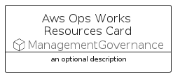

# AwsOpsWorksResources


```text
aws-q3-2022/Resource/ManagementGovernance/AwsOpsWorksResources
```

```text
include('aws-q3-2022/Resource/ManagementGovernance/AwsOpsWorksResources')
```


| Illustration | AwsOpsWorksResources | AwsOpsWorksResourcesCard | AwsOpsWorksResourcesGroup |
| :---: | :---: | :---: | :---: |
|  |  |  |  |


## AwsOpsWorksResources

### Load remotely
```plantuml
@startuml
' configures the library
!global $LIB_BASE_LOCATION="https://raw.githubusercontent.com/tmorin/plantuml-libs/master/distribution"

' loads the library's bootstrap
!include $LIB_BASE_LOCATION/bootstrap.puml

' loads the package bootstrap
include('aws-q3-2022/bootstrap')

' loads the Item which embeds the element AwsOpsWorksResources
include('aws-q3-2022/Resource/ManagementGovernance/AwsOpsWorksResources')

' renders the element
AwsOpsWorksResources('AwsOpsWorksResources', 'Aws Ops Works Resources', 'an optional tech label', 'an optional description')
@enduml
```

### Load locally
```plantuml
@startuml
' configures the library
!global $INCLUSION_MODE="local"
!global $LIB_BASE_LOCATION="../../.."

' loads the library's bootstrap
!include $LIB_BASE_LOCATION/bootstrap.puml

' loads the package bootstrap
include('aws-q3-2022/bootstrap')

' loads the Item which embeds the element AwsOpsWorksResources
include('aws-q3-2022/Resource/ManagementGovernance/AwsOpsWorksResources')

' renders the element
AwsOpsWorksResources('AwsOpsWorksResources', 'Aws Ops Works Resources', 'an optional tech label', 'an optional description')
@enduml
```

## AwsOpsWorksResourcesCard

### Load remotely
```plantuml
@startuml
' configures the library
!global $LIB_BASE_LOCATION="https://raw.githubusercontent.com/tmorin/plantuml-libs/master/distribution"

' loads the library's bootstrap
!include $LIB_BASE_LOCATION/bootstrap.puml

' loads the package bootstrap
include('aws-q3-2022/bootstrap')

' loads the Item which embeds the element AwsOpsWorksResourcesCard
include('aws-q3-2022/Resource/ManagementGovernance/AwsOpsWorksResources')

' renders the element
AwsOpsWorksResourcesCard('AwsOpsWorksResourcesCard', 'Aws Ops Works Resources Card', 'an optional description')
@enduml
```

### Load locally
```plantuml
@startuml
' configures the library
!global $INCLUSION_MODE="local"
!global $LIB_BASE_LOCATION="../../.."

' loads the library's bootstrap
!include $LIB_BASE_LOCATION/bootstrap.puml

' loads the package bootstrap
include('aws-q3-2022/bootstrap')

' loads the Item which embeds the element AwsOpsWorksResourcesCard
include('aws-q3-2022/Resource/ManagementGovernance/AwsOpsWorksResources')

' renders the element
AwsOpsWorksResourcesCard('AwsOpsWorksResourcesCard', 'Aws Ops Works Resources Card', 'an optional description')
@enduml
```

## AwsOpsWorksResourcesGroup

### Load remotely
```plantuml
@startuml
' configures the library
!global $LIB_BASE_LOCATION="https://raw.githubusercontent.com/tmorin/plantuml-libs/master/distribution"

' loads the library's bootstrap
!include $LIB_BASE_LOCATION/bootstrap.puml

' loads the package bootstrap
include('aws-q3-2022/bootstrap')

' loads the Item which embeds the element AwsOpsWorksResourcesGroup
include('aws-q3-2022/Resource/ManagementGovernance/AwsOpsWorksResources')

' renders the element
AwsOpsWorksResourcesGroup('AwsOpsWorksResourcesGroup', 'Aws Ops Works Resources Group', 'an optional tech label') {
    note as note
        the content of the group
    end note
}
@enduml
```

### Load locally
```plantuml
@startuml
' configures the library
!global $INCLUSION_MODE="local"
!global $LIB_BASE_LOCATION="../../.."

' loads the library's bootstrap
!include $LIB_BASE_LOCATION/bootstrap.puml

' loads the package bootstrap
include('aws-q3-2022/bootstrap')

' loads the Item which embeds the element AwsOpsWorksResourcesGroup
include('aws-q3-2022/Resource/ManagementGovernance/AwsOpsWorksResources')

' renders the element
AwsOpsWorksResourcesGroup('AwsOpsWorksResourcesGroup', 'Aws Ops Works Resources Group', 'an optional tech label') {
    note as note
        the content of the group
    end note
}
@enduml
```

