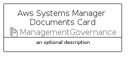

# AwsSystemsManagerDocuments


```text
aws-q3-2022/Resource/ManagementGovernance/AwsSystemsManagerDocuments
```

```text
include('aws-q3-2022/Resource/ManagementGovernance/AwsSystemsManagerDocuments')
```


| Illustration | AwsSystemsManagerDocuments | AwsSystemsManagerDocumentsCard | AwsSystemsManagerDocumentsGroup |
| :---: | :---: | :---: | :---: |
|  |  |  |  |


## AwsSystemsManagerDocuments

### Load remotely
```plantuml
@startuml
' configures the library
!global $LIB_BASE_LOCATION="https://raw.githubusercontent.com/tmorin/plantuml-libs/master/distribution"

' loads the library's bootstrap
!include $LIB_BASE_LOCATION/bootstrap.puml

' loads the package bootstrap
include('aws-q3-2022/bootstrap')

' loads the Item which embeds the element AwsSystemsManagerDocuments
include('aws-q3-2022/Resource/ManagementGovernance/AwsSystemsManagerDocuments')

' renders the element
AwsSystemsManagerDocuments('AwsSystemsManagerDocuments', 'Aws Systems Manager Documents', 'an optional tech label', 'an optional description')
@enduml
```

### Load locally
```plantuml
@startuml
' configures the library
!global $INCLUSION_MODE="local"
!global $LIB_BASE_LOCATION="../../.."

' loads the library's bootstrap
!include $LIB_BASE_LOCATION/bootstrap.puml

' loads the package bootstrap
include('aws-q3-2022/bootstrap')

' loads the Item which embeds the element AwsSystemsManagerDocuments
include('aws-q3-2022/Resource/ManagementGovernance/AwsSystemsManagerDocuments')

' renders the element
AwsSystemsManagerDocuments('AwsSystemsManagerDocuments', 'Aws Systems Manager Documents', 'an optional tech label', 'an optional description')
@enduml
```

## AwsSystemsManagerDocumentsCard

### Load remotely
```plantuml
@startuml
' configures the library
!global $LIB_BASE_LOCATION="https://raw.githubusercontent.com/tmorin/plantuml-libs/master/distribution"

' loads the library's bootstrap
!include $LIB_BASE_LOCATION/bootstrap.puml

' loads the package bootstrap
include('aws-q3-2022/bootstrap')

' loads the Item which embeds the element AwsSystemsManagerDocumentsCard
include('aws-q3-2022/Resource/ManagementGovernance/AwsSystemsManagerDocuments')

' renders the element
AwsSystemsManagerDocumentsCard('AwsSystemsManagerDocumentsCard', 'Aws Systems Manager Documents Card', 'an optional description')
@enduml
```

### Load locally
```plantuml
@startuml
' configures the library
!global $INCLUSION_MODE="local"
!global $LIB_BASE_LOCATION="../../.."

' loads the library's bootstrap
!include $LIB_BASE_LOCATION/bootstrap.puml

' loads the package bootstrap
include('aws-q3-2022/bootstrap')

' loads the Item which embeds the element AwsSystemsManagerDocumentsCard
include('aws-q3-2022/Resource/ManagementGovernance/AwsSystemsManagerDocuments')

' renders the element
AwsSystemsManagerDocumentsCard('AwsSystemsManagerDocumentsCard', 'Aws Systems Manager Documents Card', 'an optional description')
@enduml
```

## AwsSystemsManagerDocumentsGroup

### Load remotely
```plantuml
@startuml
' configures the library
!global $LIB_BASE_LOCATION="https://raw.githubusercontent.com/tmorin/plantuml-libs/master/distribution"

' loads the library's bootstrap
!include $LIB_BASE_LOCATION/bootstrap.puml

' loads the package bootstrap
include('aws-q3-2022/bootstrap')

' loads the Item which embeds the element AwsSystemsManagerDocumentsGroup
include('aws-q3-2022/Resource/ManagementGovernance/AwsSystemsManagerDocuments')

' renders the element
AwsSystemsManagerDocumentsGroup('AwsSystemsManagerDocumentsGroup', 'Aws Systems Manager Documents Group', 'an optional tech label') {
    note as note
        the content of the group
    end note
}
@enduml
```

### Load locally
```plantuml
@startuml
' configures the library
!global $INCLUSION_MODE="local"
!global $LIB_BASE_LOCATION="../../.."

' loads the library's bootstrap
!include $LIB_BASE_LOCATION/bootstrap.puml

' loads the package bootstrap
include('aws-q3-2022/bootstrap')

' loads the Item which embeds the element AwsSystemsManagerDocumentsGroup
include('aws-q3-2022/Resource/ManagementGovernance/AwsSystemsManagerDocuments')

' renders the element
AwsSystemsManagerDocumentsGroup('AwsSystemsManagerDocumentsGroup', 'Aws Systems Manager Documents Group', 'an optional tech label') {
    note as note
        the content of the group
    end note
}
@enduml
```

