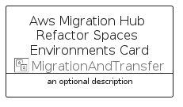

# AwsMigrationHubRefactorSpacesEnvironments


```text
aws-q3-2022/Resource/MigrationAndTransfer/AwsMigrationHubRefactorSpacesEnvironments
```

```text
include('aws-q3-2022/Resource/MigrationAndTransfer/AwsMigrationHubRefactorSpacesEnvironments')
```


| Illustration | AwsMigrationHubRefactorSpacesEnvironments | AwsMigrationHubRefactorSpacesEnvironmentsCard | AwsMigrationHubRefactorSpacesEnvironmentsGroup |
| :---: | :---: | :---: | :---: |
|  |  |  |  |


## AwsMigrationHubRefactorSpacesEnvironments

### Load remotely
```plantuml
@startuml
' configures the library
!global $LIB_BASE_LOCATION="https://raw.githubusercontent.com/tmorin/plantuml-libs/master/distribution"

' loads the library's bootstrap
!include $LIB_BASE_LOCATION/bootstrap.puml

' loads the package bootstrap
include('aws-q3-2022/bootstrap')

' loads the Item which embeds the element AwsMigrationHubRefactorSpacesEnvironments
include('aws-q3-2022/Resource/MigrationAndTransfer/AwsMigrationHubRefactorSpacesEnvironments')

' renders the element
AwsMigrationHubRefactorSpacesEnvironments('AwsMigrationHubRefactorSpacesEnvironments', 'Aws Migration Hub Refactor Spaces Environments', 'an optional tech label', 'an optional description')
@enduml
```

### Load locally
```plantuml
@startuml
' configures the library
!global $INCLUSION_MODE="local"
!global $LIB_BASE_LOCATION="../../.."

' loads the library's bootstrap
!include $LIB_BASE_LOCATION/bootstrap.puml

' loads the package bootstrap
include('aws-q3-2022/bootstrap')

' loads the Item which embeds the element AwsMigrationHubRefactorSpacesEnvironments
include('aws-q3-2022/Resource/MigrationAndTransfer/AwsMigrationHubRefactorSpacesEnvironments')

' renders the element
AwsMigrationHubRefactorSpacesEnvironments('AwsMigrationHubRefactorSpacesEnvironments', 'Aws Migration Hub Refactor Spaces Environments', 'an optional tech label', 'an optional description')
@enduml
```

## AwsMigrationHubRefactorSpacesEnvironmentsCard

### Load remotely
```plantuml
@startuml
' configures the library
!global $LIB_BASE_LOCATION="https://raw.githubusercontent.com/tmorin/plantuml-libs/master/distribution"

' loads the library's bootstrap
!include $LIB_BASE_LOCATION/bootstrap.puml

' loads the package bootstrap
include('aws-q3-2022/bootstrap')

' loads the Item which embeds the element AwsMigrationHubRefactorSpacesEnvironmentsCard
include('aws-q3-2022/Resource/MigrationAndTransfer/AwsMigrationHubRefactorSpacesEnvironments')

' renders the element
AwsMigrationHubRefactorSpacesEnvironmentsCard('AwsMigrationHubRefactorSpacesEnvironmentsCard', 'Aws Migration Hub Refactor Spaces Environments Card', 'an optional description')
@enduml
```

### Load locally
```plantuml
@startuml
' configures the library
!global $INCLUSION_MODE="local"
!global $LIB_BASE_LOCATION="../../.."

' loads the library's bootstrap
!include $LIB_BASE_LOCATION/bootstrap.puml

' loads the package bootstrap
include('aws-q3-2022/bootstrap')

' loads the Item which embeds the element AwsMigrationHubRefactorSpacesEnvironmentsCard
include('aws-q3-2022/Resource/MigrationAndTransfer/AwsMigrationHubRefactorSpacesEnvironments')

' renders the element
AwsMigrationHubRefactorSpacesEnvironmentsCard('AwsMigrationHubRefactorSpacesEnvironmentsCard', 'Aws Migration Hub Refactor Spaces Environments Card', 'an optional description')
@enduml
```

## AwsMigrationHubRefactorSpacesEnvironmentsGroup

### Load remotely
```plantuml
@startuml
' configures the library
!global $LIB_BASE_LOCATION="https://raw.githubusercontent.com/tmorin/plantuml-libs/master/distribution"

' loads the library's bootstrap
!include $LIB_BASE_LOCATION/bootstrap.puml

' loads the package bootstrap
include('aws-q3-2022/bootstrap')

' loads the Item which embeds the element AwsMigrationHubRefactorSpacesEnvironmentsGroup
include('aws-q3-2022/Resource/MigrationAndTransfer/AwsMigrationHubRefactorSpacesEnvironments')

' renders the element
AwsMigrationHubRefactorSpacesEnvironmentsGroup('AwsMigrationHubRefactorSpacesEnvironmentsGroup', 'Aws Migration Hub Refactor Spaces Environments Group', 'an optional tech label') {
    note as note
        the content of the group
    end note
}
@enduml
```

### Load locally
```plantuml
@startuml
' configures the library
!global $INCLUSION_MODE="local"
!global $LIB_BASE_LOCATION="../../.."

' loads the library's bootstrap
!include $LIB_BASE_LOCATION/bootstrap.puml

' loads the package bootstrap
include('aws-q3-2022/bootstrap')

' loads the Item which embeds the element AwsMigrationHubRefactorSpacesEnvironmentsGroup
include('aws-q3-2022/Resource/MigrationAndTransfer/AwsMigrationHubRefactorSpacesEnvironments')

' renders the element
AwsMigrationHubRefactorSpacesEnvironmentsGroup('AwsMigrationHubRefactorSpacesEnvironmentsGroup', 'Aws Migration Hub Refactor Spaces Environments Group', 'an optional tech label') {
    note as note
        the content of the group
    end note
}
@enduml
```

