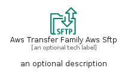

# AwsTransferFamilyAwsSftp


```text
aws-q3-2022/Resource/MigrationAndTransfer/AwsTransferFamilyAwsSftp
```

```text
include('aws-q3-2022/Resource/MigrationAndTransfer/AwsTransferFamilyAwsSftp')
```


| Illustration | AwsTransferFamilyAwsSftp | AwsTransferFamilyAwsSftpCard | AwsTransferFamilyAwsSftpGroup |
| :---: | :---: | :---: | :---: |
|  |  |  |  |


## AwsTransferFamilyAwsSftp

### Load remotely
```plantuml
@startuml
' configures the library
!global $LIB_BASE_LOCATION="https://raw.githubusercontent.com/tmorin/plantuml-libs/master/distribution"

' loads the library's bootstrap
!include $LIB_BASE_LOCATION/bootstrap.puml

' loads the package bootstrap
include('aws-q3-2022/bootstrap')

' loads the Item which embeds the element AwsTransferFamilyAwsSftp
include('aws-q3-2022/Resource/MigrationAndTransfer/AwsTransferFamilyAwsSftp')

' renders the element
AwsTransferFamilyAwsSftp('AwsTransferFamilyAwsSftp', 'Aws Transfer Family Aws Sftp', 'an optional tech label', 'an optional description')
@enduml
```

### Load locally
```plantuml
@startuml
' configures the library
!global $INCLUSION_MODE="local"
!global $LIB_BASE_LOCATION="../../.."

' loads the library's bootstrap
!include $LIB_BASE_LOCATION/bootstrap.puml

' loads the package bootstrap
include('aws-q3-2022/bootstrap')

' loads the Item which embeds the element AwsTransferFamilyAwsSftp
include('aws-q3-2022/Resource/MigrationAndTransfer/AwsTransferFamilyAwsSftp')

' renders the element
AwsTransferFamilyAwsSftp('AwsTransferFamilyAwsSftp', 'Aws Transfer Family Aws Sftp', 'an optional tech label', 'an optional description')
@enduml
```

## AwsTransferFamilyAwsSftpCard

### Load remotely
```plantuml
@startuml
' configures the library
!global $LIB_BASE_LOCATION="https://raw.githubusercontent.com/tmorin/plantuml-libs/master/distribution"

' loads the library's bootstrap
!include $LIB_BASE_LOCATION/bootstrap.puml

' loads the package bootstrap
include('aws-q3-2022/bootstrap')

' loads the Item which embeds the element AwsTransferFamilyAwsSftpCard
include('aws-q3-2022/Resource/MigrationAndTransfer/AwsTransferFamilyAwsSftp')

' renders the element
AwsTransferFamilyAwsSftpCard('AwsTransferFamilyAwsSftpCard', 'Aws Transfer Family Aws Sftp Card', 'an optional description')
@enduml
```

### Load locally
```plantuml
@startuml
' configures the library
!global $INCLUSION_MODE="local"
!global $LIB_BASE_LOCATION="../../.."

' loads the library's bootstrap
!include $LIB_BASE_LOCATION/bootstrap.puml

' loads the package bootstrap
include('aws-q3-2022/bootstrap')

' loads the Item which embeds the element AwsTransferFamilyAwsSftpCard
include('aws-q3-2022/Resource/MigrationAndTransfer/AwsTransferFamilyAwsSftp')

' renders the element
AwsTransferFamilyAwsSftpCard('AwsTransferFamilyAwsSftpCard', 'Aws Transfer Family Aws Sftp Card', 'an optional description')
@enduml
```

## AwsTransferFamilyAwsSftpGroup

### Load remotely
```plantuml
@startuml
' configures the library
!global $LIB_BASE_LOCATION="https://raw.githubusercontent.com/tmorin/plantuml-libs/master/distribution"

' loads the library's bootstrap
!include $LIB_BASE_LOCATION/bootstrap.puml

' loads the package bootstrap
include('aws-q3-2022/bootstrap')

' loads the Item which embeds the element AwsTransferFamilyAwsSftpGroup
include('aws-q3-2022/Resource/MigrationAndTransfer/AwsTransferFamilyAwsSftp')

' renders the element
AwsTransferFamilyAwsSftpGroup('AwsTransferFamilyAwsSftpGroup', 'Aws Transfer Family Aws Sftp Group', 'an optional tech label') {
    note as note
        the content of the group
    end note
}
@enduml
```

### Load locally
```plantuml
@startuml
' configures the library
!global $INCLUSION_MODE="local"
!global $LIB_BASE_LOCATION="../../.."

' loads the library's bootstrap
!include $LIB_BASE_LOCATION/bootstrap.puml

' loads the package bootstrap
include('aws-q3-2022/bootstrap')

' loads the Item which embeds the element AwsTransferFamilyAwsSftpGroup
include('aws-q3-2022/Resource/MigrationAndTransfer/AwsTransferFamilyAwsSftp')

' renders the element
AwsTransferFamilyAwsSftpGroup('AwsTransferFamilyAwsSftpGroup', 'Aws Transfer Family Aws Sftp Group', 'an optional tech label') {
    note as note
        the content of the group
    end note
}
@enduml
```

