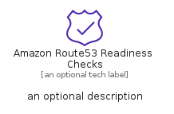

# AmazonRoute53ReadinessChecks


```text
aws-q3-2022/Resource/NetworkingAndContentDelivery/AmazonRoute53ReadinessChecks
```

```text
include('aws-q3-2022/Resource/NetworkingAndContentDelivery/AmazonRoute53ReadinessChecks')
```


| Illustration | AmazonRoute53ReadinessChecks | AmazonRoute53ReadinessChecksCard | AmazonRoute53ReadinessChecksGroup |
| :---: | :---: | :---: | :---: |
|  |  |  |  |


## AmazonRoute53ReadinessChecks

### Load remotely
```plantuml
@startuml
' configures the library
!global $LIB_BASE_LOCATION="https://raw.githubusercontent.com/tmorin/plantuml-libs/master/distribution"

' loads the library's bootstrap
!include $LIB_BASE_LOCATION/bootstrap.puml

' loads the package bootstrap
include('aws-q3-2022/bootstrap')

' loads the Item which embeds the element AmazonRoute53ReadinessChecks
include('aws-q3-2022/Resource/NetworkingAndContentDelivery/AmazonRoute53ReadinessChecks')

' renders the element
AmazonRoute53ReadinessChecks('AmazonRoute53ReadinessChecks', 'Amazon Route53 Readiness Checks', 'an optional tech label', 'an optional description')
@enduml
```

### Load locally
```plantuml
@startuml
' configures the library
!global $INCLUSION_MODE="local"
!global $LIB_BASE_LOCATION="../../.."

' loads the library's bootstrap
!include $LIB_BASE_LOCATION/bootstrap.puml

' loads the package bootstrap
include('aws-q3-2022/bootstrap')

' loads the Item which embeds the element AmazonRoute53ReadinessChecks
include('aws-q3-2022/Resource/NetworkingAndContentDelivery/AmazonRoute53ReadinessChecks')

' renders the element
AmazonRoute53ReadinessChecks('AmazonRoute53ReadinessChecks', 'Amazon Route53 Readiness Checks', 'an optional tech label', 'an optional description')
@enduml
```

## AmazonRoute53ReadinessChecksCard

### Load remotely
```plantuml
@startuml
' configures the library
!global $LIB_BASE_LOCATION="https://raw.githubusercontent.com/tmorin/plantuml-libs/master/distribution"

' loads the library's bootstrap
!include $LIB_BASE_LOCATION/bootstrap.puml

' loads the package bootstrap
include('aws-q3-2022/bootstrap')

' loads the Item which embeds the element AmazonRoute53ReadinessChecksCard
include('aws-q3-2022/Resource/NetworkingAndContentDelivery/AmazonRoute53ReadinessChecks')

' renders the element
AmazonRoute53ReadinessChecksCard('AmazonRoute53ReadinessChecksCard', 'Amazon Route53 Readiness Checks Card', 'an optional description')
@enduml
```

### Load locally
```plantuml
@startuml
' configures the library
!global $INCLUSION_MODE="local"
!global $LIB_BASE_LOCATION="../../.."

' loads the library's bootstrap
!include $LIB_BASE_LOCATION/bootstrap.puml

' loads the package bootstrap
include('aws-q3-2022/bootstrap')

' loads the Item which embeds the element AmazonRoute53ReadinessChecksCard
include('aws-q3-2022/Resource/NetworkingAndContentDelivery/AmazonRoute53ReadinessChecks')

' renders the element
AmazonRoute53ReadinessChecksCard('AmazonRoute53ReadinessChecksCard', 'Amazon Route53 Readiness Checks Card', 'an optional description')
@enduml
```

## AmazonRoute53ReadinessChecksGroup

### Load remotely
```plantuml
@startuml
' configures the library
!global $LIB_BASE_LOCATION="https://raw.githubusercontent.com/tmorin/plantuml-libs/master/distribution"

' loads the library's bootstrap
!include $LIB_BASE_LOCATION/bootstrap.puml

' loads the package bootstrap
include('aws-q3-2022/bootstrap')

' loads the Item which embeds the element AmazonRoute53ReadinessChecksGroup
include('aws-q3-2022/Resource/NetworkingAndContentDelivery/AmazonRoute53ReadinessChecks')

' renders the element
AmazonRoute53ReadinessChecksGroup('AmazonRoute53ReadinessChecksGroup', 'Amazon Route53 Readiness Checks Group', 'an optional tech label') {
    note as note
        the content of the group
    end note
}
@enduml
```

### Load locally
```plantuml
@startuml
' configures the library
!global $INCLUSION_MODE="local"
!global $LIB_BASE_LOCATION="../../.."

' loads the library's bootstrap
!include $LIB_BASE_LOCATION/bootstrap.puml

' loads the package bootstrap
include('aws-q3-2022/bootstrap')

' loads the Item which embeds the element AmazonRoute53ReadinessChecksGroup
include('aws-q3-2022/Resource/NetworkingAndContentDelivery/AmazonRoute53ReadinessChecks')

' renders the element
AmazonRoute53ReadinessChecksGroup('AmazonRoute53ReadinessChecksGroup', 'Amazon Route53 Readiness Checks Group', 'an optional tech label') {
    note as note
        the content of the group
    end note
}
@enduml
```

