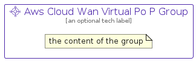

# AwsCloudWanVirtualPoP


```text
aws-q3-2022/Resource/NetworkingAndContentDelivery/AwsCloudWanVirtualPoP
```

```text
include('aws-q3-2022/Resource/NetworkingAndContentDelivery/AwsCloudWanVirtualPoP')
```


| Illustration | AwsCloudWanVirtualPoP | AwsCloudWanVirtualPoPCard | AwsCloudWanVirtualPoPGroup |
| :---: | :---: | :---: | :---: |
|  |  |  |  |


## AwsCloudWanVirtualPoP

### Load remotely
```plantuml
@startuml
' configures the library
!global $LIB_BASE_LOCATION="https://raw.githubusercontent.com/tmorin/plantuml-libs/master/distribution"

' loads the library's bootstrap
!include $LIB_BASE_LOCATION/bootstrap.puml

' loads the package bootstrap
include('aws-q3-2022/bootstrap')

' loads the Item which embeds the element AwsCloudWanVirtualPoP
include('aws-q3-2022/Resource/NetworkingAndContentDelivery/AwsCloudWanVirtualPoP')

' renders the element
AwsCloudWanVirtualPoP('AwsCloudWanVirtualPoP', 'Aws Cloud Wan Virtual Po P', 'an optional tech label', 'an optional description')
@enduml
```

### Load locally
```plantuml
@startuml
' configures the library
!global $INCLUSION_MODE="local"
!global $LIB_BASE_LOCATION="../../.."

' loads the library's bootstrap
!include $LIB_BASE_LOCATION/bootstrap.puml

' loads the package bootstrap
include('aws-q3-2022/bootstrap')

' loads the Item which embeds the element AwsCloudWanVirtualPoP
include('aws-q3-2022/Resource/NetworkingAndContentDelivery/AwsCloudWanVirtualPoP')

' renders the element
AwsCloudWanVirtualPoP('AwsCloudWanVirtualPoP', 'Aws Cloud Wan Virtual Po P', 'an optional tech label', 'an optional description')
@enduml
```

## AwsCloudWanVirtualPoPCard

### Load remotely
```plantuml
@startuml
' configures the library
!global $LIB_BASE_LOCATION="https://raw.githubusercontent.com/tmorin/plantuml-libs/master/distribution"

' loads the library's bootstrap
!include $LIB_BASE_LOCATION/bootstrap.puml

' loads the package bootstrap
include('aws-q3-2022/bootstrap')

' loads the Item which embeds the element AwsCloudWanVirtualPoPCard
include('aws-q3-2022/Resource/NetworkingAndContentDelivery/AwsCloudWanVirtualPoP')

' renders the element
AwsCloudWanVirtualPoPCard('AwsCloudWanVirtualPoPCard', 'Aws Cloud Wan Virtual Po P Card', 'an optional description')
@enduml
```

### Load locally
```plantuml
@startuml
' configures the library
!global $INCLUSION_MODE="local"
!global $LIB_BASE_LOCATION="../../.."

' loads the library's bootstrap
!include $LIB_BASE_LOCATION/bootstrap.puml

' loads the package bootstrap
include('aws-q3-2022/bootstrap')

' loads the Item which embeds the element AwsCloudWanVirtualPoPCard
include('aws-q3-2022/Resource/NetworkingAndContentDelivery/AwsCloudWanVirtualPoP')

' renders the element
AwsCloudWanVirtualPoPCard('AwsCloudWanVirtualPoPCard', 'Aws Cloud Wan Virtual Po P Card', 'an optional description')
@enduml
```

## AwsCloudWanVirtualPoPGroup

### Load remotely
```plantuml
@startuml
' configures the library
!global $LIB_BASE_LOCATION="https://raw.githubusercontent.com/tmorin/plantuml-libs/master/distribution"

' loads the library's bootstrap
!include $LIB_BASE_LOCATION/bootstrap.puml

' loads the package bootstrap
include('aws-q3-2022/bootstrap')

' loads the Item which embeds the element AwsCloudWanVirtualPoPGroup
include('aws-q3-2022/Resource/NetworkingAndContentDelivery/AwsCloudWanVirtualPoP')

' renders the element
AwsCloudWanVirtualPoPGroup('AwsCloudWanVirtualPoPGroup', 'Aws Cloud Wan Virtual Po P Group', 'an optional tech label') {
    note as note
        the content of the group
    end note
}
@enduml
```

### Load locally
```plantuml
@startuml
' configures the library
!global $INCLUSION_MODE="local"
!global $LIB_BASE_LOCATION="../../.."

' loads the library's bootstrap
!include $LIB_BASE_LOCATION/bootstrap.puml

' loads the package bootstrap
include('aws-q3-2022/bootstrap')

' loads the Item which embeds the element AwsCloudWanVirtualPoPGroup
include('aws-q3-2022/Resource/NetworkingAndContentDelivery/AwsCloudWanVirtualPoP')

' renders the element
AwsCloudWanVirtualPoPGroup('AwsCloudWanVirtualPoPGroup', 'Aws Cloud Wan Virtual Po P Group', 'an optional tech label') {
    note as note
        the content of the group
    end note
}
@enduml
```

