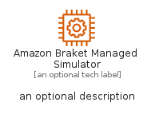

# AmazonBraketManagedSimulator


```text
aws-q3-2022/Resource/QuantumTechnologies/AmazonBraketManagedSimulator
```

```text
include('aws-q3-2022/Resource/QuantumTechnologies/AmazonBraketManagedSimulator')
```


| Illustration | AmazonBraketManagedSimulator | AmazonBraketManagedSimulatorCard | AmazonBraketManagedSimulatorGroup |
| :---: | :---: | :---: | :---: |
|  |  |  |  |


## AmazonBraketManagedSimulator

### Load remotely
```plantuml
@startuml
' configures the library
!global $LIB_BASE_LOCATION="https://raw.githubusercontent.com/tmorin/plantuml-libs/master/distribution"

' loads the library's bootstrap
!include $LIB_BASE_LOCATION/bootstrap.puml

' loads the package bootstrap
include('aws-q3-2022/bootstrap')

' loads the Item which embeds the element AmazonBraketManagedSimulator
include('aws-q3-2022/Resource/QuantumTechnologies/AmazonBraketManagedSimulator')

' renders the element
AmazonBraketManagedSimulator('AmazonBraketManagedSimulator', 'Amazon Braket Managed Simulator', 'an optional tech label', 'an optional description')
@enduml
```

### Load locally
```plantuml
@startuml
' configures the library
!global $INCLUSION_MODE="local"
!global $LIB_BASE_LOCATION="../../.."

' loads the library's bootstrap
!include $LIB_BASE_LOCATION/bootstrap.puml

' loads the package bootstrap
include('aws-q3-2022/bootstrap')

' loads the Item which embeds the element AmazonBraketManagedSimulator
include('aws-q3-2022/Resource/QuantumTechnologies/AmazonBraketManagedSimulator')

' renders the element
AmazonBraketManagedSimulator('AmazonBraketManagedSimulator', 'Amazon Braket Managed Simulator', 'an optional tech label', 'an optional description')
@enduml
```

## AmazonBraketManagedSimulatorCard

### Load remotely
```plantuml
@startuml
' configures the library
!global $LIB_BASE_LOCATION="https://raw.githubusercontent.com/tmorin/plantuml-libs/master/distribution"

' loads the library's bootstrap
!include $LIB_BASE_LOCATION/bootstrap.puml

' loads the package bootstrap
include('aws-q3-2022/bootstrap')

' loads the Item which embeds the element AmazonBraketManagedSimulatorCard
include('aws-q3-2022/Resource/QuantumTechnologies/AmazonBraketManagedSimulator')

' renders the element
AmazonBraketManagedSimulatorCard('AmazonBraketManagedSimulatorCard', 'Amazon Braket Managed Simulator Card', 'an optional description')
@enduml
```

### Load locally
```plantuml
@startuml
' configures the library
!global $INCLUSION_MODE="local"
!global $LIB_BASE_LOCATION="../../.."

' loads the library's bootstrap
!include $LIB_BASE_LOCATION/bootstrap.puml

' loads the package bootstrap
include('aws-q3-2022/bootstrap')

' loads the Item which embeds the element AmazonBraketManagedSimulatorCard
include('aws-q3-2022/Resource/QuantumTechnologies/AmazonBraketManagedSimulator')

' renders the element
AmazonBraketManagedSimulatorCard('AmazonBraketManagedSimulatorCard', 'Amazon Braket Managed Simulator Card', 'an optional description')
@enduml
```

## AmazonBraketManagedSimulatorGroup

### Load remotely
```plantuml
@startuml
' configures the library
!global $LIB_BASE_LOCATION="https://raw.githubusercontent.com/tmorin/plantuml-libs/master/distribution"

' loads the library's bootstrap
!include $LIB_BASE_LOCATION/bootstrap.puml

' loads the package bootstrap
include('aws-q3-2022/bootstrap')

' loads the Item which embeds the element AmazonBraketManagedSimulatorGroup
include('aws-q3-2022/Resource/QuantumTechnologies/AmazonBraketManagedSimulator')

' renders the element
AmazonBraketManagedSimulatorGroup('AmazonBraketManagedSimulatorGroup', 'Amazon Braket Managed Simulator Group', 'an optional tech label') {
    note as note
        the content of the group
    end note
}
@enduml
```

### Load locally
```plantuml
@startuml
' configures the library
!global $INCLUSION_MODE="local"
!global $LIB_BASE_LOCATION="../../.."

' loads the library's bootstrap
!include $LIB_BASE_LOCATION/bootstrap.puml

' loads the package bootstrap
include('aws-q3-2022/bootstrap')

' loads the Item which embeds the element AmazonBraketManagedSimulatorGroup
include('aws-q3-2022/Resource/QuantumTechnologies/AmazonBraketManagedSimulator')

' renders the element
AmazonBraketManagedSimulatorGroup('AmazonBraketManagedSimulatorGroup', 'Amazon Braket Managed Simulator Group', 'an optional tech label') {
    note as note
        the content of the group
    end note
}
@enduml
```

