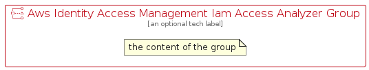

# AwsIdentityAccessManagementIamAccessAnalyzer


```text
aws-q3-2022/Resource/SecurityIdentityAndCompliance/AwsIdentityAccessManagementIamAccessAnalyzer
```

```text
include('aws-q3-2022/Resource/SecurityIdentityAndCompliance/AwsIdentityAccessManagementIamAccessAnalyzer')
```


| Illustration | AwsIdentityAccessManagementIamAccessAnalyzer | AwsIdentityAccessManagementIamAccessAnalyzerCard | AwsIdentityAccessManagementIamAccessAnalyzerGroup |
| :---: | :---: | :---: | :---: |
|  |  |  |  |


## AwsIdentityAccessManagementIamAccessAnalyzer

### Load remotely
```plantuml
@startuml
' configures the library
!global $LIB_BASE_LOCATION="https://raw.githubusercontent.com/tmorin/plantuml-libs/master/distribution"

' loads the library's bootstrap
!include $LIB_BASE_LOCATION/bootstrap.puml

' loads the package bootstrap
include('aws-q3-2022/bootstrap')

' loads the Item which embeds the element AwsIdentityAccessManagementIamAccessAnalyzer
include('aws-q3-2022/Resource/SecurityIdentityAndCompliance/AwsIdentityAccessManagementIamAccessAnalyzer')

' renders the element
AwsIdentityAccessManagementIamAccessAnalyzer('AwsIdentityAccessManagementIamAccessAnalyzer', 'Aws Identity Access Management Iam Access Analyzer', 'an optional tech label', 'an optional description')
@enduml
```

### Load locally
```plantuml
@startuml
' configures the library
!global $INCLUSION_MODE="local"
!global $LIB_BASE_LOCATION="../../.."

' loads the library's bootstrap
!include $LIB_BASE_LOCATION/bootstrap.puml

' loads the package bootstrap
include('aws-q3-2022/bootstrap')

' loads the Item which embeds the element AwsIdentityAccessManagementIamAccessAnalyzer
include('aws-q3-2022/Resource/SecurityIdentityAndCompliance/AwsIdentityAccessManagementIamAccessAnalyzer')

' renders the element
AwsIdentityAccessManagementIamAccessAnalyzer('AwsIdentityAccessManagementIamAccessAnalyzer', 'Aws Identity Access Management Iam Access Analyzer', 'an optional tech label', 'an optional description')
@enduml
```

## AwsIdentityAccessManagementIamAccessAnalyzerCard

### Load remotely
```plantuml
@startuml
' configures the library
!global $LIB_BASE_LOCATION="https://raw.githubusercontent.com/tmorin/plantuml-libs/master/distribution"

' loads the library's bootstrap
!include $LIB_BASE_LOCATION/bootstrap.puml

' loads the package bootstrap
include('aws-q3-2022/bootstrap')

' loads the Item which embeds the element AwsIdentityAccessManagementIamAccessAnalyzerCard
include('aws-q3-2022/Resource/SecurityIdentityAndCompliance/AwsIdentityAccessManagementIamAccessAnalyzer')

' renders the element
AwsIdentityAccessManagementIamAccessAnalyzerCard('AwsIdentityAccessManagementIamAccessAnalyzerCard', 'Aws Identity Access Management Iam Access Analyzer Card', 'an optional description')
@enduml
```

### Load locally
```plantuml
@startuml
' configures the library
!global $INCLUSION_MODE="local"
!global $LIB_BASE_LOCATION="../../.."

' loads the library's bootstrap
!include $LIB_BASE_LOCATION/bootstrap.puml

' loads the package bootstrap
include('aws-q3-2022/bootstrap')

' loads the Item which embeds the element AwsIdentityAccessManagementIamAccessAnalyzerCard
include('aws-q3-2022/Resource/SecurityIdentityAndCompliance/AwsIdentityAccessManagementIamAccessAnalyzer')

' renders the element
AwsIdentityAccessManagementIamAccessAnalyzerCard('AwsIdentityAccessManagementIamAccessAnalyzerCard', 'Aws Identity Access Management Iam Access Analyzer Card', 'an optional description')
@enduml
```

## AwsIdentityAccessManagementIamAccessAnalyzerGroup

### Load remotely
```plantuml
@startuml
' configures the library
!global $LIB_BASE_LOCATION="https://raw.githubusercontent.com/tmorin/plantuml-libs/master/distribution"

' loads the library's bootstrap
!include $LIB_BASE_LOCATION/bootstrap.puml

' loads the package bootstrap
include('aws-q3-2022/bootstrap')

' loads the Item which embeds the element AwsIdentityAccessManagementIamAccessAnalyzerGroup
include('aws-q3-2022/Resource/SecurityIdentityAndCompliance/AwsIdentityAccessManagementIamAccessAnalyzer')

' renders the element
AwsIdentityAccessManagementIamAccessAnalyzerGroup('AwsIdentityAccessManagementIamAccessAnalyzerGroup', 'Aws Identity Access Management Iam Access Analyzer Group', 'an optional tech label') {
    note as note
        the content of the group
    end note
}
@enduml
```

### Load locally
```plantuml
@startuml
' configures the library
!global $INCLUSION_MODE="local"
!global $LIB_BASE_LOCATION="../../.."

' loads the library's bootstrap
!include $LIB_BASE_LOCATION/bootstrap.puml

' loads the package bootstrap
include('aws-q3-2022/bootstrap')

' loads the Item which embeds the element AwsIdentityAccessManagementIamAccessAnalyzerGroup
include('aws-q3-2022/Resource/SecurityIdentityAndCompliance/AwsIdentityAccessManagementIamAccessAnalyzer')

' renders the element
AwsIdentityAccessManagementIamAccessAnalyzerGroup('AwsIdentityAccessManagementIamAccessAnalyzerGroup', 'Aws Identity Access Management Iam Access Analyzer Group', 'an optional tech label') {
    note as note
        the content of the group
    end note
}
@enduml
```

