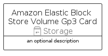

# AmazonElasticBlockStoreVolumeGp3


```text
aws-q3-2022/Resource/Storage/AmazonElasticBlockStoreVolumeGp3
```

```text
include('aws-q3-2022/Resource/Storage/AmazonElasticBlockStoreVolumeGp3')
```


| Illustration | AmazonElasticBlockStoreVolumeGp3 | AmazonElasticBlockStoreVolumeGp3Card | AmazonElasticBlockStoreVolumeGp3Group |
| :---: | :---: | :---: | :---: |
|  |  |  |  |


## AmazonElasticBlockStoreVolumeGp3

### Load remotely
```plantuml
@startuml
' configures the library
!global $LIB_BASE_LOCATION="https://raw.githubusercontent.com/tmorin/plantuml-libs/master/distribution"

' loads the library's bootstrap
!include $LIB_BASE_LOCATION/bootstrap.puml

' loads the package bootstrap
include('aws-q3-2022/bootstrap')

' loads the Item which embeds the element AmazonElasticBlockStoreVolumeGp3
include('aws-q3-2022/Resource/Storage/AmazonElasticBlockStoreVolumeGp3')

' renders the element
AmazonElasticBlockStoreVolumeGp3('AmazonElasticBlockStoreVolumeGp3', 'Amazon Elastic Block Store Volume Gp3', 'an optional tech label', 'an optional description')
@enduml
```

### Load locally
```plantuml
@startuml
' configures the library
!global $INCLUSION_MODE="local"
!global $LIB_BASE_LOCATION="../../.."

' loads the library's bootstrap
!include $LIB_BASE_LOCATION/bootstrap.puml

' loads the package bootstrap
include('aws-q3-2022/bootstrap')

' loads the Item which embeds the element AmazonElasticBlockStoreVolumeGp3
include('aws-q3-2022/Resource/Storage/AmazonElasticBlockStoreVolumeGp3')

' renders the element
AmazonElasticBlockStoreVolumeGp3('AmazonElasticBlockStoreVolumeGp3', 'Amazon Elastic Block Store Volume Gp3', 'an optional tech label', 'an optional description')
@enduml
```

## AmazonElasticBlockStoreVolumeGp3Card

### Load remotely
```plantuml
@startuml
' configures the library
!global $LIB_BASE_LOCATION="https://raw.githubusercontent.com/tmorin/plantuml-libs/master/distribution"

' loads the library's bootstrap
!include $LIB_BASE_LOCATION/bootstrap.puml

' loads the package bootstrap
include('aws-q3-2022/bootstrap')

' loads the Item which embeds the element AmazonElasticBlockStoreVolumeGp3Card
include('aws-q3-2022/Resource/Storage/AmazonElasticBlockStoreVolumeGp3')

' renders the element
AmazonElasticBlockStoreVolumeGp3Card('AmazonElasticBlockStoreVolumeGp3Card', 'Amazon Elastic Block Store Volume Gp3 Card', 'an optional description')
@enduml
```

### Load locally
```plantuml
@startuml
' configures the library
!global $INCLUSION_MODE="local"
!global $LIB_BASE_LOCATION="../../.."

' loads the library's bootstrap
!include $LIB_BASE_LOCATION/bootstrap.puml

' loads the package bootstrap
include('aws-q3-2022/bootstrap')

' loads the Item which embeds the element AmazonElasticBlockStoreVolumeGp3Card
include('aws-q3-2022/Resource/Storage/AmazonElasticBlockStoreVolumeGp3')

' renders the element
AmazonElasticBlockStoreVolumeGp3Card('AmazonElasticBlockStoreVolumeGp3Card', 'Amazon Elastic Block Store Volume Gp3 Card', 'an optional description')
@enduml
```

## AmazonElasticBlockStoreVolumeGp3Group

### Load remotely
```plantuml
@startuml
' configures the library
!global $LIB_BASE_LOCATION="https://raw.githubusercontent.com/tmorin/plantuml-libs/master/distribution"

' loads the library's bootstrap
!include $LIB_BASE_LOCATION/bootstrap.puml

' loads the package bootstrap
include('aws-q3-2022/bootstrap')

' loads the Item which embeds the element AmazonElasticBlockStoreVolumeGp3Group
include('aws-q3-2022/Resource/Storage/AmazonElasticBlockStoreVolumeGp3')

' renders the element
AmazonElasticBlockStoreVolumeGp3Group('AmazonElasticBlockStoreVolumeGp3Group', 'Amazon Elastic Block Store Volume Gp3 Group', 'an optional tech label') {
    note as note
        the content of the group
    end note
}
@enduml
```

### Load locally
```plantuml
@startuml
' configures the library
!global $INCLUSION_MODE="local"
!global $LIB_BASE_LOCATION="../../.."

' loads the library's bootstrap
!include $LIB_BASE_LOCATION/bootstrap.puml

' loads the package bootstrap
include('aws-q3-2022/bootstrap')

' loads the Item which embeds the element AmazonElasticBlockStoreVolumeGp3Group
include('aws-q3-2022/Resource/Storage/AmazonElasticBlockStoreVolumeGp3')

' renders the element
AmazonElasticBlockStoreVolumeGp3Group('AmazonElasticBlockStoreVolumeGp3Group', 'Amazon Elastic Block Store Volume Gp3 Group', 'an optional tech label') {
    note as note
        the content of the group
    end note
}
@enduml
```

