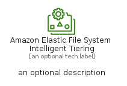
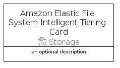

# AmazonElasticFileSystemIntelligentTiering


```text
aws-q3-2022/Resource/Storage/AmazonElasticFileSystemIntelligentTiering
```

```text
include('aws-q3-2022/Resource/Storage/AmazonElasticFileSystemIntelligentTiering')
```


| Illustration | AmazonElasticFileSystemIntelligentTiering | AmazonElasticFileSystemIntelligentTieringCard | AmazonElasticFileSystemIntelligentTieringGroup |
| :---: | :---: | :---: | :---: |
|  |  |  |  |


## AmazonElasticFileSystemIntelligentTiering

### Load remotely
```plantuml
@startuml
' configures the library
!global $LIB_BASE_LOCATION="https://raw.githubusercontent.com/tmorin/plantuml-libs/master/distribution"

' loads the library's bootstrap
!include $LIB_BASE_LOCATION/bootstrap.puml

' loads the package bootstrap
include('aws-q3-2022/bootstrap')

' loads the Item which embeds the element AmazonElasticFileSystemIntelligentTiering
include('aws-q3-2022/Resource/Storage/AmazonElasticFileSystemIntelligentTiering')

' renders the element
AmazonElasticFileSystemIntelligentTiering('AmazonElasticFileSystemIntelligentTiering', 'Amazon Elastic File System Intelligent Tiering', 'an optional tech label', 'an optional description')
@enduml
```

### Load locally
```plantuml
@startuml
' configures the library
!global $INCLUSION_MODE="local"
!global $LIB_BASE_LOCATION="../../.."

' loads the library's bootstrap
!include $LIB_BASE_LOCATION/bootstrap.puml

' loads the package bootstrap
include('aws-q3-2022/bootstrap')

' loads the Item which embeds the element AmazonElasticFileSystemIntelligentTiering
include('aws-q3-2022/Resource/Storage/AmazonElasticFileSystemIntelligentTiering')

' renders the element
AmazonElasticFileSystemIntelligentTiering('AmazonElasticFileSystemIntelligentTiering', 'Amazon Elastic File System Intelligent Tiering', 'an optional tech label', 'an optional description')
@enduml
```

## AmazonElasticFileSystemIntelligentTieringCard

### Load remotely
```plantuml
@startuml
' configures the library
!global $LIB_BASE_LOCATION="https://raw.githubusercontent.com/tmorin/plantuml-libs/master/distribution"

' loads the library's bootstrap
!include $LIB_BASE_LOCATION/bootstrap.puml

' loads the package bootstrap
include('aws-q3-2022/bootstrap')

' loads the Item which embeds the element AmazonElasticFileSystemIntelligentTieringCard
include('aws-q3-2022/Resource/Storage/AmazonElasticFileSystemIntelligentTiering')

' renders the element
AmazonElasticFileSystemIntelligentTieringCard('AmazonElasticFileSystemIntelligentTieringCard', 'Amazon Elastic File System Intelligent Tiering Card', 'an optional description')
@enduml
```

### Load locally
```plantuml
@startuml
' configures the library
!global $INCLUSION_MODE="local"
!global $LIB_BASE_LOCATION="../../.."

' loads the library's bootstrap
!include $LIB_BASE_LOCATION/bootstrap.puml

' loads the package bootstrap
include('aws-q3-2022/bootstrap')

' loads the Item which embeds the element AmazonElasticFileSystemIntelligentTieringCard
include('aws-q3-2022/Resource/Storage/AmazonElasticFileSystemIntelligentTiering')

' renders the element
AmazonElasticFileSystemIntelligentTieringCard('AmazonElasticFileSystemIntelligentTieringCard', 'Amazon Elastic File System Intelligent Tiering Card', 'an optional description')
@enduml
```

## AmazonElasticFileSystemIntelligentTieringGroup

### Load remotely
```plantuml
@startuml
' configures the library
!global $LIB_BASE_LOCATION="https://raw.githubusercontent.com/tmorin/plantuml-libs/master/distribution"

' loads the library's bootstrap
!include $LIB_BASE_LOCATION/bootstrap.puml

' loads the package bootstrap
include('aws-q3-2022/bootstrap')

' loads the Item which embeds the element AmazonElasticFileSystemIntelligentTieringGroup
include('aws-q3-2022/Resource/Storage/AmazonElasticFileSystemIntelligentTiering')

' renders the element
AmazonElasticFileSystemIntelligentTieringGroup('AmazonElasticFileSystemIntelligentTieringGroup', 'Amazon Elastic File System Intelligent Tiering Group', 'an optional tech label') {
    note as note
        the content of the group
    end note
}
@enduml
```

### Load locally
```plantuml
@startuml
' configures the library
!global $INCLUSION_MODE="local"
!global $LIB_BASE_LOCATION="../../.."

' loads the library's bootstrap
!include $LIB_BASE_LOCATION/bootstrap.puml

' loads the package bootstrap
include('aws-q3-2022/bootstrap')

' loads the Item which embeds the element AmazonElasticFileSystemIntelligentTieringGroup
include('aws-q3-2022/Resource/Storage/AmazonElasticFileSystemIntelligentTiering')

' renders the element
AmazonElasticFileSystemIntelligentTieringGroup('AmazonElasticFileSystemIntelligentTieringGroup', 'Amazon Elastic File System Intelligent Tiering Group', 'an optional tech label') {
    note as note
        the content of the group
    end note
}
@enduml
```

