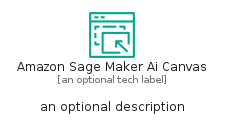
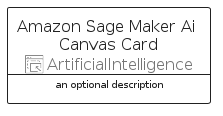
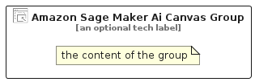

# AmazonSageMakerAiCanvas


```text
aws-q3-2025/Resource/ArtificialIntelligence/AmazonSageMakerAiCanvas
```

```text
include('aws-q3-2025/Resource/ArtificialIntelligence/AmazonSageMakerAiCanvas')
```


| Illustration | AmazonSageMakerAiCanvas | AmazonSageMakerAiCanvasCard | AmazonSageMakerAiCanvasGroup |
| :---: | :---: | :---: | :---: |
|  |  |  |  |


## Sprites
The item provides the following sriptes:

- `<$AmazonSageMakerAiCanvasXs>`
- `<$AmazonSageMakerAiCanvasSm>`
- `<$AmazonSageMakerAiCanvasMd>`
- `<$AmazonSageMakerAiCanvasLg>`


## AmazonSageMakerAiCanvas

### Load remotely
```plantuml
@startuml
' configures the library
!global $LIB_BASE_LOCATION="https://raw.githubusercontent.com/tmorin/plantuml-libs/master/distribution"

' loads the library's bootstrap
!include $LIB_BASE_LOCATION/bootstrap.puml

' loads the package bootstrap
include('aws-q3-2025/bootstrap')

' loads the Item which embeds the element AmazonSageMakerAiCanvas
include('aws-q3-2025/Resource/ArtificialIntelligence/AmazonSageMakerAiCanvas')

' renders the element
AmazonSageMakerAiCanvas('AmazonSageMakerAiCanvas', 'Amazon Sage Maker Ai Canvas', 'an optional tech label', 'an optional description')
@enduml
```

### Load locally
```plantuml
@startuml
' configures the library
!global $INCLUSION_MODE="local"
!global $LIB_BASE_LOCATION="../../.."

' loads the library's bootstrap
!include $LIB_BASE_LOCATION/bootstrap.puml

' loads the package bootstrap
include('aws-q3-2025/bootstrap')

' loads the Item which embeds the element AmazonSageMakerAiCanvas
include('aws-q3-2025/Resource/ArtificialIntelligence/AmazonSageMakerAiCanvas')

' renders the element
AmazonSageMakerAiCanvas('AmazonSageMakerAiCanvas', 'Amazon Sage Maker Ai Canvas', 'an optional tech label', 'an optional description')
@enduml
```

## AmazonSageMakerAiCanvasCard

### Load remotely
```plantuml
@startuml
' configures the library
!global $LIB_BASE_LOCATION="https://raw.githubusercontent.com/tmorin/plantuml-libs/master/distribution"

' loads the library's bootstrap
!include $LIB_BASE_LOCATION/bootstrap.puml

' loads the package bootstrap
include('aws-q3-2025/bootstrap')

' loads the Item which embeds the element AmazonSageMakerAiCanvasCard
include('aws-q3-2025/Resource/ArtificialIntelligence/AmazonSageMakerAiCanvas')

' renders the element
AmazonSageMakerAiCanvasCard('AmazonSageMakerAiCanvasCard', 'Amazon Sage Maker Ai Canvas Card', 'an optional description')
@enduml
```

### Load locally
```plantuml
@startuml
' configures the library
!global $INCLUSION_MODE="local"
!global $LIB_BASE_LOCATION="../../.."

' loads the library's bootstrap
!include $LIB_BASE_LOCATION/bootstrap.puml

' loads the package bootstrap
include('aws-q3-2025/bootstrap')

' loads the Item which embeds the element AmazonSageMakerAiCanvasCard
include('aws-q3-2025/Resource/ArtificialIntelligence/AmazonSageMakerAiCanvas')

' renders the element
AmazonSageMakerAiCanvasCard('AmazonSageMakerAiCanvasCard', 'Amazon Sage Maker Ai Canvas Card', 'an optional description')
@enduml
```

## AmazonSageMakerAiCanvasGroup

### Load remotely
```plantuml
@startuml
' configures the library
!global $LIB_BASE_LOCATION="https://raw.githubusercontent.com/tmorin/plantuml-libs/master/distribution"

' loads the library's bootstrap
!include $LIB_BASE_LOCATION/bootstrap.puml

' loads the package bootstrap
include('aws-q3-2025/bootstrap')

' loads the Item which embeds the element AmazonSageMakerAiCanvasGroup
include('aws-q3-2025/Resource/ArtificialIntelligence/AmazonSageMakerAiCanvas')

' renders the element
AmazonSageMakerAiCanvasGroup('AmazonSageMakerAiCanvasGroup', 'Amazon Sage Maker Ai Canvas Group', 'an optional tech label') {
    note as note
        the content of the group
    end note
}
@enduml
```

### Load locally
```plantuml
@startuml
' configures the library
!global $INCLUSION_MODE="local"
!global $LIB_BASE_LOCATION="../../.."

' loads the library's bootstrap
!include $LIB_BASE_LOCATION/bootstrap.puml

' loads the package bootstrap
include('aws-q3-2025/bootstrap')

' loads the Item which embeds the element AmazonSageMakerAiCanvasGroup
include('aws-q3-2025/Resource/ArtificialIntelligence/AmazonSageMakerAiCanvas')

' renders the element
AmazonSageMakerAiCanvasGroup('AmazonSageMakerAiCanvasGroup', 'Amazon Sage Maker Ai Canvas Group', 'an optional tech label') {
    note as note
        the content of the group
    end note
}
@enduml
```

