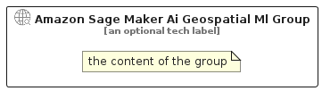

# AmazonSageMakerAiGeospatialMl


```text
aws-q3-2025/Resource/ArtificialIntelligence/AmazonSageMakerAiGeospatialMl
```

```text
include('aws-q3-2025/Resource/ArtificialIntelligence/AmazonSageMakerAiGeospatialMl')
```


| Illustration | AmazonSageMakerAiGeospatialMl | AmazonSageMakerAiGeospatialMlCard | AmazonSageMakerAiGeospatialMlGroup |
| :---: | :---: | :---: | :---: |
|  |  |  |  |


## Sprites
The item provides the following sriptes:

- `<$AmazonSageMakerAiGeospatialMlXs>`
- `<$AmazonSageMakerAiGeospatialMlSm>`
- `<$AmazonSageMakerAiGeospatialMlMd>`
- `<$AmazonSageMakerAiGeospatialMlLg>`


## AmazonSageMakerAiGeospatialMl

### Load remotely
```plantuml
@startuml
' configures the library
!global $LIB_BASE_LOCATION="https://raw.githubusercontent.com/tmorin/plantuml-libs/master/distribution"

' loads the library's bootstrap
!include $LIB_BASE_LOCATION/bootstrap.puml

' loads the package bootstrap
include('aws-q3-2025/bootstrap')

' loads the Item which embeds the element AmazonSageMakerAiGeospatialMl
include('aws-q3-2025/Resource/ArtificialIntelligence/AmazonSageMakerAiGeospatialMl')

' renders the element
AmazonSageMakerAiGeospatialMl('AmazonSageMakerAiGeospatialMl', 'Amazon Sage Maker Ai Geospatial Ml', 'an optional tech label', 'an optional description')
@enduml
```

### Load locally
```plantuml
@startuml
' configures the library
!global $INCLUSION_MODE="local"
!global $LIB_BASE_LOCATION="../../.."

' loads the library's bootstrap
!include $LIB_BASE_LOCATION/bootstrap.puml

' loads the package bootstrap
include('aws-q3-2025/bootstrap')

' loads the Item which embeds the element AmazonSageMakerAiGeospatialMl
include('aws-q3-2025/Resource/ArtificialIntelligence/AmazonSageMakerAiGeospatialMl')

' renders the element
AmazonSageMakerAiGeospatialMl('AmazonSageMakerAiGeospatialMl', 'Amazon Sage Maker Ai Geospatial Ml', 'an optional tech label', 'an optional description')
@enduml
```

## AmazonSageMakerAiGeospatialMlCard

### Load remotely
```plantuml
@startuml
' configures the library
!global $LIB_BASE_LOCATION="https://raw.githubusercontent.com/tmorin/plantuml-libs/master/distribution"

' loads the library's bootstrap
!include $LIB_BASE_LOCATION/bootstrap.puml

' loads the package bootstrap
include('aws-q3-2025/bootstrap')

' loads the Item which embeds the element AmazonSageMakerAiGeospatialMlCard
include('aws-q3-2025/Resource/ArtificialIntelligence/AmazonSageMakerAiGeospatialMl')

' renders the element
AmazonSageMakerAiGeospatialMlCard('AmazonSageMakerAiGeospatialMlCard', 'Amazon Sage Maker Ai Geospatial Ml Card', 'an optional description')
@enduml
```

### Load locally
```plantuml
@startuml
' configures the library
!global $INCLUSION_MODE="local"
!global $LIB_BASE_LOCATION="../../.."

' loads the library's bootstrap
!include $LIB_BASE_LOCATION/bootstrap.puml

' loads the package bootstrap
include('aws-q3-2025/bootstrap')

' loads the Item which embeds the element AmazonSageMakerAiGeospatialMlCard
include('aws-q3-2025/Resource/ArtificialIntelligence/AmazonSageMakerAiGeospatialMl')

' renders the element
AmazonSageMakerAiGeospatialMlCard('AmazonSageMakerAiGeospatialMlCard', 'Amazon Sage Maker Ai Geospatial Ml Card', 'an optional description')
@enduml
```

## AmazonSageMakerAiGeospatialMlGroup

### Load remotely
```plantuml
@startuml
' configures the library
!global $LIB_BASE_LOCATION="https://raw.githubusercontent.com/tmorin/plantuml-libs/master/distribution"

' loads the library's bootstrap
!include $LIB_BASE_LOCATION/bootstrap.puml

' loads the package bootstrap
include('aws-q3-2025/bootstrap')

' loads the Item which embeds the element AmazonSageMakerAiGeospatialMlGroup
include('aws-q3-2025/Resource/ArtificialIntelligence/AmazonSageMakerAiGeospatialMl')

' renders the element
AmazonSageMakerAiGeospatialMlGroup('AmazonSageMakerAiGeospatialMlGroup', 'Amazon Sage Maker Ai Geospatial Ml Group', 'an optional tech label') {
    note as note
        the content of the group
    end note
}
@enduml
```

### Load locally
```plantuml
@startuml
' configures the library
!global $INCLUSION_MODE="local"
!global $LIB_BASE_LOCATION="../../.."

' loads the library's bootstrap
!include $LIB_BASE_LOCATION/bootstrap.puml

' loads the package bootstrap
include('aws-q3-2025/bootstrap')

' loads the Item which embeds the element AmazonSageMakerAiGeospatialMlGroup
include('aws-q3-2025/Resource/ArtificialIntelligence/AmazonSageMakerAiGeospatialMl')

' renders the element
AmazonSageMakerAiGeospatialMlGroup('AmazonSageMakerAiGeospatialMlGroup', 'Amazon Sage Maker Ai Geospatial Ml Group', 'an optional tech label') {
    note as note
        the content of the group
    end note
}
@enduml
```

