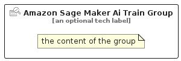

# AmazonSageMakerAiTrain


```text
aws-q3-2025/Resource/ArtificialIntelligence/AmazonSageMakerAiTrain
```

```text
include('aws-q3-2025/Resource/ArtificialIntelligence/AmazonSageMakerAiTrain')
```


| Illustration | AmazonSageMakerAiTrain | AmazonSageMakerAiTrainCard | AmazonSageMakerAiTrainGroup |
| :---: | :---: | :---: | :---: |
|  |  |  |  |


## Sprites
The item provides the following sriptes:

- `<$AmazonSageMakerAiTrainXs>`
- `<$AmazonSageMakerAiTrainSm>`
- `<$AmazonSageMakerAiTrainMd>`
- `<$AmazonSageMakerAiTrainLg>`


## AmazonSageMakerAiTrain

### Load remotely
```plantuml
@startuml
' configures the library
!global $LIB_BASE_LOCATION="https://raw.githubusercontent.com/tmorin/plantuml-libs/master/distribution"

' loads the library's bootstrap
!include $LIB_BASE_LOCATION/bootstrap.puml

' loads the package bootstrap
include('aws-q3-2025/bootstrap')

' loads the Item which embeds the element AmazonSageMakerAiTrain
include('aws-q3-2025/Resource/ArtificialIntelligence/AmazonSageMakerAiTrain')

' renders the element
AmazonSageMakerAiTrain('AmazonSageMakerAiTrain', 'Amazon Sage Maker Ai Train', 'an optional tech label', 'an optional description')
@enduml
```

### Load locally
```plantuml
@startuml
' configures the library
!global $INCLUSION_MODE="local"
!global $LIB_BASE_LOCATION="../../.."

' loads the library's bootstrap
!include $LIB_BASE_LOCATION/bootstrap.puml

' loads the package bootstrap
include('aws-q3-2025/bootstrap')

' loads the Item which embeds the element AmazonSageMakerAiTrain
include('aws-q3-2025/Resource/ArtificialIntelligence/AmazonSageMakerAiTrain')

' renders the element
AmazonSageMakerAiTrain('AmazonSageMakerAiTrain', 'Amazon Sage Maker Ai Train', 'an optional tech label', 'an optional description')
@enduml
```

## AmazonSageMakerAiTrainCard

### Load remotely
```plantuml
@startuml
' configures the library
!global $LIB_BASE_LOCATION="https://raw.githubusercontent.com/tmorin/plantuml-libs/master/distribution"

' loads the library's bootstrap
!include $LIB_BASE_LOCATION/bootstrap.puml

' loads the package bootstrap
include('aws-q3-2025/bootstrap')

' loads the Item which embeds the element AmazonSageMakerAiTrainCard
include('aws-q3-2025/Resource/ArtificialIntelligence/AmazonSageMakerAiTrain')

' renders the element
AmazonSageMakerAiTrainCard('AmazonSageMakerAiTrainCard', 'Amazon Sage Maker Ai Train Card', 'an optional description')
@enduml
```

### Load locally
```plantuml
@startuml
' configures the library
!global $INCLUSION_MODE="local"
!global $LIB_BASE_LOCATION="../../.."

' loads the library's bootstrap
!include $LIB_BASE_LOCATION/bootstrap.puml

' loads the package bootstrap
include('aws-q3-2025/bootstrap')

' loads the Item which embeds the element AmazonSageMakerAiTrainCard
include('aws-q3-2025/Resource/ArtificialIntelligence/AmazonSageMakerAiTrain')

' renders the element
AmazonSageMakerAiTrainCard('AmazonSageMakerAiTrainCard', 'Amazon Sage Maker Ai Train Card', 'an optional description')
@enduml
```

## AmazonSageMakerAiTrainGroup

### Load remotely
```plantuml
@startuml
' configures the library
!global $LIB_BASE_LOCATION="https://raw.githubusercontent.com/tmorin/plantuml-libs/master/distribution"

' loads the library's bootstrap
!include $LIB_BASE_LOCATION/bootstrap.puml

' loads the package bootstrap
include('aws-q3-2025/bootstrap')

' loads the Item which embeds the element AmazonSageMakerAiTrainGroup
include('aws-q3-2025/Resource/ArtificialIntelligence/AmazonSageMakerAiTrain')

' renders the element
AmazonSageMakerAiTrainGroup('AmazonSageMakerAiTrainGroup', 'Amazon Sage Maker Ai Train Group', 'an optional tech label') {
    note as note
        the content of the group
    end note
}
@enduml
```

### Load locally
```plantuml
@startuml
' configures the library
!global $INCLUSION_MODE="local"
!global $LIB_BASE_LOCATION="../../.."

' loads the library's bootstrap
!include $LIB_BASE_LOCATION/bootstrap.puml

' loads the package bootstrap
include('aws-q3-2025/bootstrap')

' loads the Item which embeds the element AmazonSageMakerAiTrainGroup
include('aws-q3-2025/Resource/ArtificialIntelligence/AmazonSageMakerAiTrain')

' renders the element
AmazonSageMakerAiTrainGroup('AmazonSageMakerAiTrainGroup', 'Amazon Sage Maker Ai Train Group', 'an optional tech label') {
    note as note
        the content of the group
    end note
}
@enduml
```

