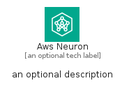
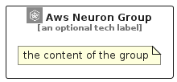

# AwsNeuron


```text
aws/Architecture/ArtificialIntelligence/AwsNeuron
```

```text
include('aws/Architecture/ArtificialIntelligence/AwsNeuron')
```


| Illustration | AwsNeuron | AwsNeuronCard | AwsNeuronGroup |
| :---: | :---: | :---: | :---: |
|  |  |  |  |


## Sprites
The item provides the following sriptes:

- `<$AwsNeuronXs>`
- `<$AwsNeuronSm>`
- `<$AwsNeuronMd>`
- `<$AwsNeuronLg>`


## AwsNeuron

### Load remotely
```plantuml
@startuml
' configures the library
!global $LIB_BASE_LOCATION="https://raw.githubusercontent.com/tmorin/plantuml-libs/master/distribution"

' loads the library's bootstrap
!include $LIB_BASE_LOCATION/bootstrap.puml

' loads the package bootstrap
include('aws/bootstrap')

' loads the Item which embeds the element AwsNeuron
include('aws/Architecture/ArtificialIntelligence/AwsNeuron')

' renders the element
AwsNeuron('AwsNeuron', 'Aws Neuron', 'an optional tech label', 'an optional description')
@enduml
```

### Load locally
```plantuml
@startuml
' configures the library
!global $INCLUSION_MODE="local"
!global $LIB_BASE_LOCATION="../../.."

' loads the library's bootstrap
!include $LIB_BASE_LOCATION/bootstrap.puml

' loads the package bootstrap
include('aws/bootstrap')

' loads the Item which embeds the element AwsNeuron
include('aws/Architecture/ArtificialIntelligence/AwsNeuron')

' renders the element
AwsNeuron('AwsNeuron', 'Aws Neuron', 'an optional tech label', 'an optional description')
@enduml
```

## AwsNeuronCard

### Load remotely
```plantuml
@startuml
' configures the library
!global $LIB_BASE_LOCATION="https://raw.githubusercontent.com/tmorin/plantuml-libs/master/distribution"

' loads the library's bootstrap
!include $LIB_BASE_LOCATION/bootstrap.puml

' loads the package bootstrap
include('aws/bootstrap')

' loads the Item which embeds the element AwsNeuronCard
include('aws/Architecture/ArtificialIntelligence/AwsNeuron')

' renders the element
AwsNeuronCard('AwsNeuronCard', 'Aws Neuron Card', 'an optional description')
@enduml
```

### Load locally
```plantuml
@startuml
' configures the library
!global $INCLUSION_MODE="local"
!global $LIB_BASE_LOCATION="../../.."

' loads the library's bootstrap
!include $LIB_BASE_LOCATION/bootstrap.puml

' loads the package bootstrap
include('aws/bootstrap')

' loads the Item which embeds the element AwsNeuronCard
include('aws/Architecture/ArtificialIntelligence/AwsNeuron')

' renders the element
AwsNeuronCard('AwsNeuronCard', 'Aws Neuron Card', 'an optional description')
@enduml
```

## AwsNeuronGroup

### Load remotely
```plantuml
@startuml
' configures the library
!global $LIB_BASE_LOCATION="https://raw.githubusercontent.com/tmorin/plantuml-libs/master/distribution"

' loads the library's bootstrap
!include $LIB_BASE_LOCATION/bootstrap.puml

' loads the package bootstrap
include('aws/bootstrap')

' loads the Item which embeds the element AwsNeuronGroup
include('aws/Architecture/ArtificialIntelligence/AwsNeuron')

' renders the element
AwsNeuronGroup('AwsNeuronGroup', 'Aws Neuron Group', 'an optional tech label') {
    note as note
        the content of the group
    end note
}
@enduml
```

### Load locally
```plantuml
@startuml
' configures the library
!global $INCLUSION_MODE="local"
!global $LIB_BASE_LOCATION="../../.."

' loads the library's bootstrap
!include $LIB_BASE_LOCATION/bootstrap.puml

' loads the package bootstrap
include('aws/bootstrap')

' loads the Item which embeds the element AwsNeuronGroup
include('aws/Architecture/ArtificialIntelligence/AwsNeuron')

' renders the element
AwsNeuronGroup('AwsNeuronGroup', 'Aws Neuron Group', 'an optional tech label') {
    note as note
        the content of the group
    end note
}
@enduml
```

