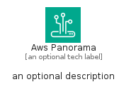
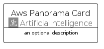
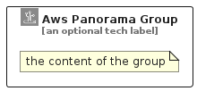

# AwsPanorama


```text
aws/Architecture/ArtificialIntelligence/AwsPanorama
```

```text
include('aws/Architecture/ArtificialIntelligence/AwsPanorama')
```


| Illustration | AwsPanorama | AwsPanoramaCard | AwsPanoramaGroup |
| :---: | :---: | :---: | :---: |
|  |  |  |  |


## Sprites
The item provides the following sriptes:

- `<$AwsPanoramaXs>`
- `<$AwsPanoramaSm>`
- `<$AwsPanoramaMd>`
- `<$AwsPanoramaLg>`


## AwsPanorama

### Load remotely
```plantuml
@startuml
' configures the library
!global $LIB_BASE_LOCATION="https://raw.githubusercontent.com/tmorin/plantuml-libs/master/distribution"

' loads the library's bootstrap
!include $LIB_BASE_LOCATION/bootstrap.puml

' loads the package bootstrap
include('aws/bootstrap')

' loads the Item which embeds the element AwsPanorama
include('aws/Architecture/ArtificialIntelligence/AwsPanorama')

' renders the element
AwsPanorama('AwsPanorama', 'Aws Panorama', 'an optional tech label', 'an optional description')
@enduml
```

### Load locally
```plantuml
@startuml
' configures the library
!global $INCLUSION_MODE="local"
!global $LIB_BASE_LOCATION="../../.."

' loads the library's bootstrap
!include $LIB_BASE_LOCATION/bootstrap.puml

' loads the package bootstrap
include('aws/bootstrap')

' loads the Item which embeds the element AwsPanorama
include('aws/Architecture/ArtificialIntelligence/AwsPanorama')

' renders the element
AwsPanorama('AwsPanorama', 'Aws Panorama', 'an optional tech label', 'an optional description')
@enduml
```

## AwsPanoramaCard

### Load remotely
```plantuml
@startuml
' configures the library
!global $LIB_BASE_LOCATION="https://raw.githubusercontent.com/tmorin/plantuml-libs/master/distribution"

' loads the library's bootstrap
!include $LIB_BASE_LOCATION/bootstrap.puml

' loads the package bootstrap
include('aws/bootstrap')

' loads the Item which embeds the element AwsPanoramaCard
include('aws/Architecture/ArtificialIntelligence/AwsPanorama')

' renders the element
AwsPanoramaCard('AwsPanoramaCard', 'Aws Panorama Card', 'an optional description')
@enduml
```

### Load locally
```plantuml
@startuml
' configures the library
!global $INCLUSION_MODE="local"
!global $LIB_BASE_LOCATION="../../.."

' loads the library's bootstrap
!include $LIB_BASE_LOCATION/bootstrap.puml

' loads the package bootstrap
include('aws/bootstrap')

' loads the Item which embeds the element AwsPanoramaCard
include('aws/Architecture/ArtificialIntelligence/AwsPanorama')

' renders the element
AwsPanoramaCard('AwsPanoramaCard', 'Aws Panorama Card', 'an optional description')
@enduml
```

## AwsPanoramaGroup

### Load remotely
```plantuml
@startuml
' configures the library
!global $LIB_BASE_LOCATION="https://raw.githubusercontent.com/tmorin/plantuml-libs/master/distribution"

' loads the library's bootstrap
!include $LIB_BASE_LOCATION/bootstrap.puml

' loads the package bootstrap
include('aws/bootstrap')

' loads the Item which embeds the element AwsPanoramaGroup
include('aws/Architecture/ArtificialIntelligence/AwsPanorama')

' renders the element
AwsPanoramaGroup('AwsPanoramaGroup', 'Aws Panorama Group', 'an optional tech label') {
    note as note
        the content of the group
    end note
}
@enduml
```

### Load locally
```plantuml
@startuml
' configures the library
!global $INCLUSION_MODE="local"
!global $LIB_BASE_LOCATION="../../.."

' loads the library's bootstrap
!include $LIB_BASE_LOCATION/bootstrap.puml

' loads the package bootstrap
include('aws/bootstrap')

' loads the Item which embeds the element AwsPanoramaGroup
include('aws/Architecture/ArtificialIntelligence/AwsPanorama')

' renders the element
AwsPanoramaGroup('AwsPanoramaGroup', 'Aws Panorama Group', 'an optional tech label') {
    note as note
        the content of the group
    end note
}
@enduml
```

