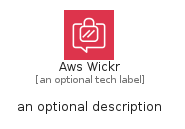
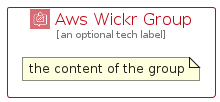

# AwsWickr


```text
aws/Architecture/BusinessApplications/AwsWickr
```

```text
include('aws/Architecture/BusinessApplications/AwsWickr')
```


| Illustration | AwsWickr | AwsWickrCard | AwsWickrGroup |
| :---: | :---: | :---: | :---: |
|  |  |  |  |


## Sprites
The item provides the following sriptes:

- `<$AwsWickrXs>`
- `<$AwsWickrSm>`
- `<$AwsWickrMd>`
- `<$AwsWickrLg>`


## AwsWickr

### Load remotely
```plantuml
@startuml
' configures the library
!global $LIB_BASE_LOCATION="https://raw.githubusercontent.com/tmorin/plantuml-libs/master/distribution"

' loads the library's bootstrap
!include $LIB_BASE_LOCATION/bootstrap.puml

' loads the package bootstrap
include('aws/bootstrap')

' loads the Item which embeds the element AwsWickr
include('aws/Architecture/BusinessApplications/AwsWickr')

' renders the element
AwsWickr('AwsWickr', 'Aws Wickr', 'an optional tech label', 'an optional description')
@enduml
```

### Load locally
```plantuml
@startuml
' configures the library
!global $INCLUSION_MODE="local"
!global $LIB_BASE_LOCATION="../../.."

' loads the library's bootstrap
!include $LIB_BASE_LOCATION/bootstrap.puml

' loads the package bootstrap
include('aws/bootstrap')

' loads the Item which embeds the element AwsWickr
include('aws/Architecture/BusinessApplications/AwsWickr')

' renders the element
AwsWickr('AwsWickr', 'Aws Wickr', 'an optional tech label', 'an optional description')
@enduml
```

## AwsWickrCard

### Load remotely
```plantuml
@startuml
' configures the library
!global $LIB_BASE_LOCATION="https://raw.githubusercontent.com/tmorin/plantuml-libs/master/distribution"

' loads the library's bootstrap
!include $LIB_BASE_LOCATION/bootstrap.puml

' loads the package bootstrap
include('aws/bootstrap')

' loads the Item which embeds the element AwsWickrCard
include('aws/Architecture/BusinessApplications/AwsWickr')

' renders the element
AwsWickrCard('AwsWickrCard', 'Aws Wickr Card', 'an optional description')
@enduml
```

### Load locally
```plantuml
@startuml
' configures the library
!global $INCLUSION_MODE="local"
!global $LIB_BASE_LOCATION="../../.."

' loads the library's bootstrap
!include $LIB_BASE_LOCATION/bootstrap.puml

' loads the package bootstrap
include('aws/bootstrap')

' loads the Item which embeds the element AwsWickrCard
include('aws/Architecture/BusinessApplications/AwsWickr')

' renders the element
AwsWickrCard('AwsWickrCard', 'Aws Wickr Card', 'an optional description')
@enduml
```

## AwsWickrGroup

### Load remotely
```plantuml
@startuml
' configures the library
!global $LIB_BASE_LOCATION="https://raw.githubusercontent.com/tmorin/plantuml-libs/master/distribution"

' loads the library's bootstrap
!include $LIB_BASE_LOCATION/bootstrap.puml

' loads the package bootstrap
include('aws/bootstrap')

' loads the Item which embeds the element AwsWickrGroup
include('aws/Architecture/BusinessApplications/AwsWickr')

' renders the element
AwsWickrGroup('AwsWickrGroup', 'Aws Wickr Group', 'an optional tech label') {
    note as note
        the content of the group
    end note
}
@enduml
```

### Load locally
```plantuml
@startuml
' configures the library
!global $INCLUSION_MODE="local"
!global $LIB_BASE_LOCATION="../../.."

' loads the library's bootstrap
!include $LIB_BASE_LOCATION/bootstrap.puml

' loads the package bootstrap
include('aws/bootstrap')

' loads the Item which embeds the element AwsWickrGroup
include('aws/Architecture/BusinessApplications/AwsWickr')

' renders the element
AwsWickrGroup('AwsWickrGroup', 'Aws Wickr Group', 'an optional tech label') {
    note as note
        the content of the group
    end note
}
@enduml
```

