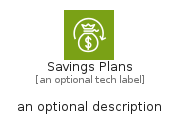
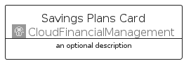
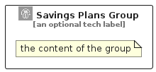

# SavingsPlans


```text
aws/Architecture/CloudFinancialManagement/SavingsPlans
```

```text
include('aws/Architecture/CloudFinancialManagement/SavingsPlans')
```


| Illustration | SavingsPlans | SavingsPlansCard | SavingsPlansGroup |
| :---: | :---: | :---: | :---: |
|  |  |  |  |


## Sprites
The item provides the following sriptes:

- `<$SavingsPlansXs>`
- `<$SavingsPlansSm>`
- `<$SavingsPlansMd>`
- `<$SavingsPlansLg>`


## SavingsPlans

### Load remotely
```plantuml
@startuml
' configures the library
!global $LIB_BASE_LOCATION="https://raw.githubusercontent.com/tmorin/plantuml-libs/master/distribution"

' loads the library's bootstrap
!include $LIB_BASE_LOCATION/bootstrap.puml

' loads the package bootstrap
include('aws/bootstrap')

' loads the Item which embeds the element SavingsPlans
include('aws/Architecture/CloudFinancialManagement/SavingsPlans')

' renders the element
SavingsPlans('SavingsPlans', 'Savings Plans', 'an optional tech label', 'an optional description')
@enduml
```

### Load locally
```plantuml
@startuml
' configures the library
!global $INCLUSION_MODE="local"
!global $LIB_BASE_LOCATION="../../.."

' loads the library's bootstrap
!include $LIB_BASE_LOCATION/bootstrap.puml

' loads the package bootstrap
include('aws/bootstrap')

' loads the Item which embeds the element SavingsPlans
include('aws/Architecture/CloudFinancialManagement/SavingsPlans')

' renders the element
SavingsPlans('SavingsPlans', 'Savings Plans', 'an optional tech label', 'an optional description')
@enduml
```

## SavingsPlansCard

### Load remotely
```plantuml
@startuml
' configures the library
!global $LIB_BASE_LOCATION="https://raw.githubusercontent.com/tmorin/plantuml-libs/master/distribution"

' loads the library's bootstrap
!include $LIB_BASE_LOCATION/bootstrap.puml

' loads the package bootstrap
include('aws/bootstrap')

' loads the Item which embeds the element SavingsPlansCard
include('aws/Architecture/CloudFinancialManagement/SavingsPlans')

' renders the element
SavingsPlansCard('SavingsPlansCard', 'Savings Plans Card', 'an optional description')
@enduml
```

### Load locally
```plantuml
@startuml
' configures the library
!global $INCLUSION_MODE="local"
!global $LIB_BASE_LOCATION="../../.."

' loads the library's bootstrap
!include $LIB_BASE_LOCATION/bootstrap.puml

' loads the package bootstrap
include('aws/bootstrap')

' loads the Item which embeds the element SavingsPlansCard
include('aws/Architecture/CloudFinancialManagement/SavingsPlans')

' renders the element
SavingsPlansCard('SavingsPlansCard', 'Savings Plans Card', 'an optional description')
@enduml
```

## SavingsPlansGroup

### Load remotely
```plantuml
@startuml
' configures the library
!global $LIB_BASE_LOCATION="https://raw.githubusercontent.com/tmorin/plantuml-libs/master/distribution"

' loads the library's bootstrap
!include $LIB_BASE_LOCATION/bootstrap.puml

' loads the package bootstrap
include('aws/bootstrap')

' loads the Item which embeds the element SavingsPlansGroup
include('aws/Architecture/CloudFinancialManagement/SavingsPlans')

' renders the element
SavingsPlansGroup('SavingsPlansGroup', 'Savings Plans Group', 'an optional tech label') {
    note as note
        the content of the group
    end note
}
@enduml
```

### Load locally
```plantuml
@startuml
' configures the library
!global $INCLUSION_MODE="local"
!global $LIB_BASE_LOCATION="../../.."

' loads the library's bootstrap
!include $LIB_BASE_LOCATION/bootstrap.puml

' loads the package bootstrap
include('aws/bootstrap')

' loads the Item which embeds the element SavingsPlansGroup
include('aws/Architecture/CloudFinancialManagement/SavingsPlans')

' renders the element
SavingsPlansGroup('SavingsPlansGroup', 'Savings Plans Group', 'an optional tech label') {
    note as note
        the content of the group
    end note
}
@enduml
```

