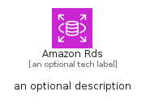
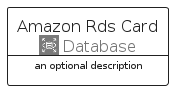
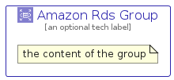

# AmazonRds


```text
aws/Architecture/Database/AmazonRds
```

```text
include('aws/Architecture/Database/AmazonRds')
```


| Illustration | AmazonRds | AmazonRdsCard | AmazonRdsGroup |
| :---: | :---: | :---: | :---: |
|  |  |  |  |


## Sprites
The item provides the following sriptes:

- `<$AmazonRdsXs>`
- `<$AmazonRdsSm>`
- `<$AmazonRdsMd>`
- `<$AmazonRdsLg>`


## AmazonRds

### Load remotely
```plantuml
@startuml
' configures the library
!global $LIB_BASE_LOCATION="https://raw.githubusercontent.com/tmorin/plantuml-libs/master/distribution"

' loads the library's bootstrap
!include $LIB_BASE_LOCATION/bootstrap.puml

' loads the package bootstrap
include('aws/bootstrap')

' loads the Item which embeds the element AmazonRds
include('aws/Architecture/Database/AmazonRds')

' renders the element
AmazonRds('AmazonRds', 'Amazon Rds', 'an optional tech label', 'an optional description')
@enduml
```

### Load locally
```plantuml
@startuml
' configures the library
!global $INCLUSION_MODE="local"
!global $LIB_BASE_LOCATION="../../.."

' loads the library's bootstrap
!include $LIB_BASE_LOCATION/bootstrap.puml

' loads the package bootstrap
include('aws/bootstrap')

' loads the Item which embeds the element AmazonRds
include('aws/Architecture/Database/AmazonRds')

' renders the element
AmazonRds('AmazonRds', 'Amazon Rds', 'an optional tech label', 'an optional description')
@enduml
```

## AmazonRdsCard

### Load remotely
```plantuml
@startuml
' configures the library
!global $LIB_BASE_LOCATION="https://raw.githubusercontent.com/tmorin/plantuml-libs/master/distribution"

' loads the library's bootstrap
!include $LIB_BASE_LOCATION/bootstrap.puml

' loads the package bootstrap
include('aws/bootstrap')

' loads the Item which embeds the element AmazonRdsCard
include('aws/Architecture/Database/AmazonRds')

' renders the element
AmazonRdsCard('AmazonRdsCard', 'Amazon Rds Card', 'an optional description')
@enduml
```

### Load locally
```plantuml
@startuml
' configures the library
!global $INCLUSION_MODE="local"
!global $LIB_BASE_LOCATION="../../.."

' loads the library's bootstrap
!include $LIB_BASE_LOCATION/bootstrap.puml

' loads the package bootstrap
include('aws/bootstrap')

' loads the Item which embeds the element AmazonRdsCard
include('aws/Architecture/Database/AmazonRds')

' renders the element
AmazonRdsCard('AmazonRdsCard', 'Amazon Rds Card', 'an optional description')
@enduml
```

## AmazonRdsGroup

### Load remotely
```plantuml
@startuml
' configures the library
!global $LIB_BASE_LOCATION="https://raw.githubusercontent.com/tmorin/plantuml-libs/master/distribution"

' loads the library's bootstrap
!include $LIB_BASE_LOCATION/bootstrap.puml

' loads the package bootstrap
include('aws/bootstrap')

' loads the Item which embeds the element AmazonRdsGroup
include('aws/Architecture/Database/AmazonRds')

' renders the element
AmazonRdsGroup('AmazonRdsGroup', 'Amazon Rds Group', 'an optional tech label') {
    note as note
        the content of the group
    end note
}
@enduml
```

### Load locally
```plantuml
@startuml
' configures the library
!global $INCLUSION_MODE="local"
!global $LIB_BASE_LOCATION="../../.."

' loads the library's bootstrap
!include $LIB_BASE_LOCATION/bootstrap.puml

' loads the package bootstrap
include('aws/bootstrap')

' loads the Item which embeds the element AmazonRdsGroup
include('aws/Architecture/Database/AmazonRds')

' renders the element
AmazonRdsGroup('AmazonRdsGroup', 'Amazon Rds Group', 'an optional tech label') {
    note as note
        the content of the group
    end note
}
@enduml
```

