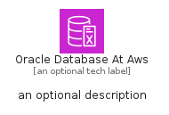
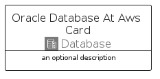
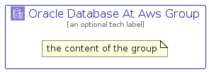

# OracleDatabaseAtAws


```text
aws/Architecture/Database/OracleDatabaseAtAws
```

```text
include('aws/Architecture/Database/OracleDatabaseAtAws')
```


| Illustration | OracleDatabaseAtAws | OracleDatabaseAtAwsCard | OracleDatabaseAtAwsGroup |
| :---: | :---: | :---: | :---: |
|  |  |  |  |


## Sprites
The item provides the following sriptes:

- `<$OracleDatabaseAtAwsXs>`
- `<$OracleDatabaseAtAwsSm>`
- `<$OracleDatabaseAtAwsMd>`
- `<$OracleDatabaseAtAwsLg>`


## OracleDatabaseAtAws

### Load remotely
```plantuml
@startuml
' configures the library
!global $LIB_BASE_LOCATION="https://raw.githubusercontent.com/tmorin/plantuml-libs/master/distribution"

' loads the library's bootstrap
!include $LIB_BASE_LOCATION/bootstrap.puml

' loads the package bootstrap
include('aws/bootstrap')

' loads the Item which embeds the element OracleDatabaseAtAws
include('aws/Architecture/Database/OracleDatabaseAtAws')

' renders the element
OracleDatabaseAtAws('OracleDatabaseAtAws', 'Oracle Database At Aws', 'an optional tech label', 'an optional description')
@enduml
```

### Load locally
```plantuml
@startuml
' configures the library
!global $INCLUSION_MODE="local"
!global $LIB_BASE_LOCATION="../../.."

' loads the library's bootstrap
!include $LIB_BASE_LOCATION/bootstrap.puml

' loads the package bootstrap
include('aws/bootstrap')

' loads the Item which embeds the element OracleDatabaseAtAws
include('aws/Architecture/Database/OracleDatabaseAtAws')

' renders the element
OracleDatabaseAtAws('OracleDatabaseAtAws', 'Oracle Database At Aws', 'an optional tech label', 'an optional description')
@enduml
```

## OracleDatabaseAtAwsCard

### Load remotely
```plantuml
@startuml
' configures the library
!global $LIB_BASE_LOCATION="https://raw.githubusercontent.com/tmorin/plantuml-libs/master/distribution"

' loads the library's bootstrap
!include $LIB_BASE_LOCATION/bootstrap.puml

' loads the package bootstrap
include('aws/bootstrap')

' loads the Item which embeds the element OracleDatabaseAtAwsCard
include('aws/Architecture/Database/OracleDatabaseAtAws')

' renders the element
OracleDatabaseAtAwsCard('OracleDatabaseAtAwsCard', 'Oracle Database At Aws Card', 'an optional description')
@enduml
```

### Load locally
```plantuml
@startuml
' configures the library
!global $INCLUSION_MODE="local"
!global $LIB_BASE_LOCATION="../../.."

' loads the library's bootstrap
!include $LIB_BASE_LOCATION/bootstrap.puml

' loads the package bootstrap
include('aws/bootstrap')

' loads the Item which embeds the element OracleDatabaseAtAwsCard
include('aws/Architecture/Database/OracleDatabaseAtAws')

' renders the element
OracleDatabaseAtAwsCard('OracleDatabaseAtAwsCard', 'Oracle Database At Aws Card', 'an optional description')
@enduml
```

## OracleDatabaseAtAwsGroup

### Load remotely
```plantuml
@startuml
' configures the library
!global $LIB_BASE_LOCATION="https://raw.githubusercontent.com/tmorin/plantuml-libs/master/distribution"

' loads the library's bootstrap
!include $LIB_BASE_LOCATION/bootstrap.puml

' loads the package bootstrap
include('aws/bootstrap')

' loads the Item which embeds the element OracleDatabaseAtAwsGroup
include('aws/Architecture/Database/OracleDatabaseAtAws')

' renders the element
OracleDatabaseAtAwsGroup('OracleDatabaseAtAwsGroup', 'Oracle Database At Aws Group', 'an optional tech label') {
    note as note
        the content of the group
    end note
}
@enduml
```

### Load locally
```plantuml
@startuml
' configures the library
!global $INCLUSION_MODE="local"
!global $LIB_BASE_LOCATION="../../.."

' loads the library's bootstrap
!include $LIB_BASE_LOCATION/bootstrap.puml

' loads the package bootstrap
include('aws/bootstrap')

' loads the Item which embeds the element OracleDatabaseAtAwsGroup
include('aws/Architecture/Database/OracleDatabaseAtAws')

' renders the element
OracleDatabaseAtAwsGroup('OracleDatabaseAtAwsGroup', 'Oracle Database At Aws Group', 'an optional tech label') {
    note as note
        the content of the group
    end note
}
@enduml
```

